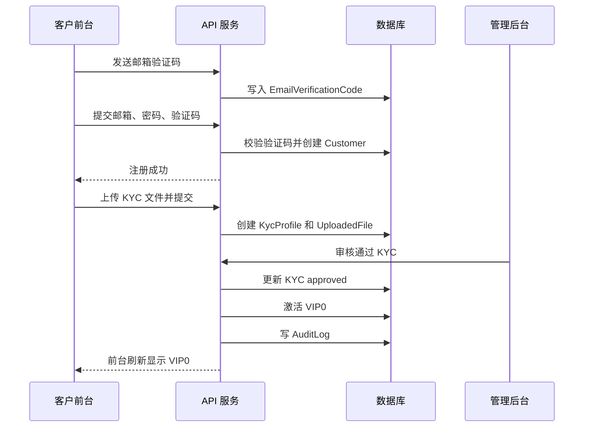
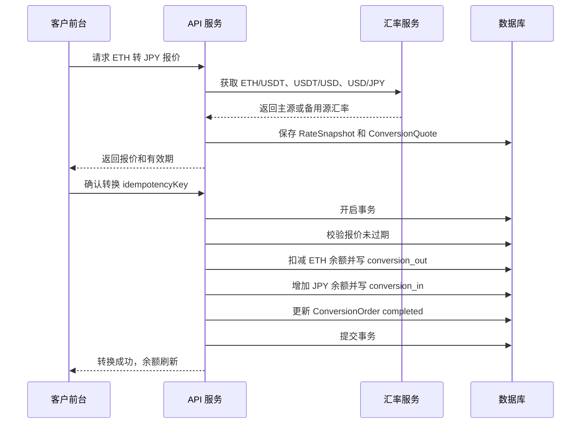
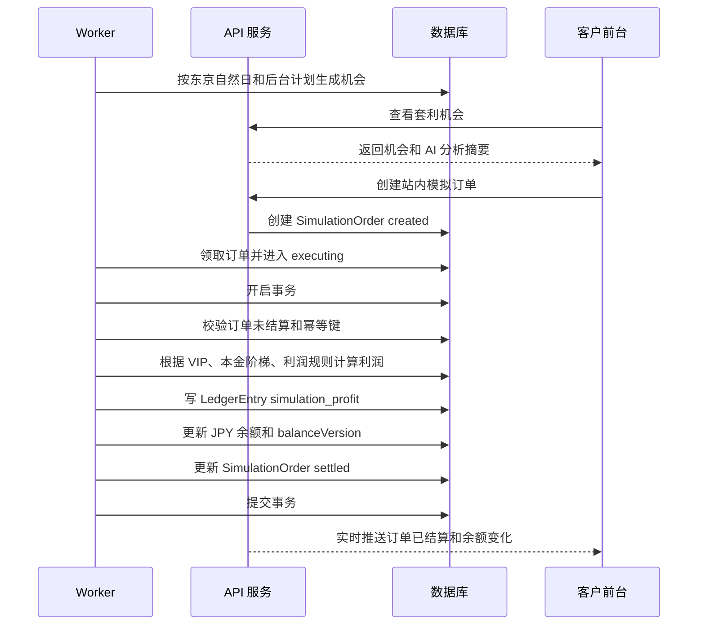
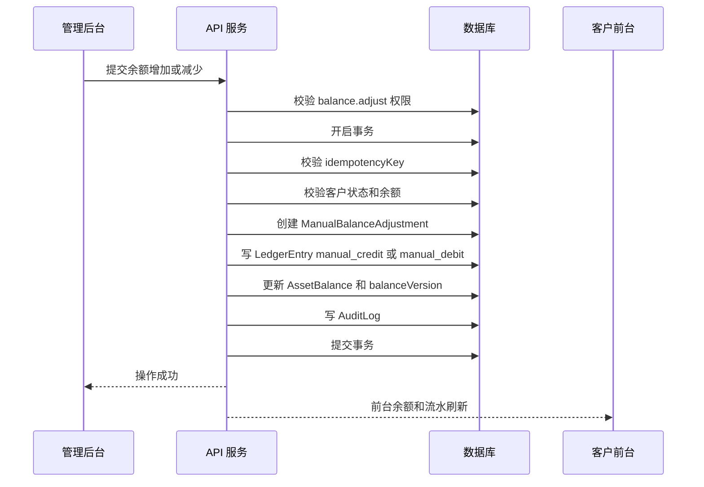
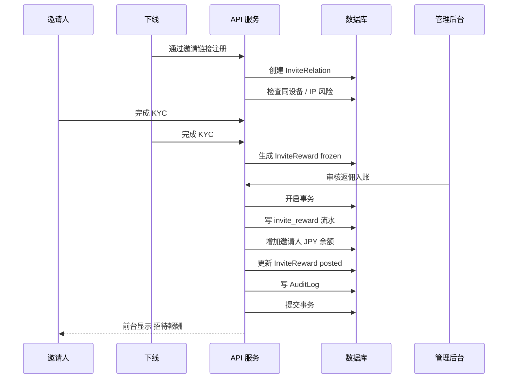

# AI 套利网站响应式 Web 完整开发文档

文档状态：首期 MVP 开发规格书。

最近更新日期：2026-06-27。

适用范围：

- 响应式客户前台 Web。
- 中文管理后台 Web。
- 后端 API。
- 队列 worker。
- 数据库 schema。
- 资金账本。
- 站内模拟套利引擎。
- 测试、部署、验收和运维。

不可变业务原则：

- 首期只做站内模拟套利，不执行外部交易所真实买入或卖出。
- 客户余额和利润可以在站内真实变化，但必须来自站内资金账本。
- 站内模拟收益、运营奖励、人工调整、邀请返佣必须保留真实业务类型。
- 不能把站内模拟订单、运营奖励或人工入账展示成外部交易所真实成交。
- 所有资金变化必须有 `businessNo`、`idempotencyKey`、`ledgerStatus`、`balanceVersion` 和审计记录。
- 客户前台使用日语和日元。
- 管理后台使用中文。
- 业务时间以东京自然日为准。

## 目录

| 章节 | 内容 |
| ---: | --- |
| 1 | 项目定位 |
| 2 | 设计目标 |
| 3 | 响应式策略 |
| 4 | 信息架构 |
| 5 | 页面规划 |
| 6 | 管理后台 |
| 7 | 视觉风格 |
| 8 | 组件响应式规则 |
| 9 | 推荐技术栈 |
| 10 | 前端目录建议 |
| 11 | 核心数据模型 |
| 12 | API 草案 |
| 13 | 风控与安全 |
| 14 | MVP 开发阶段 |
| 15 | 首期验收清单 |
| 16 | 建议优先开发顺序 |
| 17 | 非首期范围 |
| 18 | 备注 |
| 19 | 数据库设计与索引约束 |
| 20 | API DTO 与错误码 |
| 21 | 状态机与状态流转 |
| 22 | 队列任务、定时任务与实时事件 |
| 23 | 环境变量、部署和 Seed 数据 |
| 24 | 测试计划 |
| 25 | 文件上传与凭证存储 |
| 26 | 后台角色权限矩阵 |
| 27 | 审计日志增强规范 |
| 28 | 安全边界与合规提示 |
| 29 | 开发实施工作包 |
| 30 | 资金对账与一致性闭环 |
| 31 | 生产配置开关与演示模式 |
| 32 | 最终客户路径验收剧本 |
| 33 | 最终管理后台验收剧本 |
| 34 | 交付物清单 |
| 35 | 上线前最终检查清单 |
| 36 | 字段字典与枚举规范 |
| 37 | API 落地清单 |
| 38 | 前端组件状态库存 |
| 39 | 文案与格式规范 |
| 40 | 实施排期建议 |
| 41 | 上线、回滚与数据修复 |
| 42 | 监控与告警 |
| 43 | 开发完成定义 |
| 44 | 开发边界结论 |
| 45 | 开发任务票据拆分 |
| 46 | 设计与前端验收细则 |
| 47 | 后端实现检查表 |
| 48 | 测试用例矩阵 |
| 49 | 交接给开发团队的最终说明 |
| 50 | 数据库 ERD 草案 |
| 51 | 核心业务时序图 |
| 52 | OpenAPI 生成要求 |
| 53 | Prisma / 数据库落地规则 |
| 54 | 生产初始化数据清单 |
| 55 | 最终缺口复查 |

## 1. 项目定位

本项目是一个手机网页端和桌面网页端通用的 AI 套利监控与交易辅助平台，参考截图中的 `AI Arbitrage Pro` 仪表盘风格开发。

首期目标是开发一套响应式 Web App：

- 桌面端展示完整专业仪表盘。
- 手机浏览器展示精简但可操作的交易监控界面。
- 两端共用同一套前端代码、同一套后端接口、同一套业务数据模型。
- 根据屏幕宽度自动切换布局，而不是分别开发两套系统。
- 同时提供管理后台，用于管理客户、身份认证、入金、出金、VIP 等级、AI 算力和站内模拟套利机会。
- 客户前台默认使用日语界面，货币默认使用日元 `JPY / ¥`。
- 管理后台默认使用中文界面，用于运营和配置。
- 所有交易开始、执行中、结束、结算、入金、出金、审核时间均以东京时间 `Asia/Tokyo` 为业务基准。

第一版建议先使用 Mock 数据完成界面、交互和响应式布局，再实现站内模拟套利引擎、后台配置和实时结算。首期不接入真实交易所下单，不执行真实的“交易所 A 买入、交易所 B 卖出”。交易所行情 API 可以作为后续增强，但不影响首期站内结算闭环。

本项目的“AI 自动套利”在首期定义为站内模拟流程：

- 不真实执行“交易所 A 买入、交易所 B 卖出”。
- 由系统检测或后台配置生成站内套利机会。
- AI 引擎在当前网站内自动分析、执行、结算。
- 订单详情、执行过程、利润和余额都会在当前网站内真实变动。
- 所有余额变动必须通过资金账本、幂等键和数据库事务完成，不能出现误差。
- 后台可按 VIP 等级控制检测频率、机会数量、AI 算力和收益规则。
- 客户可自行开启或关闭“自动 AI 套利”，关闭后只展示机会，不自动进入模拟执行。

## 2. 设计目标

### 2.1 桌面端目标

桌面端尽量接近截图中的金融仪表盘：

- 左侧导航栏。
- 顶部状态栏。
- 多列指标卡片。
- 套利机会表格。
- 价格图表。
- 订单板。
- AI 分析。
- 交易历史。
- 系统状态。
- 底部行情条。

桌面端主要用于长时间监控、对比数据、查看多模块信息。

### 2.2 手机网页端目标

手机端不强行复刻桌面大屏，而是保留核心操作：

- 查看关键指标。
- 查看推荐套利机会。
- 查看机会详情。
- 查看价格图表和盘口。
- 查看交易历史。
- 查看系统状态。
- 暂停或开启自动 AI 套利。
- 接收告警。

手机端主要用于快速查看、处理告警、确认或暂停策略。

## 3. 响应式策略

项目采用一套 Web App，根据断点切换布局。

| 屏幕宽度 | 设备类型 | 布局策略 |
| --- | --- | --- |
| `< 640px` | 手机网页 | 单列布局，底部导航，卡片列表 |
| `640px - 1023px` | 平板 / 小屏 | 双列布局，顶部导航或折叠菜单 |
| `1024px - 1279px` | 小桌面 | 左侧窄导航，主要内容两列 |
| `>= 1280px` | 桌面 | 左侧完整导航，多列仪表盘 |
| `>= 1536px` | 大屏桌面 | 增强信息密度，保留右侧辅助栏 |

核心原则：

- 同一页面在不同屏幕宽度下改变布局，不改变业务逻辑。
- 桌面表格在手机端转换为卡片列表。
- 桌面左侧导航在手机端转换为底部导航。
- 桌面右侧辅助栏在手机端转换为页面内卡片或详情折叠区。
- 桌面底部行情条在手机端可变为横向滚动 ticker。

## 4. 信息架构

系统分为两个入口：

| 入口 | 使用者 | 说明 |
| --- | --- | --- |
| 客户前台 | 普通客户 / VIP 客户 | 查看行情、套利机会、AI 自动套利、资产、入金、出金、身份认证 |
| 管理后台 | 管理员 / 运营 / 财务 / 审核员 | 管理客户、KYC、入金出金、VIP、套利机会、模拟结算、账本和审计 |

### 4.1 语言、货币和时间规则

| 项目 | 客户前台 | 管理后台 |
| --- | --- | --- |
| 默认语言 | 日语 `ja-JP` | 中文 `zh-CN` |
| 默认货币 | 日元 `JPY / ¥` | 后台可查看 JPY、USD、USDT、BTC、ETH 和换算记录 |
| 时间基准 | 东京时间 `Asia/Tokyo` | 东京时间 `Asia/Tokyo` |
| 日期统计 | 1 天 = 24 小时 | 1 天 = 24 小时 |
| 金额格式 | `¥1,250,000` | `¥1,250,000` / `$8,300.00` / `500 USDT` |

所有业务时间必须保存 UTC 时间戳，同时在前台和后台按东京时间展示：

```text
存储时间：UTC ISO string
展示时间：Asia/Tokyo
日统计窗口：东京时间 00:00:00 - 23:59:59
首期固定使用东京自然日，不使用滚动 24 小时
```

### 4.2 默认内置交易所列表

交易所列表由管理后台维护，客户前台只展示被启用的交易所。

首期建议内置以下交易所，后台可新增、编辑、禁用、排序：

| 分类 | 交易所 |
| --- | --- |
| 日本交易所 | bitFlyer |
| 日本交易所 | Coincheck |
| 日本交易所 | GMO Coin |
| 日本交易所 | bitbank |
| 日本交易所 | SBI VC Trade |
| 日本交易所 | BITPoint |
| 日本交易所 | Zaif |
| 日本交易所 | BitTrade |
| 日本交易所 | OKCoinJapan |
| 日本交易所 | Binance Japan |
| 海外展示交易所 | OKX |
| 海外展示交易所 | HTX |
| 海外展示交易所 | Binance |

备注：

- 这里是默认内置交易所列表，不写成固定“日本 10 大交易所”。
- OKX 和 OKCoinJapan 是不同展示项，不再使用容易混淆的 `OKC` 文案。
- HTX 是海外展示交易所；BitTrade 作为日本交易所单独展示，不与 HTX 混用。
- 交易所名称、品牌和日本注册状态可能变化，因此系统中必须做成后台可编辑配置。
- 首期为站内模拟套利，不要求真实连接这些交易所下单。
- 如果后续接入真实行情，应按交易所当前公开 API、限流规则和当地合规要求单独评估。

### 4.3 客户前台主导航（日语）

| 功能 | 日语文案 | 说明 |
| --- | --- | --- |
| 首页 | ホーム | 总览、自动 AI 套利开关、今日收益 |
| 套利机会 | 裁定機会 | 机会列表、详情、AI 分析 |
| 行情 | マーケット | 价格图表、盘口 |
| 交易历史 | 履歴 | 模拟交易、收益流水 |
| 邀请 | 招待 | 邀请链接、下线和返佣 |
| 我的 | マイページ | 资产、入金、出金、KYC、VIP |

统一使用以下主导航：

| 导航 | 桌面端呈现 | 手机端呈现 |
| --- | --- | --- |
| Dashboard | 左侧导航：首页 | 底部导航：首页 |
| 套利机会 | 左侧导航：套利检测 | 底部导航：机会 |
| 价格监视 | 左侧导航：价格监视 | 底部导航：行情 |
| 交易历史 | 左侧导航：交易历史 | 底部导航：交易 |
| 我的 / 设置 | 左侧导航：资产、KYC、VIP、邀请、设置 | 底部导航：我的 |

桌面端可在左侧导航展示更多入口：

- AI 分析。
- 资产组合。
- 自动 AI 套利。
- 告警设置。
- 系统设置。
- 支持。

手机端为了减少导航复杂度，二级功能放入“我的”或页面内入口：

- 自动 AI 套利设置。
- 告警设置。
- 资产组合。
- 系统设置。

## 5. 页面规划

### 5.0 邮箱验证码注册页

客户使用邮箱注册即可，不需要手机号。

注册流程：

1. 客户输入邮箱。
2. 点击发送验证码。
3. 系统发送邮箱验证码。
4. 客户输入验证码。
5. 客户设置密码。
6. 客户勾选服务条款。
7. 点击注册。
8. 后端验证邮箱验证码是否正确。
9. 验证码正确后创建账号。
10. 注册成功后进入客户前台 Dashboard。

注册后的默认状态：

- 默认 KYC 状态：未认证。
- 默认 VIP 状态：未激活 VIP0，前台显示“本人確認後に VIP0 が有効になります”。
- 默认自动 AI 套利：关闭。
- 默认 JPY、USDT、BTC、ETH 余额：0。
- 未完成 KYC 前，客户可以登录、查看页面、提交 KYC、提交入金和查看资产，但不能进行站内模拟套利操作。
- KYC 审核通过后，系统自动激活 VIP0，并写入客户状态变更日志。

注册体验金额规则：

- 管理后台可配置注册体验金额是否启用。
- 注册体验金额必须在 KYC 通过并激活 VIP0 后发放。
- 体验金额通过 `operation_reward` 写入资金流水。
- 客户前台资金流水日语显示为 `キャンペーン報酬`。
- 体验金额入账后可用于 VIP0 站内模拟套利。
- 体验金额发放必须使用 `idempotencyKey`，防止重复发放。

日语文案建议：

| 中文含义 | 日语文案 |
| --- | --- |
| 注册 | 新規登録 |
| 邮箱地址 | メールアドレス |
| 发送验证码 | 認証コードを送信 |
| 验证码 | 認証コード |
| 密码 | パスワード |
| 确认密码 | パスワード確認 |
| 注册成功 | 登録が完了しました |
| 验证码错误 | 認証コードが正しくありません |
| 验证码过期 | 認証コードの有効期限が切れました |

验证码规则：

- 验证码长度：6 位数字。
- 有效期：5 分钟。
- 同一邮箱 60 秒内不可重复发送。
- 同一邮箱每天最多发送 10 次。
- 验证码错误超过 5 次后，当前验证码失效。
- 注册成功后验证码立即失效。
- 邮箱必须唯一。
- 密码建议至少 8 位，包含字母和数字。

### 5.0.1 登录页

客户使用邮箱和密码登录。

功能：

- 输入邮箱。
- 输入密码。
- 登录。
- 跳转忘记密码。
- 跳转注册。
- 展示账号冻结、密码错误、验证码未完成等错误状态。

安全规则：

- 连续登录失败 5 次后，账号进入短时间保护状态。
- 后台冻结账号后，客户不可登录。
- 登录成功后记录登录日志，包括 IP、设备、User Agent、东京时间。
- 登录会话应支持过期和退出登录。

### 5.0.2 忘记密码页

客户通过邮箱验证码重置密码。

流程：

1. 输入邮箱。
2. 发送重置密码验证码。
3. 输入验证码。
4. 输入新密码。
5. 后端验证验证码。
6. 验证通过后更新密码。
7. 旧会话失效，客户重新登录。

### 5.0.3 验证码发送记录和登录日志

后台需要可查看：

- 验证码发送记录。
- 验证码用途：注册、登录、重置密码。
- 发送邮箱。
- 发送 IP。
- 发送结果。
- 失败原因。
- 登录日志。
- 登录设备。
- 登录 IP。
- 登录时间，按东京时间展示。
- 登录成功 / 失败原因。

### 5.0.4 账号冻结和后台重置

后台可以执行：

- 冻结账号。
- 解冻账号。
- 禁用账号登录。
- 恢复账号登录。
- 重置客户密码。
- 强制客户重新登录。
- 查看账号操作日志。

### 5.1 Dashboard 首页

Dashboard 是首期核心页面。

#### 桌面端布局

桌面端参考截图：

- 左侧固定导航栏。
- 顶部栏展示页面标题、服务器时间、通知、用户状态。
- 主区域上方展示三张关键指标卡。
- 右上展示自动 AI 套利状态。
- 中间展示套利机会表格。
- 右侧展示价格图表和订单板。
- 下方展示 AI 分析、交易历史、系统状态。
- 底部展示行情 ticker。

建议桌面 Grid：

```text
┌──────────┬──────────────────────────────┬──────────────────┐
│ Sidebar  │ Top metrics                  │ Auto trading     │
│          ├──────────────────────────────┼──────────────────┤
│          │ Opportunities table          │ Price chart      │
│          │                              ├──────────────────┤
│          │                              │ Order book       │
│          ├──────────────┬───────────────┼──────────────────┤
│          │ AI summary   │ Trade history │ System status    │
└──────────┴──────────────┴───────────────┴──────────────────┘
```

#### 手机端布局

手机端按重要性排序：

1. 顶部状态栏：产品名、在线状态、通知。
2. 自动 AI 套利状态卡。
3. 关键指标横向滑动卡片。
4. 推荐套利机会卡片列表。
5. AI 分析摘要。
6. 价格图表入口。
7. 最近交易。
8. 系统状态。
9. 底部导航。

手机端不要显示宽表格，套利机会必须改成卡片列表。

#### 自动 AI 套利开关（日语前台）

客户前台必须在首页首屏提供自动 AI 套利开关，客户可以自行开启或关闭。

日语文案建议：

| 中文含义 | 日语文案 |
| --- | --- |
| 自动 AI 套利 | 自動AI裁定 |
| 运行中 | 稼働中 |
| 已停止 | 停止中 |
| 开启自动 AI 套利 | 自動AI裁定を開始 |
| 停止自动 AI 套利 | 自動AI裁定を停止 |
| 确认开启 | 自動AI裁定を開始しますか？ |
| 确认停止 | 自動AI裁定を停止しますか？ |

开启说明文案：

```text
VIPレベル、利用可能残高、AI算力、裁定機会の上限に基づいて、サイト内で自動シミュレーションを実行します。
外部取引所への実注文は行われません。
```

业务规则：

- 开启后，系统按 VIP 配置自动检测、执行和结算站内模拟套利。
- 关闭后，只展示套利机会，不自动执行。
- 开启和关闭都需要确认弹窗。
- 开关变更必须写入客户操作日志。
- 关闭后停止创建新模拟订单，已经进入执行中或结算中的订单继续完成闭环。
- 如果客户 KYC 未通过、余额不足、今日机会已用完或后台暂停，则开关不可开启，并展示原因。

状态：

| 状态值 | 日语展示 | 说明 |
| --- | --- | --- |
| `enabled` | 稼働中 | 自动 AI 套利运行中 |
| `disabled` | 停止中 | 客户已关闭 |
| `paused_by_admin` | 管理者により一時停止 | 后台暂停 |
| `insufficient_balance` | 残高不足 | 余额不足 |
| `vip_limit_reached` | 本日の上限に達しました | 东京自然日机会次数已用完 |
| `kyc_required` | 本人確認が必要です | 需要完成 KYC |

### 5.2 套利机会页

#### 桌面端

使用完整表格：

- 通币对。
- 买入交易所。
- 卖出交易所。
- 买入价格。
- 卖出价格。
- 价差。
- 预估利润。
- 利润率。
- 信赖度。
- 风险等级。
- 状态。
- 操作。

支持：

- 交易所筛选。
- 币种筛选。
- 利润率排序。
- 信赖度排序。
- 风险等级筛选。
- 刷新。
- 点击详情。

#### 手机端

使用卡片列表：

- 第一行：币种对、状态、信赖度。
- 第二行：买入交易所 -> 卖出交易所。
- 第三行：价差、利润率、预估收益。
- 底部：详情、设置告警、模拟执行。

手机端筛选使用顶部筛选按钮或底部抽屉。

### 5.3 套利机会详情

桌面端可以使用右侧抽屉或独立页面。  
手机端建议使用独立详情页或全屏弹层。

展示内容：

- 币种对。
- 买入交易所。
- 卖出交易所。
- 买入价。
- 卖出价。
- 价差。
- 利润率。
- 预计平台费用，如有。
- 预计转换费用，如有。
- 预计净收益。
- AI 信赖度。
- 风险等级。
- 机会发现时间。
- 机会过期时间。
- 风险说明。
- 本金，使用日元展示。
- 利润范围，使用日元展示。
- 本次预计利润，使用日元展示。
- 本次 AI 分析详细解释。
- 东京时间开始时间。
- 东京时间预计结束时间。
- 关联资金流水。

操作：

- 加入观察。
- 设置告警。
- 模拟执行。
- 创建站内模拟订单。
- 查看交易历史。
- 查看资金流水。
- 返回机会列表。

创建站内模拟订单前必须二次确认。第一版只开放站内模拟执行，不开放真实交易所买入或卖出。

客户前台日语文案：

| 字段 | 日语 |
| --- | --- |
| 套利机会详情 | 裁定機会の詳細 |
| 本金 | 元本 |
| 预计利润 | 予想利益 |
| 利润范围 | 利益範囲 |
| AI 信赖度 | AI信頼度 |
| 创建站内模拟订单 | サイト内シミュレーションを開始 |
| 开始时间 | 開始時刻 |
| 结束时间 | 終了時刻 |
| 查看资金流水 | 資金履歴を見る |
| 查看交易历史 | 取引履歴を見る |
| 返回机会列表 | 裁定機会に戻る |

点击闭环要求：

| 点击位置 | 必须到达的结果 |
| --- | --- |
| 套利机会卡片 / 表格行 | 打开套利机会详情 |
| `詳細` | 打开套利机会详情 |
| `自動AI裁定を開始` | 确认弹窗 -> 状态变为 `稼働中` |
| `自動AI裁定を停止` | 确认弹窗 -> 状态变为 `停止中` |
| `今すぐシミュレーション` | 创建模拟订单 -> 进入订单详情 |
| `取引履歴を見る` | 打开交易历史，并定位当前订单 |
| `資金履歴を見る` | 打开资金流水，并定位关联流水 |
| `VIPをアップグレード` | 打开 VIP 权益页 |
| `入金する` | 打开入金页 |
| `出金する` | 打开出金页 |
| `本人確認する` | 打开身份认证页 |
| `招待リンクをコピー` | 复制邀请链接，并显示成功提示 |
| `招待報酬を見る` | 打开邀请收益页 |

验收标准：

- 所有可点击按钮、卡片、链接都必须有结果。
- 不允许出现点击后无响应的控件。
- 每个异步操作必须有 loading、success、error 状态。
- 每个失败状态必须展示可执行的下一步，例如入金、升级 VIP、完成身份认证或联系客服。

### 5.4 价格监视页

#### 桌面端

- 左侧或顶部交易对列表。
- 中间大图表。
- 右侧订单板。
- 下方交易所价格对比表。

#### 手机端

- 顶部交易对切换。
- 时间周期 segmented control。
- 图表固定高度。
- 盘口用 Tab 展示：ASK / BID。
- 交易所价格对比使用横向滚动小表格或卡片。

### 5.5 AI 分析页

展示 AI 对当前市场和机会质量的判断。

模块：

- 综合评分。
- 流动性评分。
- 价格稳定性。
- 交易量评分。
- 市场情绪。
- 风险等级。
- 推荐关注币种。
- AI 总结文本。

桌面端可展示雷达图、进度条和说明面板。  
手机端保留评分圆环、关键进度条和简短结论。

客户前台的 AI 分析摘要必须提供详细解释，不只显示分数。

日语示例：

```text
AI分析：
現在のBTC/JPY裁定機会は、流動性、価格差、過去24時間の変動率、VIP1のAI算力、利用可能残高に基づいて評価されています。
今回のシミュレーション元本は ¥75,000、予想利益範囲は ¥5,000 - ¥20,000 です。
過去の同条件では、利益が ¥15,000 以上になる確率が約80% と推定されます。
価格変動リスクは中程度ですが、サイト内シミュレーションのため外部取引所への実注文は行われません。
```

AI 分析字段：

- 综合评分。
- 流动性解释。
- 价格差解释。
- 24 小时波动解释。
- VIP 等级影响。
- AI 算力影响。
- 本金如何影响利润。
- 预计利润范围。
- 高于目标利润的概率。
- 是否建议执行。
- 东京时间预计结算时间。

### 5.6 交易历史页

#### 桌面端

使用表格：

- 时间。
- 币种对。
- 买入交易所。
- 卖出交易所。
- 交易金额。
- 平台费用，如有。
- 净收益。
- 状态。
- 详情。

#### 手机端

使用交易记录卡片：

- 时间。
- 币种对。
- 交易路径。
- 净收益。
- 状态。

支持按状态筛选：

- 全部。
- 进行中。
- 完成。
- 失败。
- 已取消。

交易详情必须展示站内模拟执行明细：

- 模拟订单号 `businessNo`。
- 关联机会 ID。
- 展示买入交易所和展示卖出交易所。
- 站内模拟本金冻结金额。
- 站内模拟利润入账金额。
- 资金流水 ID。
- 余额版本 `balanceVersionBefore / balanceVersionAfter`。
- 开始、执行、结算、完成时间，全部按东京时间展示。

余额展示规则：

- 前台余额以服务端账本计算结果为准。
- 前端不能自行用订单利润累加得出余额。
- 订单完成后必须能点击进入资金流水，资金流水也必须能返回订单详情。

### 5.7 我的 / 设置页

手机端和桌面端共用功能，布局不同。

功能：

- 用户信息。
- 在线状态。
- 自动 AI 套利设置。
- 告警设置。
- 资产组合。
- 身份认证。
- 邀请和返佣。
- 安全设置。
- 退出登录。

桌面端可以拆成多个独立页面。  
手机端建议集中到“我的”页面，再进入二级页面。

### 5.8 客户入金页

客户可在前台提交入金申请或查看入金记录。

功能：

- 选择入金币种：USDT、BTC、ETH 等。
- 选择网络：TRC20、ERC20、BEP20 等。
- 展示平台收款地址或入金说明。
- 上传付款凭证。
- 查看入金状态：
  - 待提交。
  - 待确认。
  - 已到账。
  - 已驳回。
- 查看入金流水。

首期如果不接链上自动监听，可以采用后台人工审核入金。

入金到账后进入对应资产余额：

- USDT 余额。
- BTC 余额。
- ETH 余额。

客户需要通过转换功能把 ETH 或 BTC 先换成 USDT，再由 USDT 转成 USD，最后由 USD 转成 JPY，最终形成可用于站内套利的 JPY 可用余额。

### 5.8.1 资产转换页

客户可在前台进行资产转换。

转换路径：

```text
USDT -> USD -> JPY
BTC -> USDT -> USD -> JPY
ETH -> USDT -> USD -> JPY
```

功能：

- 选择来源资产：USDT、BTC、ETH。
- 输入转换数量。
- 当来源资产为 ETH 或 BTC 时，先展示 ETH/USDT 或 BTC/USDT 汇率。
- 展示 USDT 到 USD 的换算比例。
- 展示 USD 到 JPY 的实时汇率。
- 展示预计得到 JPY。
- 展示完整转换路径和每一步汇率快照。
- 展示转换手续费或平台点差。
- 二次确认。
- 转换成功后增加 JPY 可用余额。
- 写入资产转换记录和资金流水。

汇率要求：

- 必须记录每次转换使用的汇率快照。
- 必须记录汇率来源。
- 必须记录汇率更新时间。
- USD/JPY 需要实时汇率或准实时汇率。
- 如果汇率过期，不允许提交转换。
- 转换操作必须使用 `idempotencyKey`，防止重复扣款或重复入账。
- BTC、ETH 到 USDT、USDT 到 USD 的数量计算必须使用 decimal string 或数据库 Decimal。
- JPY 入账金额必须按整数日元落库，舍入规则需要后台统一配置，例如向下取整或四舍五入。
- 转换扣减来源资产、增加 JPY 余额、写入流水、递增 `balanceVersion` 必须在同一个数据库事务中完成。

汇率来源优先级：

1. 主汇率源：系统默认实时或准实时行情源，用于 ETH/USDT、BTC/USDT、USDT/USD 和 USD/JPY。
2. 备用汇率源：主汇率源超时、错误或数据过期时自动切换，并记录切换原因。
3. 手动汇率兜底：主汇率源和备用汇率源都不可用时，由管理后台手动录入临时汇率。

手动汇率兜底规则：

- 必须填写启用原因、有效期、适用资产和操作人。
- 必须写入审计日志。
- 前台转换记录必须保存实际使用的 `rateSource` 和 `rateSnapshotAt`。
- 手动汇率超过有效期后自动失效，不允许继续用于转换。

### 5.9 客户出金页

客户可在前台提交出金申请。

功能：

- 输入出金币种。
- 输入出金金额。
- 输入钱包地址。
- 选择网络。
- 展示手续费。
- 展示预计到账金额。
- 二次确认。
- 查看出金状态：
  - 待审核。
  - 审核通过。
  - 处理中。
  - 已完成。
  - 已驳回。

出金必须经过后台审核。首期不建议自动出金。

### 5.10 身份认证页

客户提交身份认证资料。

功能：

- 基础资料：
  - 姓名。
  - 国家 / 地区。
  - 证件类型。
  - 证件号码。
- 证件照片上传。
- 手持证件或自拍视频上传。
- 提交审核。
- 查看认证状态：
  - 未认证。
  - 审核中。
  - 已通过。
  - 已驳回。

KYC 通过后的系统动作：

- 将客户 `kycStatus` 更新为 `approved`。
- 如果客户尚未激活 VIP0，则自动设置 `vipLevelId = VIP0`。
- 将客户 AI 算力设置为 VIP0 默认值 `1x`。
- 如果注册体验金额已启用且未发放，则生成 `operation_reward` 流水并增加 JPY 可用余额。
- 前台实时刷新客户状态、VIP 等级、余额和可用套利权限。
- 写入后台审计日志和客户状态变更日志。

KYC 未通过限制：

- 不允许执行手动站内模拟套利。
- 不允许开启自动 AI 套利。
- 不允许自助升级 VIP1。
- 不允许结算邀请返佣。
- 出金进入限制状态，需完成 KYC 后才能继续。

### 5.11 VIP 权益页

展示不同 VIP 等级的套利权限和 AI 算力。

示例：

| VIP 等级 | 每日检测机会 | AI 算力 | 自动模拟频率 | 单次模拟上限 | 说明 |
| --- | ---: | ---: | --- | ---: | --- |
| VIP0 | 5 次 | 1x | 手动 | ¥15,000 | 体验等级 |
| VIP1 | 10 次 | 2x | 每 10 秒 | ¥75,000 | 基础自动套利 |
| VIP2 | 30 次 | 5x | 每 5 秒 | ¥300,000 | 更高检测频率 |
| VIP3 | 100 次 | 10x | 每 2 秒 | ¥5,000,000 | 高级模拟策略 |

字段含义：

- 每日检测机会：客户每天最多可触发或获得多少次套利机会。
- AI 算力：用于前台展示和后台规则计算，可影响检测频率、机会质量和排队优先级。
- 自动模拟频率：AI 引擎为该等级客户扫描或生成机会的间隔。
- 单次模拟上限：单次模拟套利可使用的最大站内金额。
- 每日按东京自然日计算，即 `Asia/Tokyo 00:00:00 - 23:59:59`。

VIP0 规则：

- KYC 通过后自动激活 VIP0。
- VIP0 可手动执行站内模拟套利。
- VIP0 不支持自动 AI 套利。
- VIP0 单次模拟本金上限为 ¥15,000。
- VIP0 每日最多 5 次机会，按东京自然日计算。
- 未完成 KYC 的客户不能执行 VIP0 手动模拟套利。

VIP1 自助升级规则：

- 客户 JPY 可用余额达到 `¥75,000`。
- 客户 KYC 状态必须为已通过。
- 客户账号状态必须正常，不能被冻结、禁用或限制。
- 管理后台必须开启 VIP1 自助升级。
- VIP1 升级不扣除余额，只判断 JPY 可用余额门槛。
- 升级成功后客户 `vipLevelId` 从 VIP0 变为 VIP1，AI 算力从 `1x` 变为 `2x`。
- 升级当天不清零已使用机会次数，只提高当日机会次数上限。
- 示例：客户 VIP0 当天已使用 2 次，升级 VIP1 后当日上限变为 10 次，剩余次数为 8 次。
- 升级操作必须写入客户操作日志和后台审计日志。

利润规则：

- 利润根据本金决定。
- 管理后台按 VIP 配置三层利润规则：本金区间 + 利润率区间 + 固定利润保底/封顶。
- 客户前台统一展示日元。
- 利润必须写入 JPY 资金账本。
- VIP1 示例：本金 ¥75,000，利润范围 ¥5,000 - ¥20,000，80% 概率利润 ≥ ¥15,000。
- VIP2 / VIP3 按本金区间放大利润范围，由后台配置。
- 客户资金越高，可进入更高本金阶梯；更高本金阶梯对应更高利润保底、利润封顶和高利润阈值。
- 单次模拟本金不能超过客户 JPY 可用余额、VIP 单次上限、后台计划上限三者中的最小值。

示例三层利润规则：

| VIP | 本金区间 | 利润率区间 | 固定利润保底 | 固定利润封顶 | 高利润阈值 | 高利润概率 |
| --- | --- | --- | ---: | ---: | ---: | ---: |
| VIP0 | ¥5,000 - ¥15,000 | 后台配置 | ¥100 | ¥800 | ¥500 | 60% |
| VIP1 | ¥50,000 - ¥75,000 | 6.67% - 26.67% | ¥5,000 | ¥20,000 | ¥15,000 | 80% |
| VIP2 | ¥100,000 - ¥300,000 | 后台配置 | ¥15,000 | ¥80,000 | ¥50,000 | 80% |
| VIP3-A | ¥500,000 - ¥1,500,000 | 后台配置 | ¥50,000 | ¥300,000 | ¥180,000 | 80% |
| VIP3-B | ¥1,500,001 - ¥5,000,000 | 后台配置 | ¥150,000 | ¥1,200,000 | ¥700,000 | 80% |

VIP1 利润分布示例：

```text
20% 概率：¥5,000 - ¥14,999
80% 概率：¥15,000 - ¥20,000
```

高本金利润示例：

```text
客户 JPY 可用余额：¥5,000,000
客户 VIP：VIP3
命中本金阶梯：VIP3-B
单次模拟本金：最多 ¥5,000,000
利润范围：¥150,000 - ¥1,200,000
高利润阈值：¥700,000
高利润概率：80%
```

如果客户资金为 ¥5,000,000，但当前 VIP 仍是 VIP1，则只能按 VIP1 的单次本金和利润规则执行，不会直接使用 VIP3-B 阶梯。高本金阶梯必须同时满足客户余额、VIP 等级、KYC 和后台计划配置。

客户从 VIP0 升级到 VIP1 的闭环示例：

1. 客户邮箱注册成功，进入未认证状态。
2. 客户提交 KYC。
3. 管理后台审核 KYC 通过。
4. 系统自动激活 VIP0。
5. 如果管理后台启用注册体验金额，则通过 `operation_reward` 入账，前台流水显示 `キャンペーン報酬`。
6. 客户使用 VIP0 手动执行站内模拟套利。
7. 系统冻结本金、执行模拟、解冻本金、只入账利润，客户 JPY 可用余额增加。
8. 客户提交 ETH 入金申请。
9. 管理后台确认 ETH 入金到账，客户 ETH 余额增加。
10. 客户在资产转换页执行 `ETH -> USDT -> USD -> JPY`。
11. 转换完成后客户 JPY 可用余额增加。
12. 当客户 JPY 可用余额达到 `¥75,000` 且 KYC 已通过时，VIP 页面显示 VIP1 自助升级按钮。
13. 客户确认升级 VIP1。
14. 系统不扣除余额，只校验余额门槛，升级成功后刷新 VIP、AI 算力和今日机会次数。
15. 升级当天不清零已用机会次数，只把当日上限提升到 VIP1 配置。

### 5.12 邀请页面

客户可以邀请下线，并根据后台配置获得邀请利润。

日语文案建议：

| 中文含义 | 日语文案 |
| --- | --- |
| 邀请计划 | 招待プログラム |
| 邀请链接 | 招待リンク |
| 复制 | コピー |
| 邀请人数 | 招待人数 |
| 邀请收益 | 招待報酬 |
| 待结算收益 | 未確定報酬 |
| 已结算收益 | 確定報酬 |
| 下线用户 | 招待ユーザー |

功能：

- 展示客户邀请码。
- 展示邀请链接。
- 复制邀请链接。
- 展示已邀请客户列表。
- 展示每个下线的状态。
- 展示邀请收益规则。
- 展示邀请收益流水。
- 点击下线客户可查看贡献明细。

邀请收益可关联：

- 下线入金金额。
- 下线 VIP 等级。
- 下线模拟套利收益。
- 固定奖励。
- 多级邀请比例。

首期建议只做一级邀请，降低复杂度。二级、多级邀请可作为后续扩展。

### 5.13 前台路由与点击结果表

| 页面 / 点击位置 | 路由 | 点击结果 |
| --- | --- | --- |
| 注册 | `/register` | 邮箱验证码正确后创建账号并进入首页 |
| 登录 | `/login` | 登录成功进入首页，失败显示原因 |
| 忘记密码 | `/forgot-password` | 验证码正确后重置密码 |
| 首页 | `/dashboard` | 查看自动 AI 裁定状态、余额、今日机会 |
| 开启自动 AI 裁定 | `/dashboard` | 确认弹窗 -> 状态变为稼働中 |
| 停止自动 AI 裁定 | `/dashboard` | 确认弹窗 -> 状态变为停止中 |
| 套利机会列表 | `/opportunities` | 展示可模拟机会 |
| 套利机会详情 | `/opportunities/:id` | 查看 AI 分析、元本、利润范围、执行状态 |
| 立即模拟 | `/opportunities/:id` | 创建模拟订单 -> `/trades/:id` |
| 交易历史 | `/trades` | 查看模拟订单列表 |
| 交易详情 | `/trades/:id` | 查看执行过程、开始/结束时间、关联流水 |
| 资金流水 | `/wallet/ledger` | 查看余额变动 |
| 入金 | `/wallet/deposit` | 提交 USDT/BTC/ETH 入金申请 |
| 资产转换 | `/wallet/convert` | 将 ETH/BTC 先转 USDT，再由 USDT 转 USD 和 JPY |
| 出金 | `/wallet/withdraw` | 提交出金申请 |
| 本人确认 | `/kyc` | 提交或查看 KYC 状态 |
| VIP 特典 | `/vip` | 查看 VIP 权益、利润规则和自助升级入口 |
| 自助升级 VIP1 | `/vip` | KYC 通过且 JPY 可用余额 ≥ ¥75,000 时确认升级 |
| 邀请 | `/invite` | 复制邀请链接、查看下线和返佣 |
| 邀请收益 | `/invite/rewards` | 查看返佣流水 |

### 5.14 后台路由与点击结果表

| 页面 / 点击位置 | 路由 | 点击结果 |
| --- | --- | --- |
| 后台登录 | `/admin/login` | 输入账号和密码，登录成功进入 `/admin/dashboard` |
| 运营总览 | `/admin/dashboard` | 查看入金、出金、模拟套利、异常账户 |
| 客户列表 | `/admin/customers` | 查询、筛选客户 |
| 客户详情 | `/admin/customers/:id` | 查看客户资产、KYC、交易、邀请关系 |
| 冻结客户 | `/admin/customers/:id` | 确认后冻结账号并写审计日志 |
| 重置密码 | `/admin/customers/:id` | 确认后重置密码并强制重新登录 |
| KYC 审核 | `/admin/kyc-reviews` | 审核通过、驳回、需补件 |
| 入金管理 | `/admin/deposits` | 确认到账或驳回 |
| 出金管理 | `/admin/withdrawals` | 通过、驳回、标记完成 |
| 资产转换 | `/admin/conversions` | 查看转换状态、失败重试 |
| VIP 配置 | `/admin/vip-levels` | 编辑 VIP、AI 算力、本金阶梯、利润率、保底/封顶和概率 |
| VIP 本金阶梯 | `/admin/vip-levels/:id/principal-tiers` | 新增、编辑、禁用不同本金区间的利润规则 |
| 交易所 API 设置 | `/admin/exchanges` | 编辑每个交易所 API 秒数和状态 |
| 模拟套利计划 | `/admin/simulation-plans` | 创建、编辑、发布、暂停计划 |
| 邀请返佣 | `/admin/invite-rules` | 编辑返佣比例、冻结/撤销规则 |
| 返佣流水 | `/admin/invite-rewards` | 查询、冻结、解冻、撤销返佣并查看审计记录 |
| 资金流水 | `/admin/ledger` | 查询账本和冲正记录 |
| 验证码记录 | `/admin/email-codes` | 查看验证码发送记录 |
| 登录日志 | `/admin/login-logs` | 查看客户登录成功/失败记录 |
| 审计日志 | `/admin/audit-logs` | 查看后台敏感操作日志 |

## 6. 管理后台

管理后台是本项目的核心运营系统，用于管理客户、资金、身份认证、VIP 权益、套利机会和模拟结算。

### 6.0 管理后台登录

管理后台必须使用账号和密码登录。

登录字段：

- 管理员账号。
- 管理员密码。
- 登录按钮。
- 错误提示。

测试种子账号：

| 项目 | 值 |
| --- | --- |
| 账号 | `yuki888` |
| 初始密码 | `123456` |
| 默认角色 | 超级管理员 |
| 默认状态 | 启用 |

登录流程：

1. 管理员打开 `/admin/login`。
2. 输入账号和密码。
3. 后端校验账号是否存在、密码是否正确、账号是否启用。
4. 登录成功后进入 `/admin/dashboard`。
5. 登录失败时显示账号不存在、密码错误、账号禁用或尝试次数过多。
6. 每次登录成功或失败都必须写入后台登录日志。

安全要求：

- 数据库不能明文保存 `123456`，必须保存密码哈希。
- `yuki888 / 123456` 仅作为本地开发和测试种子账号。
- 首次进入生产环境前必须强制修改默认密码，或禁用该默认账号。
- 连续登录失败 5 次后，账号进入短时间保护状态。
- 后台登录会话需要过期时间和退出登录能力。
- 所有后台接口必须校验管理员登录态和权限点。

### 6.1 后台角色权限

建议最少支持以下角色：

| 角色 | 权限 |
| --- | --- |
| 超级管理员 | 所有权限、角色管理、系统配置 |
| 运营管理员 | 客户信息、VIP、套利机会、公告 |
| 财务管理员 | 入金审核、出金审核、人工入账、账本查看 |
| 审核员 | 身份认证审核 |
| 风控管理员 | 异常账户、出金冻结、策略暂停 |
| 只读观察员 | 查看数据，无修改权限 |

权限要求：

- 所有后台操作必须记录操作日志。
- 财务相关操作必须记录操作前后余额。
- 大额人工入账、出金通过、客户余额调整建议支持二次审批。
- 后台接口必须校验操作级权限点，例如 `customer.edit`、`deposit.approve`、`withdrawal.complete`、`vip.update`、`simulationPlan.publish`、`inviteRule.update`。
- 角色只是权限点集合的模板，最终以管理员账号绑定的权限点为准。

### 6.2 后台首页

展示运营总览：

- 今日新增客户。
- 今日入金金额。
- 今日出金金额。
- 今日模拟套利次数。
- 今日模拟收益总额。
- 待审核 KYC 数量。
- 待审核入金数量。
- 待审核出金数量。
- 异常账户数量。
- 系统任务运行状态。

### 6.3 客户管理

后台可查看和编辑客户信息。

客户字段：

- 用户 ID。
- 邮箱 / 手机号。
- 昵称。
- 国家 / 地区。
- 注册时间。
- 最近登录时间。
- 账户状态：正常、冻结、限制出金、注销。
- KYC 状态。
- VIP 等级。
- AI 算力。
- 总资产。
- 可用余额。
- 冻结余额。
- 累计入金。
- 累计出金。
- 累计模拟收益。

可执行操作：

- 编辑基础资料。
- 修改账户状态。
- 修改 VIP 等级。
- 调整 AI 算力。
- 查看资金流水。
- 查看模拟套利记录。
- 查看登录日志。
- 查看 KYC 资料。
- 冻结 / 解冻账户。
- 限制 / 恢复出金。

### 6.4 身份认证审核

后台审核客户 KYC。

列表字段：

- 用户 ID。
- 姓名。
- 国家 / 地区。
- 证件类型。
- 提交时间。
- 状态。
- 审核人。

审核操作：

- 查看证件图片。
- 查看自拍或手持证件。
- 通过。
- 驳回。
- 填写驳回原因。
- 标记需要补充材料。

审核状态：

- 待审核。
- 审核中。
- 已通过。
- 已驳回。
- 需补件。

### 6.5 入金管理

后台处理客户入金申请。

列表字段：

- 入金单号。
- 用户 ID。
- 币种。
- 网络。
- 申请金额。
- 实际到账金额。
- 交易哈希或凭证。
- 状态。
- 提交时间。
- 审核人。

处理流程：

1. 客户提交入金申请。
2. 后台查看凭证或链上交易。
3. 审核通过后使用 `idempotencyKey` 在数据库事务中增加客户对应资产可用余额。
4. 系统写入资金流水并递增 `balanceVersion`。
5. 前台显示入金已到账。

入金状态：

- 待确认。
- 已到账。
- 已驳回。
- 已取消。

后台操作：

- 审核通过。
- 驳回。
- 修改实际到账金额。
- 添加备注。
- 查看客户资金流水。

### 6.6 出金管理

后台处理客户出金申请。

列表字段：

- 出金单号。
- 用户 ID。
- 币种。
- 网络。
- 出金地址。
- 申请金额。
- 手续费。
- 实际到账金额。
- 状态。
- 提交时间。
- 审核人。

处理流程：

1. 客户提交出金申请。
2. 系统使用 `idempotencyKey` 在数据库事务中冻结对应余额。
3. 后台审核资料、余额、风险状态。
4. 审核通过后执行人工或外部打款。
5. 完成后在数据库事务中扣除冻结余额。
6. 写入资金流水并递增 `balanceVersion`。

出金状态：

- 待审核。
- 审核通过。
- 处理中。
- 已完成。
- 已驳回。
- 已取消。

后台操作：

- 审核通过。
- 驳回并解冻余额。
- 标记处理中。
- 标记完成。
- 填写交易哈希。
- 添加备注。

### 6.7 VIP 等级和 AI 算力管理

后台可配置不同等级的套利规则。

配置字段：

- VIP 等级名称。
- 等级排序。
- 每日检测机会次数。
- 每日自动模拟次数。
- AI 算力倍数。
- 扫描间隔秒数。
- 单次模拟本金下限。
- 单次模拟本金上限。
- 每日模拟本金上限。
- 利润率最小值。
- 利润率最大值。
- 固定利润保底。
- 固定利润封顶。
- 高利润阈值。
- 高利润概率。
- 利润分布规则。
- 本金阶梯配置。
- 每个本金阶梯的利润率区间。
- 每个本金阶梯的固定利润保底和封顶。
- 每个本金阶梯的高利润阈值和高利润概率。
- 机会优先级。
- 是否启用自动模拟。
- 等级说明。

示例配置：

| VIP | 每日检测机会 | 自动模拟次数 | AI 算力 | 扫描间隔 | 本金区间 | 利润范围 |
| --- | ---: | ---: | ---: | --- | --- | --- |
| VIP0 | 5 | 0 | 1x | 手动 | ¥5,000 - ¥15,000 | 后台配置 |
| VIP1 | 10 | 10 | 2x | 10 秒 | ¥50,000 - ¥75,000 | ¥5,000 - ¥20,000 |
| VIP2 | 30 | 30 | 5x | 5 秒 | ¥100,000 - ¥300,000 | 后台配置 |
| VIP3 | 100 | 100 | 10x | 2 秒 | ¥500,000 - ¥5,000,000 | 按本金阶梯配置 |

计算建议：

```text
每日最大机会数 = VIP 配置的每日检测机会
AI 算力 = 等级基础算力 * 后台人工调整系数
扫描频率 = VIP 配置扫描间隔
单次可用本金 = clamp(客户可用 JPY 余额, VIP 本金下限, VIP 本金上限)
利润 = 根据本金区间、利润率区间、固定利润保底/封顶、高利润概率计算
```

本金阶梯配置建议：

| 阶梯 | 适用 VIP | 本金区间 | 利润率区间 | 固定利润保底 | 固定利润封顶 | 高利润阈值 | 高利润概率 |
| --- | --- | --- | --- | ---: | ---: | ---: | ---: |
| T0 | VIP0 | ¥5,000 - ¥15,000 | 后台配置 | ¥100 | ¥800 | ¥500 | 60% |
| T1 | VIP1 | ¥50,000 - ¥75,000 | 6.67% - 26.67% | ¥5,000 | ¥20,000 | ¥15,000 | 80% |
| T2 | VIP2 | ¥100,000 - ¥300,000 | 后台配置 | ¥15,000 | ¥80,000 | ¥50,000 | 80% |
| T3 | VIP3 | ¥500,000 - ¥1,500,000 | 后台配置 | ¥50,000 | ¥300,000 | ¥180,000 | 80% |
| T4 | VIP3 | ¥1,500,001 - ¥5,000,000 | 后台配置 | ¥150,000 | ¥1,200,000 | ¥700,000 | 80% |

阶梯匹配规则：

```text
eligibleTiers = tiers where:
  customer.vipLevel in tier.eligibleVipLevels
  and customer.availableBalanceJpy >= tier.minPrincipalJpy
  and simulationPlan allows tier

selectedTier = highest eligible tier by minPrincipalJpy

principalJpy = min(
  customer.availableBalanceJpy,
  selectedTier.maxPrincipalJpy,
  vip.maxPrincipalPerSimulationJpy,
  simulationPlan.maxPrincipalJpy
)

profitJpy = generateProfitByTier(selectedTier, principalJpy)
```

当客户资金为 ¥5,000,000 且 VIP3 可用时，系统可命中 T4 阶梯；利润按 T4 的保底、封顶、阈值和概率计算。

VIP1 利润概率配置示例：

| 配置项 | 示例 |
| --- | --- |
| 本金区间 | ¥50,000 - ¥75,000 |
| 利润率区间 | 6.67% - 26.67% |
| 固定利润保底 | ¥5,000 |
| 固定利润封顶 | ¥20,000 |
| 高利润阈值 | ¥15,000 |
| 高利润概率 | 80% |
| 低利润区间权重 | 20% |
| 高利润区间权重 | 80% |

后台应支持可视化编辑利润分布，例如：

- ¥5,000 - ¥14,999：20%。
- ¥15,000 - ¥20,000：80%。

### 6.7.1 交易所管理

后台可管理交易所池。

字段：

- 交易所 ID。
- 显示名称。
- 分类：日本交易所、海外展示交易所。
- 是否启用。
- 是否在客户前台展示。
- 是否参与模拟机会生成。
- 行情 API 拉取间隔秒数。
- 盘口 API 拉取间隔秒数。
- 账户 API 拉取间隔秒数。
- API 超时时间毫秒。
- API 失败重试次数。
- API 健康状态。
- 最后成功同步时间。
- 最后失败原因。
- Logo。
- 排序。
- 备注。

交易所 API 时间设置要求：

- 所有交易所都必须可以单独设置 API 拉取间隔。
- 后台可分别设置行情、盘口、账户等不同接口的间隔秒数。
- 首期默认用于模拟行情和展示，不真实下单。
- 如果后续接真实 API，间隔不能低于交易所官方限流要求。
- 当某交易所连续失败超过阈值时，系统自动标记为异常，并暂停该交易所参与机会生成。

示例：

| 交易所 | 行情间隔 | 盘口间隔 | 账户间隔 | 状态 |
| --- | ---: | ---: | ---: | --- |
| bitFlyer | 2 秒 | 2 秒 | 30 秒 | 正常 |
| Coincheck | 2 秒 | 3 秒 | 30 秒 | 正常 |
| GMO Coin | 3 秒 | 3 秒 | 30 秒 | 正常 |
| Binance Japan | 1 秒 | 1 秒 | 30 秒 | 正常 |
| OKX | 1 秒 | 1 秒 | 30 秒 | 正常 |
| OKCoinJapan | 2 秒 | 2 秒 | 30 秒 | 正常 |
| HTX | 2 秒 | 2 秒 | 30 秒 | 正常 |

首期默认交易所：

- bitFlyer。
- Coincheck。
- GMO Coin。
- bitbank。
- SBI VC Trade。
- BITPoint。
- Zaif。
- BitTrade。
- OKCoinJapan。
- Binance Japan。
- OKX。
- HTX。
- Binance。

### 6.7.2 邀请返佣管理

后台可配置客户邀请下线的利润。

配置字段：

- 是否启用邀请。
- 邀请层级：首期建议一级。
- 邀请人适用 VIP。
- 被邀请人适用 VIP。
- 固定注册奖励。
- 首次入金奖励。
- 下线入金返佣比例。
- 下线模拟套利收益返佣比例。
- 每日返佣上限。
- 单个下线返佣上限。
- 结算周期：实时、每日、每周。
- 是否需要 KYC 通过后结算。
- 是否需要下线完成入金后结算。
- 同一设备风险提示。
- 同一 IP 风险提示。
- 是否允许冻结返佣。
- 是否允许后台撤销返佣。
- 是否启用返佣审计。

示例：

| 规则 | 示例 |
| --- | --- |
| 注册奖励 | ¥500 |
| 首次入金奖励 | 入金金额 1% |
| 下线模拟收益返佣 | 下线模拟收益 5% |
| 每日返佣上限 | ¥20,000 |
| 结算时间 | 东京时间每日 23:59 |

邀请返佣必须写入资金流水，类型为 `invite_reward`。

反作弊规则：

- 邀请人和下线都需要 KYC 通过后才可结算返佣。
- 同一设备、同一 IP、同一收款信息注册时，后台应显示风险提示。
- 返佣可以先进入冻结状态，待风控通过后再转为可用余额。
- 后台可以撤销返佣，撤销必须生成反向流水和审计日志。
- 返佣流水必须可追溯到邀请关系、下线用户和触发业务。

### 6.8 套利机会管理

后台可以手动创建或批量生成站内模拟套利机会。

注意：这里的套利机会属于站内模拟机会，不需要真实交易所下单。后台配置后，AI 引擎在站内完成模拟执行和结算。

配置字段：

- 机会名称。
- 展示交易对：BTC/JPY、ETH/JPY、SOL/JPY、XRP/JPY 等。
- 展示买入交易所。
- 展示卖出交易所。
- 展示买入价。
- 展示卖出价。
- 价差。
- 利润率。
- 风险等级。
- AI 信赖度。
- 适用 VIP 等级。
- 适用客户范围。
- 适用本金阶梯，例如 T1、T2、T3、T4。
- 机会总次数。
- 每个客户可获得次数。
- 生成间隔秒数。
- 单次模拟本金。
- 收益模式。
- 本金区间。
- 利润率区间。
- 固定利润保底。
- 固定利润封顶。
- 高利润阈值。
- 高利润概率。
- 日元汇率换算配置。
- 开始时间。
- 结束时间。
- 时间基准：东京时间。
- 状态。

本金阶梯绑定规则：

- 模拟计划可以绑定一个或多个本金阶梯。
- 如果计划只绑定 T1，则 VIP3 客户即使有 ¥5,000,000，也只能执行该计划允许的 T1 阶梯。
- 如果计划绑定 T4，则只有满足 VIP、KYC、余额和风控条件的客户才能命中 T4。
- 修改计划的适用本金阶梯后，只影响新创建的模拟订单；已创建订单继续按创建时的阶梯快照结算。
- 订单必须保存 `principalTierId` 和阶梯快照，避免后台后续修改配置影响历史订单。

次数规则：

- `机会总次数` 表示该计划全站最多可生成或执行的站内模拟机会次数。
- `每个客户可获得次数` 表示单个客户在该计划下最多可执行次数。
- 如果后台配置 10 次机会，系统最多只能成功结算 10 笔对应模拟订单。
- 每次创建订单时必须占用一次机会额度。
- 系统异常失败时返还本次机会额度。
- 用户主动取消时不返还本次机会额度。
- 风控拦截时，如果判定为误拦截或系统规则异常，可由管理后台返还额度；如果需要人工审核，则机会额度进入冻结待审核状态。
- 额度扣减、订单创建、资金冻结必须在同一个数据库事务中完成。

收益模式：

| 模式 | 说明 |
| --- | --- |
| 按利润率 | 单次收益 = 单次模拟本金 * 利润率 |
| 按单次固定收益 | 每次机会产生固定收益 |
| 按总收益拆分 | 总收益平均或按权重分配到多次机会 |
| 按三层利润规则 | 根据本金区间、利润率区间、固定利润保底/封顶和高利润概率生成本次收益 |

例如：

```text
VIP：VIP1
机会次数：10 次
生成间隔：10 秒
单次模拟本金：¥75,000
收益模式：按三层利润规则
利润范围：¥5,000 - ¥20,000
高利润阈值：¥15,000
高利润概率：80%
```

则系统在每次结算时按概率生成本次 JPY 收益：

```text
20% 概率：¥5,000 - ¥14,999
80% 概率：¥15,000 - ¥20,000
```

该模式适合测试结算链路和演示收益效果，必须走站内模拟账本，不依赖真实交易所成交。

### 6.9 AI 自动模拟执行引擎

AI 自动执行是站内任务，不对外部交易所下单。

执行流程：

1. 系统读取客户 VIP 等级和 AI 算力。
2. 判断客户是否开启 AI 自动模拟。
3. 判断客户东京自然日机会次数是否已用完。
4. 判断客户可用余额是否满足单次模拟本金。
5. 根据后台配置或行情模拟器生成套利机会。
6. AI 引擎创建模拟订单，并生成 `idempotencyKey` 和 `businessNo`。
7. 系统在数据库事务中冻结本次模拟本金。
8. 模拟订单进入执行中。
9. 到达结算时间后计算收益。
10. 在数据库事务中解冻本金。
11. 在数据库事务中只将本次利润增加到可用余额。
12. 写入模拟交易记录、资金流水和余额版本变更。
13. 前台通过接口或实时推送读取服务端最新余额，并展示“发现机会 -> AI 执行中 -> 已结算”。

时间规则：

- 开始时间、执行时间、结算时间均以东京时间展示。
- 后端保存 UTC。
- 每日机会次数按东京自然日统计，即 `Asia/Tokyo 00:00:00 - 23:59:59`。
- 首期不使用滚动 24 小时。

利润生成规则：

```text
selectedTier = selectHighestEligiblePrincipalTier(customer, vip, simulationPlan)
principalJpy = min(customer.availableBalanceJpy, selectedTier.maxPrincipalJpy, vip.maxPrincipalPerSimulationJpy, simulationPlan.maxPrincipalJpy)
profitJpy = generateProfitByPrincipalTier(selectedTier, principalJpy)
settlementAmountJpy = principalJpy + profitJpy
```

`selectHighestEligiblePrincipalTier` 必须同时校验：

- 客户 KYC 已通过。
- 客户账号状态正常。
- 客户 VIP 等级在阶梯允许范围内。
- 客户 JPY 可用余额达到阶梯本金下限。
- 模拟计划允许该本金阶梯。
- 当前东京自然日次数和本金上限未超限。

余额结算口径：

```text
执行前可用余额：availableBeforeJpy
冻结本金：principalJpy
执行中可用余额 = availableBeforeJpy - principalJpy
执行中冻结余额 = frozenBeforeJpy + principalJpy

结算完成：
1. 解冻本金 principalJpy
2. 只入账利润 profitJpy

最终可用余额 = availableBeforeJpy + profitJpy
最终冻结余额 = frozenBeforeJpy
```

禁止把 `principalJpy + profitJpy` 整体再次入账到可用余额，否则会造成本金重复增加。

当使用 VIP1 规则时：

```text
if random() < 0.8:
  profit = randomBetween(¥15,000, ¥20,000)
else:
  profit = randomBetween(¥5,000, ¥14,999)
```

订单状态：

- 待执行。
- AI 分析中。
- 执行中。
- 结算中。
- 已完成。
- 已失败。
- 已取消。

结算一致性要求：

- 同一模拟订单只能结算一次。
- `idempotencyKey` 必须唯一，重复请求返回同一业务结果。
- `businessNo` 用于前台、后台、账本、审计日志串联查询。
- 冻结本金、释放本金、利润入账必须产生独立资金流水。
- 每次余额变更必须校验并递增 `balanceVersion`，避免并发覆盖。
- 如果结算失败，订单进入 `failed`，流水进入 `failed` 或生成冲正流水，不允许前台余额和账本余额不一致。

失败场景：

- 余额不足。
- 今日次数用完。
- VIP 权限不足。
- 机会已过期。
- 风控拦截。
- 系统任务异常。

### 6.10 资金账本和流水

系统必须使用账本记录所有余额变化。

流水类型：

- 入金到账。
- 资产转换扣减。
- 资产转换入账。
- 出金冻结。
- 出金完成。
- 出金驳回解冻。
- 模拟套利本金冻结。
- 模拟套利本金解冻。
- 模拟套利收益入账。
- 人工入账。
- 人工扣款。
- VIP 购买。
- 运营奖励。
- 邀请返佣冻结。
- 邀请返佣入账。
- 邀请返佣撤销。

余额字段：

- 可用余额。
- 冻结余额。
- 总余额。

每次余额变化必须满足：

```text
变化前余额 + 变动金额 = 变化后余额
```

资金账本硬性规则：

- 资金流水一经创建不可物理删除、不可直接修改金额。
- 所有余额变更必须在数据库事务中完成。
- 所有敏感资金操作必须传入 `idempotencyKey`。
- 同一个业务场景的 `idempotencyKey` 只能成功执行一次。
- 每条资金流水必须有唯一 `businessNo`。
- 每个账户余额需要维护 `balanceVersion`，用于并发控制。
- 重试任务必须通过 `idempotencyKey` 防止重复冻结、重复解冻、重复入账。
- 失败流水需要保留 `ledgerStatus` 和失败原因。

每条流水必须记录：

- 幂等键。
- 业务编号。
- 用户 ID。
- 币种。
- 流水类型。
- 变动方向。
- 变动金额。
- 变动前可用余额。
- 变动后可用余额。
- 变动前冻结余额。
- 变动后冻结余额。
- 关联业务 ID。
- 操作来源。
- 操作人。
- 流水状态。
- 余额版本号。
- 创建时间。
- 备注。

建议流水状态：

- `pending`：待处理。
- `posted`：已入账。
- `failed`：失败。
- `reversed`：已冲正。

客户前台资金流水日语显示建议：

| 流水类型 | 日语显示 |
| --- | --- |
| `deposit_confirmed` | 入金反映 |
| `asset_conversion_credit` | JPY換算 |
| `simulation_profit_credited` | AI裁定利益 |
| `invite_reward_credited` | 招待報酬 |
| `operation_reward` | キャンペーン報酬 |
| `manual_credit` | 残高調整 |
| `withdrawal_completed` | 出金完了 |

### 6.10.1 资产转换管理

客户入金资产为 USDT、BTC、ETH 时，需要通过转换功能生成 JPY 可用余额。

后台可查看和管理：

- 转换单号。
- 用户 ID。
- 来源资产。
- 来源数量。
- 来源资产到 USD 汇率。
- USD 到 JPY 汇率。
- 预计 JPY。
- 实际 JPY。
- 转换手续费。
- 汇率来源。
- 汇率快照时间。
- 状态。
- 创建时间。

转换状态：

- 待确认。
- 转换中。
- 已完成。
- 已失败。
- 已取消。

转换必须写入资金流水：

- 扣减来源资产余额。
- 增加 JPY 可用余额。
- 如果失败，需要回滚或生成冲正流水。

### 6.11 人工入账和运营奖励

后台可以进行人工入账或运营奖励，但需要独立类型和审计记录。

功能：

- 选择客户。
- 选择币种。
- 输入金额。
- 选择类型：
  - 人工入账。
  - 运营奖励。
  - 活动奖励。
  - 余额修正。
- 填写原因。
- 提交审批。
- 审批通过后入账。

要求：

- 财务操作必须记录操作人。
- 大额入账建议二次审批。
- 前台资金流水应能显示对应类型。
- 运营奖励在客户前台资金流水中显示为日语 `キャンペーン報酬`。
- 不应把人工入账写成外部交易所真实成交订单。

后台余额增减规则：

- 管理后台可以对客户 JPY、USDT、BTC、ETH 余额进行增加或减少。
- 所有余额增加必须写入 `manual_credit`、`operation_reward` 或其他明确流水类型。
- 所有余额减少必须写入 `manual_debit` 或对应业务流水类型。
- 余额调整必须选择资产、输入金额、填写原因，并生成 `idempotencyKey` 和 `businessNo`。
- 余额调整必须在数据库事务中完成，并递增客户资产对应的 `balanceVersion`。
- 调整成功后，客户前台 Dashboard、资产页、资金流水必须实时或刷新后同步显示最新余额。
- 客户前台不能只更新展示数字，必须从服务端最新账本和余额接口读取。
- 后台余额调整必须写入审计日志，记录调整前余额、调整后余额、操作人、原因和 IP。

### 6.12 后台审计日志

所有敏感操作必须记录。

审计范围：

- 登录后台。
- 修改客户信息。
- 修改 VIP 等级。
- 修改 AI 算力。
- KYC 审核。
- 入金审核。
- 出金审核。
- 手动创建套利机会。
- 修改收益规则。
- 人工入账。
- 人工扣款。
- 冻结 / 解冻账户。
- 修改系统配置。

日志字段：

- 操作 ID。
- 操作人 ID。
- 操作人角色。
- 操作类型。
- 操作对象。
- 操作前数据。
- 操作后数据。
- IP 地址。
- User Agent。
- 创建时间。

### 6.13 后台权限点

后台权限应细化到操作级别。

| 权限点 | 说明 |
| --- | --- |
| `customer.view` | 查看客户 |
| `customer.edit` | 编辑客户资料 |
| `customer.freeze` | 冻结 / 解冻客户 |
| `customer.resetPassword` | 重置客户密码 |
| `kyc.review` | 查看 KYC 审核 |
| `kyc.approve` | KYC 通过 |
| `kyc.reject` | KYC 驳回 |
| `deposit.view` | 查看入金 |
| `deposit.approve` | 入金确认 |
| `deposit.reject` | 入金驳回 |
| `withdrawal.view` | 查看出金 |
| `withdrawal.approve` | 出金审核通过 |
| `withdrawal.complete` | 出金完成 |
| `withdrawal.reject` | 出金驳回 |
| `conversion.view` | 查看资产转换 |
| `conversion.manage` | 管理资产转换 |
| `rateSnapshot.view` | 查看汇率快照 |
| `rateSnapshot.manual` | 创建或禁用手动汇率 |
| `vip.view` | 查看 VIP |
| `vip.update` | 修改 VIP 配置 |
| `vip.principalTier.update` | 修改 VIP 本金阶梯利润规则 |
| `vip.selfUpgrade.manage` | 管理 VIP 自助升级开关和门槛 |
| `exchange.view` | 查看交易所配置 |
| `exchange.update` | 修改交易所和 API 间隔 |
| `simulationPlan.view` | 查看模拟套利计划 |
| `simulationPlan.create` | 创建模拟套利计划 |
| `simulationPlan.update` | 编辑模拟套利计划 |
| `simulationPlan.publish` | 发布模拟套利计划 |
| `simulationPlan.pause` | 暂停模拟套利计划 |
| `inviteRule.view` | 查看邀请返佣规则 |
| `inviteRule.update` | 修改邀请返佣规则 |
| `inviteReward.freeze` | 冻结邀请返佣 |
| `inviteReward.reverse` | 撤销邀请返佣 |
| `ledger.view` | 查看资金流水 |
| `ledger.adjust` | 人工入账 / 扣款 |
| `balance.adjust` | 后台增加或减少客户余额 |
| `auditLog.view` | 查看审计日志 |

## 7. 视觉风格

整体采用深色专业金融仪表盘风格。

建议颜色：

| 用途 | 色值 |
| --- | --- |
| 页面背景 | `#07111F` |
| 侧边栏背景 | `#06101C` |
| 卡片背景 | `#101C2A` |
| 卡片深层背景 | `#0B1624` |
| 边框 | `#1D2B3A` |
| 主文字 | `#EAF2FF` |
| 次级文字 | `#91A4B8` |
| 蓝色主按钮 | `#2563EB` |
| 盈利绿色 | `#22C55E` |
| 风险红色 | `#EF4444` |
| 警告黄色 | `#F59E0B` |
| 紫色辅助线 | `#8B5CF6` |

桌面尺寸建议：

- 左侧导航宽度：220px。
- 顶部栏高度：56px。
- 页面内边距：16px 到 20px。
- 卡片圆角：6px 到 8px。
- 表格行高：48px 到 56px。
- 最小主要适配宽度：1200px。

手机尺寸建议：

- 页面左右边距：14px 到 16px。
- 底部导航高度：64px 到 72px。
- 卡片圆角：8px。
- 主按钮高度：44px 到 48px。
- 图表高度：220px 到 280px。
- 关键指标卡支持横向滑动。

## 8. 组件响应式规则

| 组件 | 桌面端 | 手机端 |
| --- | --- | --- |
| 主导航 | 左侧固定 Sidebar | 底部 Tab Bar |
| 顶部栏 | 页面标题 + 时间 + 操作区 | 产品名 + 状态 + 通知 |
| 指标卡 | 3 到 4 列 Grid | 横向滑动或 2 列 Grid |
| 套利机会 | 表格 | 卡片列表 |
| 筛选器 | 表格上方 Select | 抽屉 / Sheet |
| 机会详情 | 右侧 Drawer / 页面 | 全屏页 / Bottom Sheet |
| 图表 | 大面积图表 + 右侧盘口 | 图表 + ASK/BID Tab |
| 交易历史 | 表格 | 卡片列表 |
| 系统状态 | 右侧卡片 | 折叠卡片 |
| 行情 ticker | 页面底部固定 | 横向滚动条 |

## 9. 推荐技术栈

当前仓库已有 `Vite + React + TypeScript` 和 `NestJS` 基础，可以继续使用。

前端：

| 类型 | 建议 |
| --- | --- |
| 框架 | Vite + React + TypeScript |
| 路由 | React Router |
| 请求缓存 | TanStack Query |
| 实时数据 | WebSocket 或 Server-Sent Events |
| 图表 | lightweight-charts 或 ECharts |
| 图标 | lucide-react |
| 样式 | Tailwind CSS 或 CSS Modules |
| 表单校验 | React Hook Form + Zod |
| 测试 | Vitest + React Testing Library |
| E2E | Playwright |

后端：

| 类型 | 建议 |
| --- | --- |
| 框架 | NestJS |
| 数据库 | PostgreSQL |
| ORM | Prisma |
| 缓存 | Redis |
| 队列 | BullMQ |
| 实时推送 | WebSocket Gateway |
| API 文档 | Swagger / OpenAPI |
| 任务调度 | Nest Schedule |

## 10. 前端目录建议

```text
apps/web/src/
  app/
    App.tsx
    router.tsx
    providers.tsx
  components/
    common/
    layout/
    responsive/
    dashboard/
    trading/
    charts/
  features/
    dashboard/
    opportunities/
    market/
    ai-analysis/
    trades/
    portfolio/
    auto-trading/
    alerts/
    settings/
    wallet/
    conversion/
    auth/
    kyc/
    vip/
    invite/
    admin/
      dashboard/
      customers/
      kyc-review/
      deposits/
      withdrawals/
      conversions/
      exchange-settings/
      vip-plans/
      simulation-plans/
      invite-rules/
      ledger/
      audit-logs/
  hooks/
    useBreakpoint.ts
    useRealtime.ts
  lib/
    api/
    format.ts
    realtime.ts
    risk.ts
  mocks/
    dashboard.ts
    opportunities.ts
    market.ts
    trades.ts
    admin.ts
    vip.ts
  styles/
    global.css
  types/
    trading.ts
    account.ts
    admin.ts
```

建议组件拆分：

- `AppShell`：统一页面骨架。
- `DesktopSidebar`：桌面左侧导航。
- `MobileTabBar`：手机底部导航。
- `TopBar`：顶部状态栏。
- `MetricCard`：指标卡。
- `OpportunityTable`：桌面机会表格。
- `OpportunityCardList`：手机机会卡片列表。
- `PriceChart`：价格图表。
- `OrderBook`：订单板。
- `SystemStatusCard`：系统状态。
- `AdminLayout`：管理后台页面骨架。
- `CustomerTable`：后台客户表格。
- `KycReviewPanel`：身份认证审核面板。
- `LedgerTable`：资金流水表。
- `SimulationPlanForm`：后台模拟套利计划配置表单。
- `ConversionForm`：客户资产转换表单。
- `ExchangeIntervalForm`：后台交易所 API 秒数设置表单。

## 11. 核心数据模型

### 11.1 套利机会

```ts
type ArbitrageOpportunity = {
  id: string;
  symbol: string;
  buyExchange: string;
  sellExchange: string;
  buyPriceJpy: number;
  sellPriceJpy: number;
  spreadJpy: number;
  spreadRateBps: number;
  estimatedProfitJpy: number;
  confidence: number;
  riskLevel: 'low' | 'medium' | 'high';
  status: 'watching' | 'simulatable' | 'expired' | 'blocked';
  detectedAt: string;
};
```

金额精度规则：

- JPY 金额全部使用整数，字段后缀统一为 `Jpy`，例如 `amountJpy: 15000`。
- BTC、ETH、USDT 等有小数的资产使用 decimal string，例如 `amount: '0.12345678'`。
- 不允许用 JavaScript `number` 直接做小数资产的精确财务计算。
- 利率建议使用 bps 或 decimal string，例如 `profitRateBps: 120` 表示 `1.2%`。

### 11.2 市场行情

```ts
type MarketTicker = {
  symbol: string;
  exchange: string;
  lastPriceJpy: number;
  change24hBps: number;
  volume24h: string;
  updatedAt: string;
};
```

### 11.3 订单板

```ts
type OrderBook = {
  symbol: string;
  exchange: string;
  asks: Array<{ priceJpy: number; amount: string }>;
  bids: Array<{ priceJpy: number; amount: string }>;
  updatedAt: string;
};
```

### 11.4 交易记录

```ts
type TradeRecord = {
  id: string;
  opportunityId: string;
  symbol: string;
  buyExchange: string;
  sellExchange: string;
  status: 'pending' | 'running' | 'completed' | 'failed' | 'cancelled';
  principalJpy: number;
  grossProfitJpy: number;
  netProfitJpy: number;
  startedAt: string;
  completedAt?: string;
  errorMessage?: string;
};
```

### 11.5 系统状态

```ts
type SystemStatus = {
  apiConnected: number;
  apiTotal: number;
  serverLoadPercent: number;
  memoryUsagePercent: number;
  diskUsagePercent: number;
  networkLatencyMs: number;
  autoAiArbitrageEnabled: boolean;
  activeStrategies: number;
  lastUpdatedAt: string;
};
```

### 11.6 客户账户

```ts
type Customer = {
  id: string;
  email?: string;
  phone?: string;
  nickname?: string;
  country?: string;
  status: 'active' | 'frozen' | 'withdraw_limited' | 'closed';
  kycStatus: 'unverified' | 'pending' | 'approved' | 'rejected' | 'needs_more_info';
  vipLevelId: string;
  aiPower: number;
  autoAiArbitrageEnabled: boolean;
  availableBalanceJpy: number;
  frozenBalanceJpy: number;
  usdtBalance: string;
  btcBalance: string;
  ethBalance: string;
  totalDepositJpy: number;
  totalWithdrawalJpy: number;
  totalSimulatedProfitJpy: number;
  balanceVersion: number;
  assetBalances: AssetBalance[];
  inviteCode: string;
  inviterId?: string;
  createdAt: string;
  lastLoginAt?: string;
};
```

```ts
type AssetBalance = {
  customerId: string;
  asset: 'JPY' | 'USDT' | 'BTC' | 'ETH';
  availableJpy?: number;
  frozenJpy?: number;
  availableDecimal?: string;
  frozenDecimal?: string;
  balanceVersion: number;
  updatedAt: string;
};
```

余额实现要求：

- JPY、USDT、BTC、ETH 每个资产都必须有独立 `balanceVersion`。
- 资产转换、入金、出金、人工调整必须锁定对应资产余额行。
- 同一笔业务如果同时影响 ETH、USDT、JPY，必须在同一数据库事务中更新多条 `AssetBalance`。
- 客户前台资产页必须读取 `AssetBalance`，不能从交易历史或流水临时累加。

### 11.7 VIP 等级

```ts
type VipLevel = {
  id: string;
  name: string;
  rank: number;
  dailyDetectionLimit: number;
  dailyAutoSimulationLimit: number;
  aiPowerMultiplier: number;
  scanIntervalSeconds: number;
  minPrincipalPerSimulationJpy: number;
  maxPrincipalPerSimulationJpy: number;
  maxDailyPrincipalJpy: number;
  minProfitRateBps: number;
  maxProfitRateBps: number;
  profitFloorJpy: number;
  profitCapJpy: number;
  highProfitThresholdJpy: number;
  highProfitProbabilityBps: number;
  principalTiers: PrincipalProfitTier[];
  minUpgradeBalanceJpy: number;
  upgradeMode: 'kyc_activated' | 'balance_threshold' | 'admin_adjustment';
  upgradeFeeJpy: number;
  selfUpgradeEnabled: boolean;
  requiresKycForUpgrade: boolean;
  opportunityPriority: number;
  autoSimulationEnabled: boolean;
  description?: string;
};
```

```ts
type PrincipalProfitTier = {
  id: string;
  vipLevelId: string;
  name: string;
  minPrincipalJpy: number;
  maxPrincipalJpy: number;
  minProfitRateBps: number;
  maxProfitRateBps: number;
  profitFloorJpy: number;
  profitCapJpy: number;
  highProfitThresholdJpy: number;
  highProfitProbabilityBps: number;
  sortOrder: number;
  enabled: boolean;
};
```

示例：

```ts
const vip1: VipLevel = {
  id: 'vip-1',
  name: 'VIP1',
  rank: 1,
  dailyDetectionLimit: 10,
  dailyAutoSimulationLimit: 10,
  aiPowerMultiplier: 2,
  scanIntervalSeconds: 10,
  minPrincipalPerSimulationJpy: 50000,
  maxPrincipalPerSimulationJpy: 75000,
  maxDailyPrincipalJpy: 750000,
  minProfitRateBps: 667,
  maxProfitRateBps: 2667,
  profitFloorJpy: 5000,
  profitCapJpy: 20000,
  highProfitThresholdJpy: 15000,
  highProfitProbabilityBps: 8000,
  principalTiers: [
    {
      id: 'vip1-tier-1',
      vipLevelId: 'vip-1',
      name: 'VIP1 基础本金阶梯',
      minPrincipalJpy: 50000,
      maxPrincipalJpy: 75000,
      minProfitRateBps: 667,
      maxProfitRateBps: 2667,
      profitFloorJpy: 5000,
      profitCapJpy: 20000,
      highProfitThresholdJpy: 15000,
      highProfitProbabilityBps: 8000,
      sortOrder: 1,
      enabled: true,
    },
  ],
  minUpgradeBalanceJpy: 75000,
  upgradeMode: 'balance_threshold',
  upgradeFeeJpy: 0,
  selfUpgradeEnabled: true,
  requiresKycForUpgrade: true,
  opportunityPriority: 10,
  autoSimulationEnabled: true,
};
```

### 11.7.1 交易所配置

```ts
type ExchangeConfig = {
  id: string;
  name: string;
  displayNameJa: string;
  category: 'japan' | 'global';
  enabled: boolean;
  visibleToCustomer: boolean;
  participatesInSimulation: boolean;
  tickerIntervalSeconds: number;
  orderBookIntervalSeconds: number;
  accountIntervalSeconds: number;
  timeoutMs: number;
  retryCount: number;
  healthStatus: 'normal' | 'degraded' | 'down' | 'disabled';
  lastSyncedAt?: string;
  lastError?: string;
  logoUrl?: string;
  sortOrder: number;
  note?: string;
};
```

### 11.7.2 邮箱验证码

```ts
type EmailVerificationCode = {
  id: string;
  email: string;
  purpose: 'register' | 'login' | 'reset_password';
  codeHash: string;
  expiresAt: string;
  consumedAt?: string;
  failedAttempts: number;
  createdAt: string;
};
```

### 11.7.3 注册请求

```ts
type RegisterWithEmailRequest = {
  email: string;
  verificationCode: string;
  password: string;
  inviteCode?: string;
};
```

### 11.7.4 登录日志

```ts
type LoginLog = {
  id: string;
  customerId?: string;
  email: string;
  success: boolean;
  failureReason?: 'invalid_password' | 'account_frozen' | 'account_disabled' | 'too_many_attempts';
  ipAddress: string;
  userAgent: string;
  deviceFingerprint?: string;
  createdAt: string;
};
```

### 11.7.5 管理员账号和后台登录日志

```ts
type AdminUser = {
  id: string;
  username: string;
  passwordHash: string;
  displayName: string;
  status: 'active' | 'disabled' | 'locked';
  roleIds: string[];
  permissionKeys: string[];
  lastLoginAt?: string;
  failedLoginAttempts: number;
  lockedUntil?: string;
  createdAt: string;
  updatedAt: string;
};
```

```ts
type AdminLoginLog = {
  id: string;
  adminUserId?: string;
  username: string;
  success: boolean;
  failureReason?: 'invalid_username' | 'invalid_password' | 'disabled' | 'locked' | 'too_many_attempts';
  ipAddress: string;
  userAgent: string;
  createdAt: string;
};
```

开发测试种子数据：

```ts
const seedAdminUser = {
  username: 'yuki888',
  initialPassword: '123456',
  role: 'super_admin',
  status: 'active',
};
```

实现时必须把 `initialPassword` 哈希后写入 `passwordHash`，不能明文入库。

### 11.8 后台模拟套利计划

```ts
type SimulationPlan = {
  id: string;
  name: string;
  status: 'draft' | 'active' | 'paused' | 'expired';
  symbol: string;
  displayBuyExchange: string;
  displaySellExchange: string;
  displayBuyPriceJpy: number;
  displaySellPriceJpy: number;
  spreadRateBps: number;
  confidence: number;
  riskLevel: 'low' | 'medium' | 'high';
  eligibleVipLevelIds: string[];
  eligibleCustomerIds?: string[];
  eligiblePrincipalTierIds?: string[];
  totalOpportunityCount: number;
  maxPerCustomerCount: number;
  intervalSeconds: number;
  principalMode: 'vip_limit' | 'fixed';
  minPrincipalJpy?: number;
  maxPrincipalJpy?: number;
  fixedPrincipalJpy?: number;
  profitMode: 'principal_tier' | 'fixed_per_opportunity' | 'total_split';
  minProfitRateBps?: number;
  maxProfitRateBps?: number;
  profitFloorJpy?: number;
  profitCapJpy?: number;
  fixedProfitPerOpportunityJpy?: number;
  totalProfitJpy?: number;
  highProfitThresholdJpy?: number;
  highProfitProbabilityBps?: number;
  settlementDelaySeconds: number;
  startsAt: string;
  endsAt?: string;
  createdBy: string;
  createdAt: string;
};
```

收益计算规则：

```text
principal = principalMode === 'fixed'
  ? fixedPrincipalJpy
  : clamp(customer.availableBalanceJpy, vip.minPrincipalPerSimulationJpy, vip.maxPrincipalPerSimulationJpy)

selectedTier = selectHighestEligiblePrincipalTier(customer, vip, simulationPlan)

profit =
  profitMode === 'fixed_per_opportunity'
      ? fixedProfitPerOpportunityJpy
      : profitMode === 'total_split'
        ? floor(totalProfitJpy / totalOpportunityCount)
        : generateProfitByPrincipalTier(selectedTier, principal)
```

### 11.9 站内模拟套利订单

```ts
type SimulatedArbitrageOrder = {
  id: string;
  customerId: string;
  simulationPlanId?: string;
  opportunityId: string;
  vipLevelId: string;
  principalTierId: string;
  principalTierSnapshot: {
    name: string;
    minPrincipalJpy: number;
    maxPrincipalJpy: number;
    profitFloorJpy: number;
    profitCapJpy: number;
    highProfitThresholdJpy: number;
    highProfitProbabilityBps: number;
  };
  aiPowerSnapshot: number;
  symbol: string;
  displayBuyExchange: string;
  displaySellExchange: string;
  principalJpy: number;
  expectedProfitJpy: number;
  actualProfitJpy: number;
  profitRateBps: number;
  idempotencyKey: string;
  businessNo: string;
  status:
    | 'pending'
    | 'ai_analyzing'
    | 'executing'
    | 'settling'
    | 'completed'
    | 'failed'
    | 'cancelled';
  failureReason?: string;
  startedAt: string;
  settledAt?: string;
};
```

### 11.10 入金单

```ts
type DepositRequest = {
  id: string;
  customerId: string;
  asset: 'USDT' | 'BTC' | 'ETH';
  network: 'TRC20' | 'ERC20' | 'BEP20' | string;
  requestedAmount: string;
  confirmedAmount?: string;
  txHash?: string;
  proofUrl?: string;
  status: 'pending' | 'confirmed' | 'rejected' | 'cancelled';
  idempotencyKey: string;
  businessNo: string;
  reviewedBy?: string;
  reviewedAt?: string;
  createdAt: string;
};
```

### 11.11 出金单

```ts
type WithdrawalRequest = {
  id: string;
  customerId: string;
  asset: 'USDT' | 'BTC' | 'ETH';
  network: 'TRC20' | 'ERC20' | 'BEP20' | string;
  address: string;
  amount: string;
  fee: string;
  netAmount: string;
  txHash?: string;
  status: 'pending_review' | 'approved' | 'processing' | 'completed' | 'rejected' | 'cancelled';
  idempotencyKey: string;
  businessNo: string;
  reviewedBy?: string;
  reviewedAt?: string;
  createdAt: string;
};
```

### 11.11.1 资产转换单

```ts
type AssetConversion = {
  id: string;
  customerId: string;
  conversionType: 'crypto_to_usdt' | 'usdt_to_jpy' | 'crypto_to_jpy_chained';
  fromAsset: 'USDT' | 'BTC' | 'ETH';
  toAsset: 'USDT' | 'JPY';
  fromAmount: string;
  toAmountDecimal?: string;
  usdAmount?: string;
  jpyAmount?: number;
  fromAssetToUsdtRate?: string;
  usdtToUsdRate?: string;
  usdToJpyRate: string;
  steps: Array<{
    fromAsset: 'ETH' | 'BTC' | 'USDT' | 'USD';
    toAsset: 'USDT' | 'USD' | 'JPY';
    fromAmount: string;
    toAmount: string;
    rate: string;
    rateSource: string;
    rateSnapshotAt: string;
  }>;
  rateSource: string;
  rateSnapshotAt: string;
  feeJpy: number;
  sourceAvailableBefore?: string;
  sourceAvailableAfter?: string;
  jpyAvailableBefore?: number;
  jpyAvailableAfter?: number;
  status: 'pending' | 'processing' | 'completed' | 'failed' | 'cancelled';
  idempotencyKey: string;
  businessNo: string;
  createdAt: string;
  completedAt?: string;
};
```

### 11.11.2 汇率快照

```ts
type ExchangeRateSnapshot = {
  id: string;
  pair: 'ETH/USDT' | 'BTC/USDT' | 'USDT/USD' | 'USD/JPY';
  rate: string;
  sourceType: 'primary' | 'secondary' | 'manual';
  sourceName: string;
  fetchedAt: string;
  expiresAt: string;
  isFallback: boolean;
  manualReason?: string;
  operatorId?: string;
  createdAt: string;
};
```

汇率快照规则：

- 每次转换必须引用实际使用的 `ExchangeRateSnapshot`。
- 链式转换必须保存每一步的汇率快照 ID。
- 手动汇率必须记录 `manualReason` 和 `operatorId`。
- 过期汇率不能用于新转换。

### 11.12 资金流水

```ts
type LedgerEntry = {
  id: string;
  idempotencyKey: string;
  businessNo: string;
  customerId: string;
  asset: 'JPY' | 'USDT' | 'BTC' | 'ETH';
  type:
    | 'deposit_confirmed'
    | 'asset_conversion_debit'
    | 'asset_conversion_credit'
    | 'withdrawal_frozen'
    | 'withdrawal_completed'
    | 'withdrawal_rejected_unfreeze'
    | 'simulation_principal_frozen'
    | 'simulation_principal_unfrozen'
    | 'simulation_profit_credited'
    | 'manual_credit'
    | 'manual_debit'
    | 'operation_reward'
    | 'vip_purchase'
    | 'invite_reward_frozen'
    | 'invite_reward_credited'
    | 'invite_reward_reversed';
  direction: 'in' | 'out' | 'freeze' | 'unfreeze';
  amountJpy?: number;
  amountDecimal?: string;
  availableBeforeJpy?: number;
  availableAfterJpy?: number;
  frozenBeforeJpy?: number;
  frozenAfterJpy?: number;
  availableBeforeDecimal?: string;
  availableAfterDecimal?: string;
  frozenBeforeDecimal?: string;
  frozenAfterDecimal?: string;
  balanceVersionBefore: number;
  balanceVersionAfter: number;
  ledgerStatus: 'pending' | 'posted' | 'failed' | 'reversed';
  relatedType?: 'deposit' | 'withdrawal' | 'conversion' | 'simulation_order' | 'manual_adjustment' | 'invite_reward' | 'vip_upgrade';
  relatedId?: string;
  operatorId?: string;
  note?: string;
  createdAt: string;
};
```

### 11.12.1 VIP 自助升级记录

```ts
type VipUpgradeRecord = {
  id: string;
  customerId: string;
  fromVipLevelId: string;
  toVipLevelId: string;
  upgradeMode: 'balance_threshold' | 'admin_adjustment';
  requiredBalanceJpy: number;
  chargedAmountJpy: number;
  kycStatusSnapshot: 'approved';
  balanceBeforeJpy: number;
  balanceAfterJpy: number;
  usedDetectionCountBefore: number;
  dailyDetectionLimitBefore: number;
  dailyDetectionLimitAfter: number;
  remainingDetectionCountAfter: number;
  idempotencyKey: string;
  businessNo: string;
  status: 'pending' | 'completed' | 'failed' | 'cancelled';
  failureReason?: string;
  createdAt: string;
  completedAt?: string;
};
```

### 11.13 邀请返佣规则

```ts
type InviteRewardRule = {
  id: string;
  enabled: boolean;
  level: 1 | 2 | 3;
  inviterVipLevelIds: string[];
  invitedVipLevelIds: string[];
  registrationRewardJpy: number;
  firstDepositRewardRateBps: number;
  simulationProfitRewardRateBps: number;
  dailyRewardCapJpy: number;
  perInviteeRewardCapJpy: number;
  settlementCycle: 'realtime' | 'daily' | 'weekly';
  requireInviterKycApproved: boolean;
  requireInviteeKycApproved: boolean;
  requireInviteeFirstDeposit: boolean;
  enabledFrom: string;
  enabledTo?: string;
};
```

### 11.14 邀请关系

```ts
type InviteRelation = {
  id: string;
  inviterId: string;
  inviteeId: string;
  inviteCode: string;
  status: 'registered' | 'kyc_approved' | 'deposited' | 'active' | 'blocked';
  totalRewardJpy: number;
  pendingRewardJpy: number;
  settledRewardJpy: number;
  createdAt: string;
};
```

### 11.15 身份认证审核

```ts
type KycReview = {
  id: string;
  customerId: string;
  fullName: string;
  country: string;
  documentType: 'passport' | 'id_card' | 'driver_license';
  documentNumber: string;
  frontImageUrl: string;
  backImageUrl?: string;
  selfieImageUrl?: string;
  status: 'pending' | 'in_review' | 'approved' | 'rejected' | 'needs_more_info';
  rejectionReason?: string;
  reviewedBy?: string;
  reviewedAt?: string;
  createdAt: string;
};
```

## 12. API 草案

手机端和桌面端共用同一套接口。

### 12.1 统一响应格式

所有接口统一返回：

```ts
type ApiResponse<T> = {
  code: string;
  message: string;
  data: T;
  requestId: string;
};
```

列表接口统一返回：

```ts
type PageResponse<T> = {
  page: number;
  pageSize: number;
  total: number;
  items: T[];
};
```

敏感写操作必须传入：

```ts
type IdempotentRequest = {
  idempotencyKey: string;
};
```

幂等键传递方式：

- 推荐请求头：`Idempotency-Key: <uuid>`。
- 请求体可同时包含 `idempotencyKey`，用于前端调试和后台审计。
- 后端以用户 ID、接口路径、`idempotencyKey` 组成唯一约束。
- 重复请求不能重复扣款、重复冻结、重复入账或重复结算。

适用场景：

- 注册。
- 资产转换。
- 入金确认。
- 出金审核。
- 模拟订单创建。
- 模拟订单结算。
- 人工入账 / 扣款。
- 邀请返佣结算 / 撤销。

| 方法 | 路径 | 用途 |
| --- | --- | --- |
| POST | `/api/auth/register/email-code` | 发送注册邮箱验证码 |
| POST | `/api/auth/register` | 邮箱验证码注册 |
| POST | `/api/auth/login` | 登录 |
| POST | `/api/auth/logout` | 退出登录 |
| POST | `/api/auth/password/reset-code` | 发送重置密码验证码 |
| POST | `/api/auth/password/reset` | 重置密码 |
| GET | `/api/dashboard/summary` | Dashboard 总览 |
| GET | `/api/opportunities` | 套利机会列表 |
| GET | `/api/opportunities/:id` | 套利机会详情 |
| POST | `/api/opportunities/:id/watch` | 加入观察 |
| POST | `/api/opportunities/:id/simulate` | 创建站内模拟订单 |
| POST | `/api/auto-ai-arbitrage/enable` | 客户开启自动 AI 套利 |
| POST | `/api/auto-ai-arbitrage/disable` | 客户关闭自动 AI 套利 |
| GET | `/api/auto-ai-arbitrage/status` | 自动 AI 套利状态 |
| GET | `/api/trades` | 交易历史 |
| GET | `/api/trades/:id` | 交易详情 |
| GET | `/api/ledger` | 客户资金流水 |
| GET | `/api/deposits` | 客户入金记录 |
| POST | `/api/deposits` | 客户提交 USDT/BTC/ETH 入金申请 |
| GET | `/api/deposits/:id` | 客户查看入金详情 |
| GET | `/api/withdrawals` | 客户出金记录 |
| POST | `/api/withdrawals` | 客户提交出金申请 |
| GET | `/api/withdrawals/:id` | 客户查看出金详情 |
| GET | `/api/kyc` | 查看客户 KYC 状态和资料 |
| POST | `/api/kyc` | 提交 KYC 审核资料 |
| PUT | `/api/kyc` | 需补件时更新 KYC 资料 |
| GET | `/api/conversions` | 资产转换记录 |
| POST | `/api/conversions/quote` | 获取资产转换报价 |
| POST | `/api/conversions` | 提交资产转换 |
| GET | `/api/vip/current` | 当前 VIP、AI 算力和今日机会次数 |
| GET | `/api/vip-levels` | VIP 等级和升级条件 |
| POST | `/api/vip/upgrade` | 客户自助升级 VIP |
| GET | `/api/market/symbols` | 支持的交易对 |
| GET | `/api/market/tickers` | 行情列表 |
| GET | `/api/market/candles` | K 线数据 |
| GET | `/api/market/orderbook` | 盘口数据 |
| GET | `/api/portfolio` | 资产组合 |
| GET | `/api/invites/summary` | 邀请总览 |
| GET | `/api/invites/relations` | 下线列表 |
| POST | `/api/invites/copy-event` | 记录复制邀请链接事件 |
| GET | `/api/invites/rewards` | 邀请收益流水 |
| GET | `/api/system/status` | 系统状态 |
| GET | `/api/settings/strategy` | 策略设置 |
| PUT | `/api/settings/strategy` | 更新策略设置 |

管理后台接口：

| 方法 | 路径 | 用途 |
| --- | --- | --- |
| POST | `/api/admin/auth/login` | 管理员账号密码登录 |
| POST | `/api/admin/auth/logout` | 管理员退出登录 |
| GET | `/api/admin/auth/me` | 获取当前管理员资料、角色和权限点 |
| GET | `/api/admin/dashboard/summary` | 后台首页总览 |
| GET | `/api/admin/customers` | 客户列表 |
| GET | `/api/admin/customers/:id` | 客户详情 |
| PUT | `/api/admin/customers/:id` | 编辑客户 |
| PUT | `/api/admin/customers/:id/vip` | 修改客户 VIP |
| PUT | `/api/admin/customers/:id/ai-power` | 修改客户 AI 算力 |
| POST | `/api/admin/customers/:id/freeze` | 冻结客户 |
| POST | `/api/admin/customers/:id/unfreeze` | 解冻客户 |
| POST | `/api/admin/customers/:id/reset-password` | 后台重置客户密码 |
| POST | `/api/admin/customers/:id/balance-adjustments` | 后台增加或减少客户余额 |
| GET | `/api/admin/login-logs` | 登录日志 |
| GET | `/api/admin/email-codes` | 验证码发送记录 |
| GET | `/api/admin/kyc-reviews` | KYC 审核列表 |
| POST | `/api/admin/kyc-reviews/:id/approve` | KYC 通过 |
| POST | `/api/admin/kyc-reviews/:id/reject` | KYC 驳回 |
| GET | `/api/admin/deposits` | 入金审核列表 |
| POST | `/api/admin/deposits/:id/confirm` | 入金确认到账 |
| POST | `/api/admin/deposits/:id/reject` | 入金驳回 |
| GET | `/api/admin/withdrawals` | 出金审核列表 |
| POST | `/api/admin/withdrawals/:id/approve` | 出金审核通过 |
| POST | `/api/admin/withdrawals/:id/reject` | 出金驳回 |
| POST | `/api/admin/withdrawals/:id/complete` | 出金完成 |
| GET | `/api/admin/conversions` | 资产转换列表 |
| POST | `/api/admin/conversions/:id/retry` | 重试资产转换 |
| GET | `/api/admin/rate-snapshots` | 查看汇率快照 |
| POST | `/api/admin/rate-snapshots/manual` | 创建手动汇率兜底 |
| POST | `/api/admin/rate-snapshots/:id/disable` | 禁用手动汇率 |
| GET | `/api/admin/exchanges` | 交易所配置列表 |
| POST | `/api/admin/exchanges` | 新增交易所 |
| PUT | `/api/admin/exchanges/:id` | 编辑交易所 |
| PUT | `/api/admin/exchanges/:id/api-intervals` | 编辑单个交易所 API 拉取间隔 |
| POST | `/api/admin/exchanges/:id/test-api` | 测试交易所 API 状态 |
| GET | `/api/admin/exchanges/health` | 交易所 API 健康状态 |
| GET | `/api/admin/vip-levels` | VIP 等级配置 |
| POST | `/api/admin/vip-levels` | 新增 VIP 等级 |
| PUT | `/api/admin/vip-levels/:id` | 编辑 VIP、AI 算力、利润概率 |
| GET | `/api/admin/vip-levels/:id/principal-tiers` | 查看 VIP 本金阶梯利润规则 |
| POST | `/api/admin/vip-levels/:id/principal-tiers` | 新增 VIP 本金阶梯利润规则 |
| PUT | `/api/admin/vip-levels/:id/principal-tiers/:tierId` | 编辑 VIP 本金阶梯利润规则 |
| POST | `/api/admin/vip-levels/:id/principal-tiers/:tierId/disable` | 禁用 VIP 本金阶梯利润规则 |
| GET | `/api/admin/simulation-plans` | 模拟套利计划列表 |
| POST | `/api/admin/simulation-plans` | 创建模拟套利计划 |
| PUT | `/api/admin/simulation-plans/:id` | 编辑模拟套利计划 |
| POST | `/api/admin/simulation-plans/:id/publish` | 发布模拟套利计划 |
| POST | `/api/admin/simulation-plans/:id/pause` | 暂停模拟套利计划 |
| GET | `/api/admin/invite-rules` | 邀请返佣规则 |
| POST | `/api/admin/invite-rules` | 新增邀请返佣规则 |
| PUT | `/api/admin/invite-rules/:id` | 编辑邀请返佣规则 |
| GET | `/api/admin/invite-rewards` | 邀请返佣流水 |
| POST | `/api/admin/invite-rewards/:id/freeze` | 冻结邀请返佣 |
| POST | `/api/admin/invite-rewards/:id/unfreeze` | 解冻邀请返佣 |
| POST | `/api/admin/invite-rewards/:id/reverse` | 撤销邀请返佣并生成反向流水 |
| GET | `/api/admin/ledger` | 后台资金流水 |
| POST | `/api/admin/ledger/manual-credit` | 人工入账 |
| POST | `/api/admin/ledger/manual-debit` | 人工扣款 |
| GET | `/api/admin/audit-logs` | 审计日志 |

实时推送频道：

| 频道 | 用途 |
| --- | --- |
| `market:ticker` | 最新行情 |
| `market:orderbook` | 盘口更新 |
| `opportunities:update` | 套利机会更新 |
| `trades:update` | 交易状态更新 |
| `system:update` | 系统状态更新 |
| `alerts:new` | 新告警 |

## 13. 风控与安全

金融交易相关功能必须优先保证安全。

首期必须具备：

- 自动 AI 裁定默认关闭。
- 首期不支持真实交易所下单，只做站内模拟执行和真实站内余额结算。
- 所有余额变动必须通过资金账本。
- 所有资金写操作必须使用 `idempotencyKey`。
- 所有余额变更必须在数据库事务中完成。
- JPY 使用整数金额，BTC/ETH/USDT 使用 decimal string。
- 单笔模拟本金上限。
- 每日东京自然日模拟次数上限。
- 最低 AI 信赖度限制。
- 余额不足时禁止创建模拟订单。
- KYC 未通过时限制出金和邀请返佣结算。
- 交易所 API 异常时暂停该交易所参与模拟机会生成。
- 紧急停止按钮。
- 所有模拟计划、结算、人工入账、返佣、策略变更记录审计日志。

页面风险提示：

- “AI分析はサイト内シミュレーションに基づくものです。”
- “外部取引所への実注文は行われません。”
- “自動AI裁定を開始する前に、VIP条件、残高、利益ルールをご確認ください。”

## 14. MVP 开发阶段

### 阶段 1：注册登录与响应式静态原型

目标：

- 使用 Mock 数据完成响应式 Dashboard。
- 同时支持桌面和手机网页。
- 不接真实交易所 API。
- 完成邮箱验证码注册、登录和忘记密码静态流程。

任务：

- 完成注册页、登录页、忘记密码页。
- 搭建统一 App Shell。
- 实现桌面 Sidebar。
- 实现手机 Bottom Tab Bar。
- 完成 Dashboard 指标卡片。
- 完成桌面套利机会表格。
- 完成手机套利机会卡片列表。
- 完成价格图表区域。
- 完成订单板。
- 完成 AI 分析。
- 完成交易历史。
- 完成系统状态。
- 完成底部行情 ticker。

验收：

- 375px 宽度下无横向溢出。
- 768px 宽度下布局正常。
- 1280px 以上接近截图仪表盘布局。
- 桌面端表格清晰可读。
- 手机端核心信息完整可操作。
- 注册、登录、忘记密码有完整页面状态。

### 阶段 2：路由和页面拆分

目标：

- 从单页 Dashboard 扩展为完整 Web App。

任务：

- 配置 React Router。
- 拆分 Dashboard、机会、行情、交易、我的页面。
- 桌面端导航支持完整菜单。
- 手机端导航保持 5 个核心入口。
- 页面标题和选中态随路由变化。

验收：

- 手机和桌面访问同一路径，展示对应布局。
- 页面切换不刷新浏览器。
- 导航选中态正确。

### 阶段 3：Mock API 与状态管理

目标：

- 前端从统一 API 层读取 Mock 数据。

任务：

- 定义 TypeScript 类型。
- 实现 API client。
- 接入 TanStack Query。
- 增加 loading、empty、error 状态。
- 实现筛选、排序、详情弹层。

验收：

- 页面不再直接写死业务数据。
- 请求错误时有提示。
- 空数据时有空状态。
- 手机和桌面共用同一份数据。

### 阶段 4：后端基础服务与资金账本

目标：

- 建立 NestJS 后端服务。
- 建立不可变资金账本。
- 建立邮箱验证码、登录日志、权限和审计。

任务：

- 建立数据库模型。
- 实现 REST API。
- 接入 Swagger。
- 实现认证。
- 实现系统状态接口。
- 实现资金流水、幂等键和余额版本。
- 实现后台权限点和审计日志。

验收：

- 前端可以对接本地 API。
- Swagger 可访问。
- 接口返回结构稳定。
- 余额变更不会重复入账。
- 所有资金操作可追踪。

### 阶段 5：后台配置与站内模拟机会生成

目标：

- 完成管理后台配置能力。
- 生成站内模拟套利机会。

任务：

- 实现 VIP、AI 算力、本金区间、利润率、保底/封顶和高利润概率配置。
- 实现交易所默认内置列表和每交易所 API 秒数设置。
- 实现邀请返佣配置。
- 实现模拟套利计划创建、发布、暂停。
- 实现客户自动 AI 裁定开关。

验收：

- 后台配置可影响客户前台机会。
- VIP1 可按 ¥75,000 本金、¥5,000 - ¥20,000 利润范围生成收益。
- 80% 概率利润大于等于 ¥15,000 的规则可配置。
- VIP3 可配置 ¥5,000,000 高本金阶梯，并生成更高利润保底、封顶和高利润阈值。

### 阶段 6：自动结算、邀请返佣与风控

目标：

- 在当前网站内完成模拟订单执行、余额真实变动、邀请返佣和风控。

任务：

- 实现模拟订单创建。
- 实现本金冻结。
- 实现模拟执行。
- 实现结算入账。
- 实现资产转换 ETH/BTC -> USDT -> USD -> JPY，以及 USDT -> USD -> JPY。
- 实现邀请返佣冻结、入账、撤销。
- 增加风控拦截。
- 增加审计日志。

验收：

- 模拟订单有完整历史和详情。
- 利润和余额真实变动且无误差。
- 重复请求不会重复扣款或重复入账。
- 邀请返佣可审计、可冻结、可撤销。

## 15. 首期验收清单

- 同一套代码支持手机网页和桌面网页。
- 客户前台默认日语。
- 客户前台金额默认日元 `JPY / ¥`。
- 管理后台默认中文。
- 客户可以通过邮箱验证码注册。
- 验证码正确后才允许注册成功。
- 支持登录、忘记密码、验证码发送记录、登录日志。
- 后台可以冻结账号、禁用账号、重置密码。
- 所有开始、执行、结束、结算、审核时间按东京时间展示。
- 1 天固定为东京自然日 `Asia/Tokyo 00:00:00 - 23:59:59`。
- 桌面端有左侧导航。
- 手机端有底部导航。
- Dashboard 在桌面端接近截图布局。
- Dashboard 在手机端无横向滚动。
- 套利机会桌面端为表格。
- 套利机会手机端为卡片列表。
- 客户可自行开启或关闭自动 AI 套利。
- 自动 AI 套利开启和关闭都有确认弹窗。
- 套利机会可点击进入详情。
- 所有可点击元素都有完整闭环。
- 图表和盘口在两端都可查看。
- AI 分析两端都可阅读，并包含详细解释。
- 交易历史两端都可查看状态和收益。
- 系统状态两端都可查看。
- VIP 可关联每日机会数、AI 算力、扫描间隔、本金上限、利润范围和利润概率。
- 利润根据本金区间、利润率区间、固定利润保底/封顶计算。
- VIP1 支持本金 ¥75,000、利润 ¥5,000 - ¥20,000、80% 概率利润 ≥ ¥15,000。
- VIP3 支持 ¥5,000,000 高本金阶梯，并可配置更高利润保底、封顶和高利润阈值。
- 支持资产转换：ETH/BTC -> USDT -> USD -> JPY，以及 USDT -> USD -> JPY。
- 客户注册后未 KYC 时不能执行套利操作。
- 客户 KYC 通过后自动激活 VIP0。
- 注册体验金额通过 `operation_reward` 入账，前台显示 `キャンペーン報酬`。
- 客户可完成 VIP0 手动模拟套利，结算后 JPY 可用余额只增加利润。
- 客户 ETH 入金到账后，可按 `ETH -> USDT -> USD -> JPY` 转换为 JPY 可用余额。
- 客户 JPY 可用余额达到 ¥75,000 且 KYC 通过后，可自助升级 VIP1，升级不扣余额。
- VIP1 升级当天不清零机会次数，只提高当日上限。
- USD/JPY 汇率需要实时或准实时快照。
- 客户前台有邀请页面和邀请链接复制。
- 管理后台可配置邀请下线利润。
- 邀请人与下线都需要 KYC 后才结算返佣。
- 邀请返佣可冻结、可撤销、可审计。
- 管理后台可管理默认内置交易所列表，包括日本交易所及 OKX、HTX、Binance。
- 管理后台可为每个交易所单独设置 API 拉取间隔秒数。
- 行情 API、盘口 API、账户 API 支持分别设置间隔。
- 管理后台可管理客户、KYC、入金、出金、VIP、AI 算力、模拟机会、资金流水、审计日志。
- 所有资金写操作必须支持 `idempotencyKey`。
- 所有余额变动必须在数据库事务中完成。
- 账本必须有 `businessNo`、`ledgerStatus`、`balanceVersion`。
- API 返回统一包含 `code / message / data / requestId`。
- 列表接口统一包含 `page / pageSize / total / items`。
- 375px、768px、1280px、1536px 宽度下布局稳定。

### 15.1 资金和等级闭环测试用例

测试目标：验证客户从注册到 VIP1 的完整闭环。

```text
1. 客户使用邮箱验证码注册成功。
2. 客户未 KYC，尝试模拟套利，系统拒绝并提示需要本人确认。
3. 客户提交 KYC。
4. 管理后台审核 KYC 通过。
5. 系统自动激活 VIP0。
6. 如果注册体验金额启用，例如 ¥10,000：
   - 写入 operation_reward 流水。
   - 前台资金流水显示 キャンペーン報酬。
   - 客户 JPY 可用余额变为 ¥10,000。
7. 客户执行 VIP0 手动模拟套利，使用本金 ¥5,000，利润 ¥500。
8. 结算后：
   - 本金解冻。
   - 只入账利润 ¥500。
   - 客户 JPY 可用余额 = ¥10,500。
9. 客户提交 ETH 入金。
10. 管理后台确认 ETH 到账，客户 ETH 余额增加。
11. 客户执行 ETH -> USDT -> USD -> JPY 转换。
12. 转换完成后客户 JPY 可用余额达到或超过 ¥75,000。
13. VIP 页面展示 VIP1 自助升级按钮。
14. 客户确认升级。
15. 系统校验 KYC、账号状态、JPY 可用余额和自助升级开关。
16. 升级成功后：
    - 不扣除客户 JPY 余额。
    - vipLevelId 更新为 VIP1。
    - AI 算力更新为 2x。
    - 当日已用机会次数不清零。
    - 当日机会上限提升到 VIP1 上限。
17. 前台 Dashboard、VIP 页面、资金流水、交易历史全部显示最新状态。
18. 后台客户详情、审计日志、资金账本、VIP 升级记录全部可追溯。
```

测试目标：验证 ¥5,000,000 高本金阶梯。

```text
1. 管理后台配置 VIP3 的 T4 本金阶梯：
   - 本金区间：¥1,500,001 - ¥5,000,000
   - 固定利润保底：¥150,000
   - 固定利润封顶：¥1,200,000
   - 高利润阈值：¥700,000
   - 高利润概率：80%
2. 客户 KYC 已通过，VIP 为 VIP3，JPY 可用余额为 ¥5,000,000。
3. 模拟计划允许 T4 阶梯。
4. 客户开启自动 AI 套利或触发可用机会。
5. 系统命中 T4 阶梯，创建订单并保存 principalTierId 和阶梯快照。
6. 订单结算后，客户余额只增加 actualProfitJpy。
7. 如果后台后续修改 T4 配置，历史订单仍按订单快照展示和审计。
```

## 16. 建议优先开发顺序

1. 建立深色主题和基础响应式 Layout。
2. 建立日语客户前台和中文管理后台的文案结构。
3. 建立 JPY 金额格式化和东京时间工具。
4. 开发邮箱验证码注册、登录、忘记密码。
5. 开发统一 App Shell。
6. 开发桌面 Sidebar 和手机 Bottom Tab Bar。
7. 开发客户前台 Dashboard。
8. 开发自动 AI 套利开关。
9. 开发套利机会列表和详情闭环。
10. 开发 AI 分析详细解释模块。
11. 开发交易历史和资金流水。
12. 开发资产转换 ETH/BTC -> USDT -> USD -> JPY，以及 USDT -> USD -> JPY。
13. 开发邀请页面。
14. 开发管理后台 Layout。
15. 开发客户管理、账号冻结、登录日志、验证码记录。
16. 开发 KYC、入金、出金。
17. 开发不可变资金账本、幂等键、余额版本。
18. 开发 VIP、AI 算力、三层利润规则配置。
19. 开发交易所管理和每交易所 API 间隔设置。
20. 开发邀请返佣管理和反作弊。
21. 开发模拟套利计划和订单结算。
22. 接入 Mock API。
23. 接入后端 API。
24. 增加风控和审计日志。
25. 后续再接入真实行情。

## 17. 非首期范围

以下内容不建议放入第一版：

- 真实资金自动交易。
- 真实交易所下单。
- 原生 App。
- 策略训练平台。
- 除日语前台、中文后台以外的完整多语言支持。
- 多级邀请返佣。
- 真实行情自动交易策略。
- 税务报表。
- 复杂权限系统，首期只做基础角色权限。
- 多链跨链套利。

## 18. 备注

第一版建议先做响应式 Web Dashboard：桌面端尽量接近截图，手机端保证核心信息和关键操作可用。这样后续无论用户用电脑监控，还是用手机浏览器查看告警和状态，都可以使用同一套系统。

## 19. 数据库设计与索引约束

首期建议使用 PostgreSQL + Prisma。所有金额、余额、流水、转换、模拟订单必须通过数据库事务保证一致性。

### 19.1 核心表清单

| 表名 | 用途 | 关键要求 |
| --- | --- | --- |
| `customers` | 客户账号 | 邮箱唯一、KYC 状态、VIP 状态、账号状态 |
| `asset_balances` | 客户分资产余额 | 每个客户每个资产一行，独立 `balanceVersion` |
| `ledger_entries` | 不可变资金流水 | 不物理删除，不直接改金额 |
| `email_verification_codes` | 邮箱验证码 | codeHash、过期时间、用途、失败次数 |
| `login_logs` | 客户登录日志 | 成功/失败、IP、设备、User Agent |
| `admin_users` | 管理员账号 | username 唯一，密码只保存 hash |
| `admin_login_logs` | 后台登录日志 | 成功/失败、失败原因、IP |
| `audit_logs` | 后台审计日志 | 所有敏感操作都写入 |
| `kyc_reviews` | KYC 审核 | 审核状态、驳回原因、审核人 |
| `deposit_requests` | 入金单 | 资产、网络、金额、凭证、审核状态 |
| `withdrawal_requests` | 出金单 | 冻结、审核、完成、驳回 |
| `exchange_rate_snapshots` | 汇率快照 | ETH/USDT、BTC/USDT、USDT/USD、USD/JPY |
| `asset_conversions` | 资产转换单 | 链式转换步骤、汇率快照、状态 |
| `vip_levels` | VIP 等级 | 机会次数、AI 算力、升级门槛 |
| `principal_profit_tiers` | 本金阶梯利润规则 | 本金区间、保底、封顶、概率 |
| `simulation_plans` | 模拟套利计划 | 适用 VIP、适用本金阶梯、机会次数 |
| `arbitrage_opportunities` | 站内模拟机会 | 展示交易所、价格、利润预估 |
| `simulated_arbitrage_orders` | 站内模拟订单 | 本金、利润、状态、阶梯快照 |
| `vip_upgrade_records` | VIP 自助升级记录 | 不扣余额，记录升级前后 |
| `invite_relations` | 邀请关系 | 邀请人、下线、状态 |
| `invite_reward_rules` | 邀请返佣规则 | 比例、上限、KYC 条件 |
| `invite_rewards` | 邀请返佣流水 | 冻结、入账、撤销 |
| `exchange_configs` | 交易所配置 | API 间隔、健康状态、排序 |

### 19.2 关键唯一约束

| 表名 | 唯一约束 | 说明 |
| --- | --- | --- |
| `customers` | `email` | 邮箱唯一 |
| `customers` | `inviteCode` | 邀请码唯一 |
| `asset_balances` | `customerId + asset` | 每个客户每个资产只能有一条余额 |
| `ledger_entries` | `idempotencyKey` | 防止重复入账、重复扣款 |
| `ledger_entries` | `businessNo` | 业务编号唯一 |
| `deposit_requests` | `businessNo` | 入金单号唯一 |
| `withdrawal_requests` | `businessNo` | 出金单号唯一 |
| `asset_conversions` | `idempotencyKey` | 防止重复转换 |
| `asset_conversions` | `businessNo` | 转换单号唯一 |
| `simulated_arbitrage_orders` | `idempotencyKey` | 防止重复创建订单 |
| `simulated_arbitrage_orders` | `businessNo` | 模拟订单号唯一 |
| `vip_upgrade_records` | `idempotencyKey` | 防止重复升级 |
| `admin_users` | `username` | 管理员账号唯一 |
| `invite_relations` | `inviteeId` | 一个客户只能有一个直接邀请人 |
| `email_verification_codes` | `email + purpose + codeHash + consumedAt` | 防止验证码重复消费 |

### 19.3 推荐索引

| 表名 | 索引 | 用途 |
| --- | --- | --- |
| `ledger_entries` | `customerId + createdAt` | 客户资金流水查询 |
| `ledger_entries` | `relatedType + relatedId` | 从订单、转换、入金追溯流水 |
| `simulated_arbitrage_orders` | `customerId + createdAt` | 客户交易历史 |
| `simulated_arbitrage_orders` | `status + settledAt` | 结算任务扫描 |
| `simulation_plans` | `status + startsAt + endsAt` | 可用计划扫描 |
| `asset_conversions` | `customerId + createdAt` | 客户转换记录 |
| `asset_conversions` | `status + createdAt` | 转换重试任务 |
| `exchange_rate_snapshots` | `pair + fetchedAt` | 汇率查询 |
| `kyc_reviews` | `customerId + status` | KYC 状态查询 |
| `deposit_requests` | `status + createdAt` | 待审核入金列表 |
| `withdrawal_requests` | `status + createdAt` | 待审核出金列表 |
| `audit_logs` | `operatorId + createdAt` | 后台操作追踪 |

### 19.4 金额字段类型

| 类型 | 存储方式 | 示例 |
| --- | --- | --- |
| JPY | 整数 `Int` / `BigInt` | `amountJpy = 75000` |
| USDT | Decimal string / PostgreSQL `numeric` | `"120.500000"` |
| BTC | Decimal string / PostgreSQL `numeric` | `"0.01234567"` |
| ETH | Decimal string / PostgreSQL `numeric` | `"1.250000000000000000"` |
| 利率 | bps 整数 | `8000 = 80%` |
| 概率 | bps 整数 | `8000 = 80%` |

实现要求：

- 前端和后端都不能用 JS `number` 做 BTC、ETH、USDT 的精确财务计算。
- JPY 只用整数，不允许小数日元入账。
- 汇率可使用 decimal string。
- 所有金额计算结果必须先在后端确定，再写入账本。

### 19.5 事务边界

以下业务必须使用数据库事务：

- KYC 通过并激活 VIP0、发放注册体验金额。
- 入金审核通过并增加资产余额。
- 出金申请冻结余额。
- 出金驳回并解冻余额。
- 出金完成并扣除冻结余额。
- ETH/BTC -> USDT -> USD -> JPY 链式资产转换。
- 创建模拟套利订单并冻结本金。
- 模拟订单结算并解冻本金、入账利润。
- 后台人工增加或减少余额。
- 邀请返佣冻结、入账、撤销。
- VIP 自助升级。

事务内必须完成：

```text
1. 锁定相关 asset_balances 行。
2. 校验 balanceVersion。
3. 校验余额、KYC、VIP、风控和状态。
4. 写入业务表状态变化。
5. 写入 ledger_entries。
6. 更新 asset_balances。
7. 写入 audit_logs 或 customer operation logs。
8. 提交事务。
```

### 19.6 账本不可变规则

- `ledger_entries` 创建后不能物理删除。
- `ledger_entries.amountJpy`、`amountDecimal`、`direction`、`type` 不能直接修改。
- 需要修正时必须创建反向流水，原流水状态改为 `reversed`。
- 前台余额展示以 `asset_balances` 为准。
- 资金流水用于审计和追溯，不能由前端自行累加计算余额。

## 20. API DTO 与错误码

本章定义关键接口的请求和响应字段。所有接口都必须返回统一格式：

```ts
type ApiResponse<T> = {
  code: string;
  message: string;
  data: T;
  requestId: string;
};
```

### 20.1 通用错误码

| 错误码 | 场景 | 前台处理 |
| --- | --- | --- |
| `OK` | 成功 | 正常展示 |
| `AUTH_REQUIRED` | 未登录 | 跳转登录 |
| `AUTH_INVALID_PASSWORD` | 密码错误 | 显示错误 |
| `AUTH_ACCOUNT_LOCKED` | 账号锁定 | 显示锁定提示 |
| `ADMIN_PERMISSION_DENIED` | 后台权限不足 | 显示无权限 |
| `KYC_REQUIRED` | 需要 KYC | 跳转本人确认 |
| `KYC_PENDING` | KYC 审核中 | 显示审核中 |
| `BALANCE_INSUFFICIENT` | 余额不足 | 引导入金或转换 |
| `ASSET_BALANCE_VERSION_CONFLICT` | 余额版本冲突 | 重新拉取余额后重试 |
| `IDEMPOTENCY_CONFLICT` | 幂等键冲突 | 返回首次请求结果或提示冲突 |
| `OPPORTUNITY_EXPIRED` | 机会过期 | 返回机会列表 |
| `OPPORTUNITY_LIMIT_REACHED` | 今日次数用完 | 显示东京自然日限制 |
| `SIMULATION_TIER_NOT_ALLOWED` | 本金阶梯不允许 | 显示 VIP 或计划限制 |
| `CONVERSION_RATE_EXPIRED` | 汇率过期 | 重新报价 |
| `CONVERSION_BALANCE_INSUFFICIENT` | 转换余额不足 | 重新输入金额 |
| `VIP_UPGRADE_KYC_REQUIRED` | VIP 升级需要 KYC | 跳转 KYC |
| `VIP_UPGRADE_BALANCE_NOT_ENOUGH` | VIP 升级余额不足 | 引导入金或转换 |
| `WITHDRAWAL_KYC_REQUIRED` | 出金需要 KYC | 跳转 KYC |
| `VALIDATION_ERROR` | 参数错误 | 显示字段错误 |
| `SYSTEM_BUSY` | 系统繁忙 | 稍后重试 |

### 20.2 后台登录

`POST /api/admin/auth/login`

```ts
type AdminLoginRequest = {
  username: string;
  password: string;
};
```

```ts
type AdminLoginResponse = {
  adminUser: {
    id: string;
    username: string;
    displayName: string;
    roleIds: string[];
    permissionKeys: string[];
  };
  accessToken: string;
  expiresAt: string;
};
```

测试账号：

```text
username: yuki888
password: 123456
```

### 20.3 KYC 提交

`POST /api/kyc`

```ts
type SubmitKycRequest = {
  fullName: string;
  country: string;
  documentType: 'passport' | 'id_card' | 'driver_license';
  documentNumber: string;
  frontImageFileId: string;
  backImageFileId?: string;
  selfieImageFileId?: string;
  idempotencyKey: string;
};
```

```ts
type SubmitKycResponse = {
  kycReviewId: string;
  status: 'pending' | 'in_review';
  submittedAt: string;
};
```

### 20.4 客户入金

`POST /api/deposits`

```ts
type CreateDepositRequest = {
  asset: 'USDT' | 'BTC' | 'ETH';
  network: 'TRC20' | 'ERC20' | 'BEP20' | string;
  requestedAmount: string;
  txHash?: string;
  proofFileId?: string;
  idempotencyKey: string;
};
```

```ts
type CreateDepositResponse = {
  depositId: string;
  businessNo: string;
  status: 'pending';
  createdAt: string;
};
```

### 20.5 客户出金

`POST /api/withdrawals`

```ts
type CreateWithdrawalRequest = {
  asset: 'USDT' | 'BTC' | 'ETH' | 'JPY';
  amount: string;
  network?: 'TRC20' | 'ERC20' | 'BEP20' | string;
  address?: string;
  bankAccountId?: string;
  idempotencyKey: string;
};
```

```ts
type CreateWithdrawalResponse = {
  withdrawalId: string;
  businessNo: string;
  status: 'pending_review';
  frozenLedgerEntryId: string;
  createdAt: string;
};
```

出金提交必须校验：

- KYC 已通过。
- 账号未冻结。
- 资产余额足够。
- 地址或银行账户格式正确。
- 当前没有风控限制。

### 20.6 资产转换报价

`POST /api/conversions/quote`

```ts
type QuoteConversionRequest = {
  fromAsset: 'USDT' | 'BTC' | 'ETH';
  fromAmount: string;
};
```

```ts
type QuoteConversionResponse = {
  conversionType: 'usdt_to_jpy' | 'crypto_to_jpy_chained';
  fromAsset: 'USDT' | 'BTC' | 'ETH';
  fromAmount: string;
  estimatedJpyAmount: number;
  feeJpy: number;
  expiresAt: string;
  steps: Array<{
    fromAsset: 'ETH' | 'BTC' | 'USDT' | 'USD';
    toAsset: 'USDT' | 'USD' | 'JPY';
    fromAmount: string;
    toAmount: string;
    rate: string;
    rateSnapshotId: string;
  }>;
};
```

### 20.7 提交资产转换

`POST /api/conversions`

```ts
type CreateConversionRequest = {
  quoteId?: string;
  fromAsset: 'USDT' | 'BTC' | 'ETH';
  fromAmount: string;
  acceptedEstimatedJpyAmount: number;
  acceptedRateSnapshotIds: string[];
  idempotencyKey: string;
};
```

```ts
type CreateConversionResponse = {
  conversionId: string;
  businessNo: string;
  status: 'completed' | 'processing';
  jpyAmount?: number;
  ledgerEntryIds: string[];
};
```

提交转换必须重新校验报价是否过期。如果汇率过期，返回 `CONVERSION_RATE_EXPIRED`。

### 20.8 创建站内模拟订单

`POST /api/opportunities/:id/simulate`

```ts
type CreateSimulationOrderRequest = {
  principalJpy?: number;
  idempotencyKey: string;
};
```

```ts
type CreateSimulationOrderResponse = {
  orderId: string;
  businessNo: string;
  status: 'pending' | 'ai_analyzing' | 'executing';
  principalJpy: number;
  expectedProfitJpy: number;
  principalTierId: string;
  principalTierSnapshot: {
    name: string;
    profitFloorJpy: number;
    profitCapJpy: number;
    highProfitThresholdJpy: number;
    highProfitProbabilityBps: number;
  };
  frozenLedgerEntryId: string;
};
```

创建订单必须校验 KYC、VIP、余额、机会次数、机会状态、本金阶梯和模拟计划状态。

### 20.9 VIP 自助升级

`POST /api/vip/upgrade`

```ts
type UpgradeVipRequest = {
  targetVipLevelId: string;
  idempotencyKey: string;
};
```

```ts
type UpgradeVipResponse = {
  vipUpgradeRecordId: string;
  fromVipLevelId: string;
  toVipLevelId: string;
  chargedAmountJpy: 0;
  balanceAfterJpy: number;
  dailyDetectionLimitAfter: number;
  remainingDetectionCountAfter: number;
};
```

VIP1 自助升级必须校验：

- KYC 已通过。
- JPY 可用余额大于等于 `¥75,000`。
- 账号状态正常。
- 目标 VIP 开启自助升级。
- 升级不扣余额。

### 20.10 后台余额调整

`POST /api/admin/customers/:id/balance-adjustments`

```ts
type AdminBalanceAdjustmentRequest = {
  asset: 'JPY' | 'USDT' | 'BTC' | 'ETH';
  direction: 'increase' | 'decrease';
  amountJpy?: number;
  amountDecimal?: string;
  reason: string;
  adjustmentType: 'manual_credit' | 'manual_debit' | 'operation_reward' | 'balance_correction';
  idempotencyKey: string;
};
```

```ts
type AdminBalanceAdjustmentResponse = {
  ledgerEntryId: string;
  businessNo: string;
  asset: 'JPY' | 'USDT' | 'BTC' | 'ETH';
  balanceVersionBefore: number;
  balanceVersionAfter: number;
};
```

后台余额调整必须校验权限点 `balance.adjust`，并写入审计日志。

## 21. 状态机与状态流转

状态机必须由后端控制。前端只能触发动作，不能直接指定最终状态。

### 21.1 KYC 状态机

| 当前状态 | 动作 | 下一状态 | 操作人 |
| --- | --- | --- | --- |
| `unverified` | 客户提交资料 | `pending` | 客户 |
| `pending` | 审核员开始审核 | `in_review` | 审核员 |
| `in_review` | 审核通过 | `approved` | 审核员 |
| `in_review` | 驳回 | `rejected` | 审核员 |
| `in_review` | 需补件 | `needs_more_info` | 审核员 |
| `needs_more_info` | 客户补充资料 | `pending` | 客户 |
| `rejected` | 客户重新提交 | `pending` | 客户 |

KYC 通过后的后置动作：

- 自动激活 VIP0。
- 如启用注册体验金额，写入 `operation_reward`。
- 写入审计日志。
- 推送客户状态更新。

### 21.2 入金状态机

| 当前状态 | 动作 | 下一状态 | 资金动作 |
| --- | --- | --- | --- |
| `pending` | 后台确认到账 | `confirmed` | 增加对应资产可用余额 |
| `pending` | 后台驳回 | `rejected` | 不变更余额 |
| `pending` | 客户取消 | `cancelled` | 不变更余额 |

入金确认必须在事务中完成：

```text
锁定 asset_balances -> 增加资产余额 -> 写 deposit_confirmed 流水 -> 更新入金状态
```

### 21.3 出金状态机

| 当前状态 | 动作 | 下一状态 | 资金动作 |
| --- | --- | --- | --- |
| `pending_review` | 创建出金申请 | `pending_review` | 冻结余额 |
| `pending_review` | 审核通过 | `approved` | 余额保持冻结 |
| `pending_review` | 驳回 | `rejected` | 解冻余额 |
| `approved` | 标记处理中 | `processing` | 余额保持冻结 |
| `processing` | 标记完成 | `completed` | 扣除冻结余额 |
| `processing` | 标记失败 | `rejected` | 解冻余额 |
| `pending_review` | 客户取消 | `cancelled` | 解冻余额 |

出金要求：

- KYC 未通过不能提交。
- 后台完成出金时必须填写交易哈希、银行凭证或备注。
- 驳回和取消必须生成解冻流水。

### 21.4 资产转换状态机

| 当前状态 | 动作 | 下一状态 | 资金动作 |
| --- | --- | --- | --- |
| `pending` | 创建转换 | `processing` | 锁定来源资产 |
| `processing` | 转换成功 | `completed` | 扣来源资产，增加 JPY |
| `processing` | 汇率过期 | `failed` | 不变更或冲正 |
| `processing` | 余额不足 | `failed` | 不变更或冲正 |
| `pending` | 客户取消 | `cancelled` | 不变更余额 |

链式转换必须保存每一步：

```text
ETH -> USDT
USDT -> USD
USD -> JPY
```

### 21.5 模拟订单状态机

| 当前状态 | 动作 | 下一状态 | 资金动作 |
| --- | --- | --- | --- |
| `pending` | 创建订单 | `ai_analyzing` | 冻结本金 |
| `ai_analyzing` | AI 分析完成 | `executing` | 无 |
| `executing` | 到达结算时间 | `settling` | 无 |
| `settling` | 结算成功 | `completed` | 解冻本金，只入账利润 |
| `pending` / `ai_analyzing` | 客户取消 | `cancelled` | 解冻本金，不返还用户主动取消占用机会 |
| 任意未完成状态 | 系统异常 | `failed` | 解冻本金，返还机会额度 |
| 任意未完成状态 | 风控拦截 | `failed` 或 `risk_review` | 解冻或冻结待审核 |

模拟订单禁止状态：

- `completed` 不能再次结算。
- `failed` 不能直接改为 `completed`，必须走重试或新订单。
- `cancelled` 不能恢复。

### 21.6 资金流水状态机

| 当前状态 | 动作 | 下一状态 |
| --- | --- | --- |
| `pending` | 入账成功 | `posted` |
| `pending` | 入账失败 | `failed` |
| `posted` | 创建反向流水 | `reversed` |

资金流水不能直接删除。冲正必须创建新的反向流水。

### 21.7 VIP 自助升级状态机

| 当前状态 | 动作 | 下一状态 |
| --- | --- | --- |
| `pending` | 校验通过 | `completed` |
| `pending` | KYC 未通过 | `failed` |
| `pending` | 余额不足 | `failed` |
| `pending` | 账号异常 | `failed` |
| `pending` | 客户取消 | `cancelled` |

VIP1 升级不扣余额，`chargedAmountJpy` 固定为 `0`。

### 21.8 邀请返佣状态机

| 当前状态 | 动作 | 下一状态 | 资金动作 |
| --- | --- | --- | --- |
| `pending` | 满足 KYC 和规则 | `frozen` | 冻结返佣 |
| `frozen` | 风控通过 | `credited` | 入账可用余额 |
| `frozen` | 风控拒绝 | `reversed` | 撤销冻结 |
| `credited` | 后台撤销 | `reversed` | 创建反向流水 |

返佣必须关联邀请关系、下线客户、触发业务和资金流水。

## 22. 队列任务、定时任务与实时事件

首期建议使用 BullMQ + Redis 处理异步任务，使用 WebSocket 或 SSE 推送前台状态。

### 22.1 队列任务

| 任务名 | 触发方式 | 说明 | 幂等要求 |
| --- | --- | --- | --- |
| `email.sendVerificationCode` | 用户请求 | 发送邮箱验证码 | 同一邮箱限频 |
| `rate.fetchPrimary` | 定时 | 拉取主汇率源 | pair + fetchedAt 去重 |
| `rate.fetchSecondary` | 主汇率失败 | 拉取备用汇率源 | pair + fetchedAt 去重 |
| `simulation.scanOpportunities` | 定时 | 按 VIP 和计划生成站内机会 | 按计划和客户去重 |
| `simulation.settleOrder` | 延迟任务 | 结算模拟订单 | orderId 幂等 |
| `simulation.retryFailedSettlement` | 定时 | 重试可恢复失败订单 | orderId 幂等 |
| `invite.settleRewards` | 定时 | 结算邀请返佣 | related业务唯一 |
| `risk.scanAccounts` | 定时 | 扫描异常 IP、设备、余额 | 客户维度去重 |
| `stats.rollupTokyoDay` | 每日东京时间 | 统计东京自然日数据 | 日期唯一 |
| `audit.archive` | 定时 | 归档旧审计日志 | 批次唯一 |

### 22.2 定时任务频率建议

| 任务 | 默认频率 |
| --- | ---: |
| 汇率快照拉取 | 5 秒 - 30 秒 |
| 模拟机会扫描 | 按 VIP 配置，最低 2 秒 |
| 模拟订单结算扫描 | 每 1 秒 |
| 失败任务重试 | 每 1 分钟 |
| 邀请返佣结算 | 每 10 分钟或每日 |
| 风控扫描 | 每 5 分钟 |
| 东京自然日统计 | Asia/Tokyo 00:00:05 |

### 22.3 实时事件

| 事件 | 触发时机 | Payload |
| --- | --- | --- |
| `customer:balance.updated` | 余额变化 | `customerId, asset, balanceVersion, available, frozen` |
| `kyc:status.updated` | KYC 状态变化 | `customerId, kycStatus` |
| `vip:updated` | VIP 升级或后台调整 | `customerId, vipLevelId, aiPower` |
| `simulation:order.updated` | 订单状态变化 | `orderId, businessNo, status, actualProfitJpy` |
| `ledger:posted` | 流水入账 | `ledgerEntryId, type, asset, amount` |
| `conversion:updated` | 转换状态变化 | `conversionId, status, jpyAmount` |
| `invite:reward.updated` | 返佣状态变化 | `inviteRewardId, status, amountJpy` |
| `alert:new` | 风控或系统告警 | `level, title, message` |

前台收到实时事件后，必须重新拉取关键数据，不能只相信事件 payload 更新余额。

## 23. 环境变量、部署和 Seed 数据

### 23.1 环境变量

```text
DATABASE_URL=
REDIS_URL=
JWT_SECRET=
JWT_EXPIRES_IN=3600
ADMIN_JWT_SECRET=
ADMIN_JWT_EXPIRES_IN=3600
SMTP_HOST=
SMTP_PORT=
SMTP_USER=
SMTP_PASS=
MAIL_FROM=
EMAIL_CODE_TTL_SECONDS=300
EMAIL_CODE_DAILY_LIMIT=10
RATE_PRIMARY_PROVIDER=
RATE_SECONDARY_PROVIDER=
RATE_STALE_SECONDS=30
APP_TIMEZONE=Asia/Tokyo
DEFAULT_ADMIN_USERNAME=yuki888
DEFAULT_ADMIN_PASSWORD=123456
```

### 23.2 本地启动流程

```text
1. 安装依赖。
2. 启动 PostgreSQL。
3. 启动 Redis。
4. 配置 .env。
5. 执行数据库 migration。
6. 执行 seed，创建 VIP、交易所、管理员账号 yuki888。
7. 启动 API 服务。
8. 启动队列 worker。
9. 启动前端 Web。
10. 打开客户前台和管理后台。
```

### 23.3 Seed 数据

必须 seed：

- 管理员账号：`yuki888 / 123456`，角色为超级管理员。
- VIP0、VIP1、VIP2、VIP3。
- T0、T1、T2、T3、T4 本金阶梯。
- 默认内置交易所列表。
- 默认邀请返佣规则。
- 默认汇率源配置。
- 默认系统配置：东京自然日、KYC 后激活 VIP0、注册体验金额开关。

### 23.4 部署要求

- API 服务、队列 worker、前端静态服务分开部署。
- 数据库必须启用自动备份。
- Redis 需要持久化或可接受任务重建策略。
- 管理后台必须使用 HTTPS。
- 生产环境必须修改或禁用默认管理员密码。
- 日志需要包含 `requestId`。
- 后台敏感操作日志至少保留 180 天。

## 24. 测试计划

### 24.1 单元测试

必须覆盖：

- JPY 整数金额格式化。
- decimal string 计算。
- 利润阶梯选择。
- 高利润概率生成。
- 东京自然日统计。
- 错误码映射。
- VIP 自助升级条件。

### 24.2 集成测试

必须覆盖：

- 注册验证码发送、验证、注册成功。
- KYC 通过后自动激活 VIP0。
- 注册体验金额通过 `operation_reward` 入账。
- 入金确认后资产余额增加。
- ETH -> USDT -> USD -> JPY 转换。
- VIP0 手动模拟套利。
- VIP1 自助升级不扣余额。
- VIP3 T4 高本金阶梯订单结算。
- 后台余额增加和减少同步到前台。

### 24.3 幂等和并发测试

必须覆盖：

```text
1. 同一个 idempotencyKey 重复提交入金确认，只能入账一次。
2. 同一个 idempotencyKey 重复提交资产转换，只能转换一次。
3. 同一个模拟订单重复结算，只能入账一次利润。
4. 两个并发模拟订单同时冻结余额时，balanceVersion 必须防止超额冻结。
5. 后台人工入账重复提交，只能生成一条有效流水。
```

### 24.4 E2E 测试

必须覆盖客户完整路径：

```text
注册 -> 登录 -> 提交 KYC -> 后台通过 KYC -> 自动激活 VIP0
-> 发放キャンペーン報酬 -> VIP0 手动模拟套利 -> 利润入账
-> ETH 入金 -> 后台确认 -> ETH 转 USDT -> USD -> JPY
-> JPY 达到 ¥75,000 -> 自助升级 VIP1 -> Dashboard 刷新
```

必须覆盖后台路径：

```text
后台登录 yuki888 / 123456
-> 查看客户
-> 通过 KYC
-> 确认入金
-> 调整余额
-> 编辑 VIP 本金阶梯
-> 发布模拟计划
-> 查看审计日志
```

### 24.5 验收标准

- 所有资金变动都有资金流水。
- 所有敏感操作都有审计日志。
- 所有余额变动都更新 `balanceVersion`。
- 所有金额和余额在刷新页面后与服务端一致。
- 所有列表接口支持分页。
- 所有错误都返回标准错误码。
- 375px、768px、1280px、1536px 宽度下页面无布局错乱。

## 25. 文件上传与凭证存储

KYC、入金凭证、出金凭证都涉及敏感文件，必须统一走文件上传服务。

### 25.1 文件类型和大小

| 场景 | 文件类型 | 单文件大小 | 数量限制 |
| --- | --- | ---: | ---: |
| KYC 证件正面 | jpg、jpeg、png、pdf | 10MB | 1 |
| KYC 证件背面 | jpg、jpeg、png、pdf | 10MB | 1 |
| KYC 自拍 / 手持证件 | jpg、jpeg、png | 10MB | 1 |
| 入金凭证 | jpg、jpeg、png、pdf | 10MB | 5 |
| 出金凭证 | jpg、jpeg、png、pdf | 10MB | 5 |

### 25.2 文件存储规则

- 文件必须私有存储，不能使用公开 URL。
- 后台查看文件时使用短期签名 URL。
- 签名 URL 有效期建议 5 分钟。
- 文件上传后必须记录 `sha256`。
- 文件记录必须关联上传人、业务类型、业务 ID、IP、User Agent。
- KYC 文件和资金凭证不能物理删除，只能标记废弃或替换。
- 文件下载和查看都必须写审计日志。

### 25.3 文件模型

```ts
type UploadedFile = {
  id: string;
  ownerType: 'customer' | 'admin';
  ownerId: string;
  businessType: 'kyc' | 'deposit' | 'withdrawal' | 'audit';
  businessId?: string;
  originalName: string;
  mimeType: string;
  sizeBytes: number;
  sha256: string;
  storageKey: string;
  status: 'active' | 'replaced' | 'rejected';
  uploadedIp: string;
  uploadedUserAgent: string;
  createdAt: string;
};
```

### 25.4 文件接口

| 方法 | 路径 | 用途 |
| --- | --- | --- |
| POST | `/api/files` | 客户上传 KYC 或入金凭证 |
| GET | `/api/files/:id` | 客户查看自己上传的文件元数据 |
| POST | `/api/admin/files/:id/signed-url` | 后台生成短期查看链接 |
| POST | `/api/admin/files/:id/reject` | 后台标记文件不可用 |

## 26. 后台角色权限矩阵

角色只是权限点集合模板，最终以管理员账号绑定的权限点为准。

| 权限点 | 超级管理员 | 运营管理员 | 财务管理员 | 审核员 | 风控管理员 | 只读观察员 |
| --- | --- | --- | --- | --- | --- | --- |
| `customer.view` | 是 | 是 | 是 | 是 | 是 | 是 |
| `customer.edit` | 是 | 是 | 否 | 否 | 部分 | 否 |
| `customer.freeze` | 是 | 否 | 否 | 否 | 是 | 否 |
| `customer.resetPassword` | 是 | 是 | 否 | 否 | 否 | 否 |
| `kyc.review` | 是 | 否 | 否 | 是 | 是 | 是 |
| `kyc.approve` | 是 | 否 | 否 | 是 | 否 | 否 |
| `kyc.reject` | 是 | 否 | 否 | 是 | 否 | 否 |
| `deposit.view` | 是 | 否 | 是 | 否 | 是 | 是 |
| `deposit.approve` | 是 | 否 | 是 | 否 | 否 | 否 |
| `withdrawal.view` | 是 | 否 | 是 | 否 | 是 | 是 |
| `withdrawal.approve` | 是 | 否 | 是 | 否 | 是 | 否 |
| `withdrawal.complete` | 是 | 否 | 是 | 否 | 否 | 否 |
| `conversion.view` | 是 | 是 | 是 | 否 | 是 | 是 |
| `conversion.manage` | 是 | 否 | 是 | 否 | 否 | 否 |
| `rateSnapshot.manual` | 是 | 否 | 是 | 否 | 否 | 否 |
| `vip.update` | 是 | 是 | 否 | 否 | 否 | 否 |
| `vip.principalTier.update` | 是 | 是 | 否 | 否 | 否 | 否 |
| `simulationPlan.publish` | 是 | 是 | 否 | 否 | 是 | 否 |
| `inviteRule.update` | 是 | 是 | 否 | 否 | 否 | 否 |
| `inviteReward.reverse` | 是 | 否 | 是 | 否 | 是 | 否 |
| `ledger.view` | 是 | 否 | 是 | 否 | 是 | 是 |
| `ledger.adjust` | 是 | 否 | 是 | 否 | 否 | 否 |
| `balance.adjust` | 是 | 否 | 是 | 否 | 否 | 否 |
| `auditLog.view` | 是 | 否 | 是 | 否 | 是 | 是 |

说明：

- `部分` 表示只能执行冻结、限制出金、恢复风控状态等风控相关字段，不能编辑客户基础资料。
- 财务管理员不能修改 VIP 利润规则。
- 运营管理员不能执行入金确认、出金完成、人工余额调整。
- 只读观察员不能执行任何写操作。

## 27. 审计日志增强规范

所有后台敏感操作必须写入审计日志。

### 27.1 审计日志字段

```ts
type AuditLog = {
  id: string;
  requestId: string;
  operatorId: string;
  operatorUsername: string;
  permissionKey: string;
  action: string;
  targetType: string;
  targetId: string;
  businessNo?: string;
  idempotencyKey?: string;
  beforeData?: unknown;
  afterData?: unknown;
  beforeHash?: string;
  afterHash?: string;
  result: 'success' | 'failed';
  failureReason?: string;
  ipAddress: string;
  userAgent: string;
  createdAt: string;
};
```

### 27.2 必须审计的动作

- 后台登录成功和失败。
- 修改客户资料。
- 冻结或解冻客户。
- 重置客户密码。
- KYC 通过、驳回、需补件。
- 入金确认和驳回。
- 出金通过、驳回、完成。
- 后台余额增加或减少。
- 手动汇率创建和禁用。
- VIP 配置和本金阶梯修改。
- 模拟计划创建、发布、暂停。
- 邀请返佣冻结、入账、撤销。
- 文件查看、下载、驳回。

## 28. 安全边界与合规提示

本系统首期只做站内模拟套利和站内余额结算。

必须遵守：

- 不执行真实交易所买入或卖出。
- 不把站内模拟订单展示成外部交易所真实成交订单。
- 不把人工入账、运营奖励、注册体验金额展示成外部交易所收益。
- 客户前台资金流水必须明确区分 `AI裁定利益`、`キャンペーン報酬`、`残高調整`、`招待報酬`。
- 管理后台可以查看流水真实类型，不能隐藏人工调整来源。
- 生产环境必须修改或禁用 `yuki888 / 123456` 默认账号。
- 生产环境必须使用 HTTPS。
- KYC 文件、入金凭证、出金凭证必须私有存储。

建议在客户前台保留日语风险提示：

```text
AI分析はサイト内シミュレーションに基づくものです。
外部取引所への実注文は行われません。
残高と利益はサイト内の資金台帳に基づいて反映されます。
```

## 29. 开发实施工作包

本节用于把前面的产品、资金、后台、权限、风控规则拆成可执行开发任务。实际开发时建议按工作包推进，每个工作包都必须包含接口、页面、数据表、测试用例和验收记录。

### 29.1 工作包 A：项目基础设施

目标：搭建可以稳定开发、测试、部署的基础工程。

范围：

- 前端 Web 工程。
- 后端 API 工程。
- 数据库迁移体系。
- Redis / 队列 worker。
- 管理后台和客户前台的路由框架。
- 登录态、权限校验、统一响应格式。
- requestId 链路日志。
- 本地 seed 数据。

完成标准：

- 本地一条命令可以启动前端、后端、worker。
- 数据库迁移可以从空库创建完整结构。
- seed 后可以使用 `yuki888 / 123456` 登录管理后台。
- 生产环境可以通过环境变量禁用或修改默认管理员账号。
- 所有 API 返回格式统一为 `code / message / data / requestId`。

### 29.2 工作包 B：账号、验证码与登录安全

目标：完成客户注册登录和管理后台登录。

范围：

- 邮箱验证码发送。
- 验证码校验。
- 客户注册。
- 客户登录。
- 忘记密码。
- 登录日志。
- 同设备 / 同 IP 风险提示。
- 账号冻结。
- 管理后台账号密码登录。
- 管理后台重置客户密码。
- 管理后台禁用客户账号。

完成标准：

- 邮箱验证码错误、过期、重复使用都不能注册成功。
- 客户注册成功后默认 KYC 状态为 `not_submitted`，VIP 状态为未激活。
- KYC 通过后自动激活 VIP0。
- 冻结账号不能登录、不能提交入金、不能套利、不能出金。
- 管理后台登录失败必须记录 IP、User Agent、失败原因。

### 29.3 工作包 C：KYC 与文件系统

目标：完成身份认证闭环。

范围：

- 客户上传 KYC 文件。
- 客户查看 KYC 状态。
- 管理后台 KYC 列表。
- 管理后台查看文件短期签名 URL。
- 通过 KYC。
- 驳回 KYC。
- 要求补件。
- KYC 审计日志。

完成标准：

- 未完成 KYC 的客户不能启动站内模拟套利。
- KYC 通过后客户自动获得 VIP0。
- KYC 文件不能公开访问。
- 查看 KYC 文件必须写审计日志。
- KYC 状态变化必须同步到客户前台。

### 29.4 工作包 D：资产、账本与余额系统

目标：完成所有资金变化的唯一事实来源。

范围：

- `AssetBalance`。
- `LedgerEntry`。
- `BalanceSnapshot`。
- `businessNo` 生成。
- `idempotencyKey` 防重复。
- `balanceVersion` 乐观锁。
- 后台余额增加。
- 后台余额减少。
- 余额变动实时推送。

完成标准：

- 任何余额变化必须先写流水，再更新余额。
- 每个资产的余额版本独立维护。
- 所有金额计算不能使用 JS number 做精确财务计算。
- JPY 使用整数最小单位。
- BTC / ETH / USDT 使用 decimal string。
- 后台调整余额后，客户前台刷新和实时事件都能看到一致结果。

### 29.5 工作包 E：入金、出金与异常处理

目标：完成资产进出站内账户的审核闭环。

范围：

- 客户提交 USDT / BTC / ETH 入金。
- 上传入金凭证。
- 管理后台入金审核。
- 入金确认。
- 入金驳回。
- 客户提交出金。
- 管理后台出金审核。
- 出金完成。
- 出金驳回。
- 系统异常失败返还。
- 用户取消不返还。
- 风控拦截返还或冻结待审核。

完成标准：

- 入金确认后对应资产余额增加。
- 出金申请后可按配置冻结余额。
- 出金完成后冻结余额扣除。
- 系统异常导致扣款失败必须自动返还。
- 用户主动取消按业务规则处理，不自动返还手续费或预留扣款。
- 风控拦截时资金进入冻结或待审核状态，并产生风控记录。

### 29.6 工作包 F：汇率与资产转换

目标：完成 ETH / BTC / USDT 到 JPY 的转换闭环。

范围：

- 汇率源配置。
- 主汇率源。
- 备用汇率源。
- 手动汇率兜底。
- 汇率快照。
- 转换报价。
- 报价有效期。
- 转换订单。
- ETH -> USDT -> USD -> JPY。
- BTC -> USDT -> USD -> JPY。
- USDT -> USD -> JPY。
- 转换失败回滚。

完成标准：

- 每次转换必须保存 `rateSnapshotId`。
- 报价过期后不能继续执行。
- 手动兜底汇率必须显示后台操作人和生效时间。
- 转换订单成功后资产余额和 JPY 余额必须同时正确变化。
- 转换过程中任何一步失败，数据库事务必须回滚或进入可补偿状态。

### 29.7 工作包 G：VIP、利润规则与高本金阶梯

目标：完成 VIP 等级、算力、机会次数和利润规则配置。

范围：

- VIP 等级配置。
- 每日机会次数。
- API 检测间隔秒数。
- AI 算力倍率。
- JPY 余额门槛。
- 本金区间。
- 利润率区间。
- 固定利润保底。
- 固定利润封顶。
- 高利润阈值。
- 高利润概率。
- VIP 自助升级。
- 升级审计日志。

完成标准：

- KYC 通过且 JPY 可用余额达到 ¥75,000 后，客户可以自助升级 VIP1。
- VIP1 升级不扣余额。
- 升级当天不清零已用机会次数，只提高当日上限。
- VIP3 可支持最高 ¥5,000,000 本金阶梯。
- 客户资金为 ¥5,000,000 时，必须同时满足 VIP3、KYC、计划配置和本金阶梯规则，才可使用高本金利润规则。

### 29.8 工作包 H：站内模拟套利引擎

目标：完成站内模拟机会生成、自动执行、订单详情和利润入账。

范围：

- 模拟计划配置。
- 交易所池配置。
- 每个交易所独立 API 检测间隔。
- 机会生成 worker。
- 自动 AI 套利开关。
- 手动查看机会。
- 创建模拟订单。
- 执行中状态。
- 结算成功。
- 结算失败。
- 利润入账。
- 订单详情。
- AI 分析摘要。

完成标准：

- 未完成 KYC 不能开启自动 AI 套利。
- 自动 AI 套利关闭时，不自动创建新订单。
- 自动 AI 套利开启时，系统按 VIP 和后台计划生成机会。
- 后台配置 10 次机会，客户当日最多只能获得 10 次对应机会，不能多发。
- 订单结算成功后，利润必须进入 JPY 可用余额，并生成 `AI裁定利益` 流水。
- 订单详情必须展示为站内模拟执行，不展示为外部交易所真实成交。
- 所有时间按东京时间显示和统计。

### 29.9 工作包 I：邀请与返佣

目标：完成邀请下线和返佣闭环。

范围：

- 邀请码。
- 邀请链接。
- 邀请关系绑定。
- 邀请人与下线 KYC 要求。
- 返佣规则配置。
- 返佣冻结。
- 返佣入账。
- 返佣撤销。
- 返佣流水。
- 返佣审计。

完成标准：

- 邀请人和下线都需要 KYC 通过后才可产生可入账返佣。
- 同设备 / 同 IP / 异常注册关系必须提示风险。
- 返佣可以先冻结，审核后再入账。
- 后台可以撤销返佣，并保留原始流水和冲正流水。
- 客户前台日语显示为 `招待報酬`。

### 29.10 工作包 J：管理后台

目标：完成中文管理后台所有核心操作。

范围：

- 后台登录。
- 总览 Dashboard。
- 客户管理。
- 客户编辑。
- 账号冻结 / 解冻。
- KYC 审核。
- 入金管理。
- 出金管理。
- 余额调整。
- VIP 配置。
- 本金阶梯配置。
- 模拟计划配置。
- 交易所池配置。
- 汇率源配置。
- 邀请规则配置。
- 返佣审核。
- 审计日志。
- 登录日志。
- 验证码发送记录。

完成标准：

- 所有敏感按钮必须有二次确认。
- 所有敏感操作必须提交 `idempotencyKey`。
- 所有敏感操作必须写审计日志。
- 权限不足时按钮不可见或禁用，接口也必须拒绝。
- 后台所有列表都支持分页、搜索、筛选和详情查看。

### 29.11 工作包 K：客户前台日语体验

目标：完成客户可用的日语响应式 Web。

范围：

- 注册页。
- 登录页。
- 忘记密码页。
- Dashboard。
- KYC 页。
- 入金页。
- 出金页。
- 资产转换页。
- VIP 页。
- AI 套利机会页。
- 模拟订单详情页。
- 资金流水页。
- 邀请页。
- 个人资料页。
- 安全设置页。

完成标准：

- 所有客户前台文案为日语。
- 所有客户金额以日元为主显示。
- 所有点击入口都有成功、失败、空状态、加载状态和返回路径。
- 手机浏览器和桌面浏览器共用同一套响应式页面。
- 375px、768px、1280px、1536px 宽度均无布局错乱。

### 29.12 工作包 L：测试、验收与上线准备

目标：完成上线前验证。

范围：

- 单元测试。
- 集成测试。
- 并发测试。
- E2E 测试。
- 资金对账脚本。
- 数据库备份演练。
- 异常恢复演练。
- 权限测试。
- 安全测试。
- 响应式截图测试。

完成标准：

- 核心资金链路测试全部通过。
- 并发重复提交不会造成重复入账。
- 模拟套利订单重复结算不会重复加钱。
- 余额、流水、快照三者可以对账一致。
- 生产环境默认测试管理员账号已修改或禁用。

## 30. 资金对账与一致性闭环

资金系统必须可以被对账。任何时候都要能回答三个问题：

1. 用户当前余额是多少。
2. 当前余额由哪些流水构成。
3. 哪个业务操作产生了每一条流水。

### 30.1 余额与流水关系

每个资产余额都必须满足：

```text
期初余额
+ 已成功入账流水收入
- 已成功入账流水支出
- 当前冻结余额
= 当前可用余额
```

其中：

- `availableBalance` 表示可用余额。
- `frozenBalance` 表示冻结余额。
- `totalBalance = availableBalance + frozenBalance`。
- `LedgerEntry.ledgerStatus = posted` 的流水才参与正式余额。
- `pending`、`failed`、`reversed` 不直接计入当前可用余额。

### 30.2 日终对账任务

每天东京时间 23:59:59 后执行日终对账任务。

对账范围：

- 客户资产余额。
- JPY 可用余额。
- JPY 冻结余额。
- 当日模拟套利利润。
- 当日运营奖励。
- 当日人工调整。
- 当日邀请返佣。
- 当日入金。
- 当日出金。
- 当日资产转换。

对账输出：

```ts
type DailyReconciliationReport = {
  id: string;
  businessDateTokyo: string;
  totalCustomers: number;
  checkedBalances: number;
  mismatchCount: number;
  totalJpyAvailable: number;
  totalJpyFrozen: number;
  totalSimulationProfitJpy: number;
  totalOperationRewardJpy: number;
  totalManualAdjustmentJpy: number;
  totalInviteRewardJpy: number;
  status: 'success' | 'warning' | 'failed';
  generatedAt: string;
};
```

### 30.3 对账异常处理

如果发现余额和流水不一致：

- 立即生成 `ReconciliationIssue`。
- 标记客户账户为 `finance_review_required`。
- 暂停该客户出金。
- 不自动修改余额。
- 财务管理员和超级管理员可查看差异详情。
- 修复必须通过后台余额调整或冲正流水完成。
- 修复动作必须写审计日志。

### 30.4 后台对账页面

页面：`/admin/reconciliation`

功能：

- 查看每日对账报告。
- 筛选异常客户。
- 查看客户余额、流水、快照差异。
- 导出 CSV。
- 标记已处理。
- 发起余额修正。

点击闭环：

| 操作 | 点击后结果 |
| --- | --- |
| 查看报告 | 进入报告详情 |
| 查看异常客户 | 进入客户资金对账详情 |
| 导出 CSV | 下载当前筛选结果 |
| 标记已处理 | 二次确认后更新处理状态 |
| 发起余额修正 | 跳转后台余额调整页并带入客户 ID |

## 31. 生产配置开关与演示模式

为了避免测试配置误入生产，必须把演示、测试、生产开关区分清楚。

### 31.1 系统模式

| 模式 | 用途 | 是否允许真实客户 | 是否允许默认账号 | 是否允许模拟奖励 |
| --- | --- | --- | --- | --- |
| `local` | 本地开发 | 否 | 是 | 是 |
| `staging` | 测试验收 | 否 | 可配置 | 是 |
| `demo` | 内部演示 | 否 | 可配置 | 是 |
| `production` | 正式环境 | 视业务合规而定 | 否 | 必须明确标识 |

### 31.2 必要环境开关

```env
APP_MODE=local
ENABLE_SIMULATION_ENGINE=true
ENABLE_OPERATION_REWARD=true
ENABLE_MANUAL_BALANCE_ADJUSTMENT=true
ENABLE_DEFAULT_ADMIN_SEED=true
REQUIRE_KYC_FOR_SIMULATION=true
REQUIRE_KYC_FOR_INVITE_REWARD=true
DISABLE_EXTERNAL_EXCHANGE_ORDER=true
SHOW_SIMULATION_DISCLOSURE=true
```

约束：

- `DISABLE_EXTERNAL_EXCHANGE_ORDER` 首期必须为 `true`。
- `SHOW_SIMULATION_DISCLOSURE` 不能在生产环境关闭。
- `ENABLE_DEFAULT_ADMIN_SEED` 在生产环境必须为 `false`。
- 生产环境启动时如果检测到 `yuki888 / 123456` 仍可登录，服务必须报警，建议阻止启动。

### 31.3 前台披露要求

客户前台必须在以下位置显示日语说明：

- Dashboard AI 分析摘要附近。
- AI 套利机会详情页。
- 模拟订单详情页。
- 资金流水详情页。

建议文案：

```text
この注文はサイト内のAI裁定シミュレーションです。
外部取引所での実注文や約定を示すものではありません。
利益と残高はサイト内の資金台帳に基づいて反映されます。
```

### 31.4 后台真实类型不可隐藏

管理后台任何资金流水都必须显示真实业务类型：

| ledgerType | 后台中文显示 | 前台日语显示 |
| --- | --- | --- |
| `simulation_profit` | 站内模拟套利利润 | AI裁定利益 |
| `operation_reward` | 运营奖励 / 注册体验金额 | キャンペーン報酬 |
| `manual_credit` | 后台人工增加余额 | 残高調整 |
| `manual_debit` | 后台人工减少余额 | 残高調整 |
| `invite_reward` | 邀请返佣 | 招待報酬 |
| `deposit` | 入金 | 入金 |
| `withdrawal` | 出金 | 出金 |
| `conversion_in` | 资产转换入账 | 変換 |
| `conversion_out` | 资产转换扣减 | 変換 |
| `reversal` | 冲正 / 返还 | 返金 |

## 32. 最终客户路径验收剧本

本节用于验收“从注册到 VIP1”的完整闭环。

### 32.1 初始条件

后台配置：

- 注册体验金额开关开启。
- 注册体验金额通过 `operation_reward` 入账。
- KYC 通过后自动 VIP0。
- VIP0 可以手动执行站内模拟套利。
- VIP1 门槛为 JPY 可用余额达到 ¥75,000。
- VIP1 升级不扣余额。
- ETH 转换路径为 ETH -> USDT -> USD -> JPY。
- 汇率源优先级为主汇率源、备用汇率源、手动汇率兜底。

客户初始状态：

- 未注册。
- 无余额。
- 无 KYC。
- 无 VIP。

### 32.2 验收步骤

| 步骤 | 操作 | 预期结果 |
| ---: | --- | --- |
| 1 | 客户打开注册页 | 显示日语注册表单 |
| 2 | 输入邮箱并发送验证码 | 验证码记录写入后台 |
| 3 | 输入正确验证码完成注册 | 注册成功并进入登录态 |
| 4 | 查看 Dashboard | 显示 KYC 未完成，不能套利 |
| 5 | 后台发放注册体验金额 | 通过 `operation_reward` 入账 |
| 6 | 客户查看流水 | 前台显示 `キャンペーン報酬` |
| 7 | 客户提交 KYC | KYC 状态变为审核中 |
| 8 | 管理后台通过 KYC | 客户自动激活 VIP0 |
| 9 | 客户刷新 Dashboard | 可看到 VIP0 和套利入口 |
| 10 | 客户点击套利机会 | 进入机会详情 |
| 11 | 客户确认站内模拟执行 | 创建模拟订单 |
| 12 | 模拟订单结算成功 | JPY 余额增加，生成 `AI裁定利益` 流水 |
| 13 | 客户提交 ETH 入金 | 后台出现入金审核记录 |
| 14 | 后台确认 ETH 入金 | 客户 ETH 余额增加 |
| 15 | 客户进入转换页 | 可选择 ETH 转 JPY |
| 16 | 系统生成报价 | 展示 ETH -> USDT -> USD -> JPY 汇率快照 |
| 17 | 客户确认转换 | ETH 扣减，JPY 增加 |
| 18 | JPY 可用余额达到 ¥75,000 | VIP 页出现 VIP1 自助升级按钮 |
| 19 | 客户点击升级 VIP1 | 升级成功，不扣 JPY 余额 |
| 20 | 客户回到 Dashboard | VIP 显示为 VIP1，当日机会次数上限提高 |

### 32.3 必须核对的数据

验收完成后必须检查：

- 客户 KYC 状态为 `approved`。
- 客户 VIP 等级为 `VIP1`。
- 客户 JPY 可用余额等于所有 posted 流水汇总。
- VIP1 升级没有扣减 JPY 余额。
- 当日已用机会次数没有因升级被清零。
- ETH 入金流水存在。
- ETH 转 USDT、USDT 转 USD、USD 转 JPY 的快照存在。
- 模拟套利订单详情存在。
- AI 分析摘要存在。
- 后台审计日志完整记录 KYC、入金确认、转换、VIP 升级。

### 32.4 验收失败处理

如果任一步骤失败：

- 记录失败截图。
- 记录 `requestId`。
- 记录客户 ID。
- 记录业务单号 `businessNo`。
- 检查对应审计日志。
- 检查对应资金流水。
- 检查 `balanceVersion` 是否正确递增。
- 修复后必须重新跑完整路径，不只重测失败步骤。

## 33. 最终管理后台验收剧本

### 33.1 初始登录

访问：`/admin/login`

测试账号：

```text
账号：yuki888
密码：123456
```

验收要求：

- 本地和测试环境可以登录。
- 生产环境必须修改或禁用该默认账号。
- 登录成功后进入中文管理后台。
- 登录失败写入登录日志。

### 33.2 核心后台路径

| 模块 | 操作 | 预期结果 |
| --- | --- | --- |
| 客户管理 | 搜索客户邮箱 | 显示客户详情 |
| KYC 审核 | 通过客户 KYC | 客户前台同步 VIP0 |
| 入金管理 | 确认 ETH 入金 | 客户 ETH 余额增加 |
| 资产转换 | 查看转换订单 | 可看到汇率路径和快照 |
| VIP 配置 | 修改 VIP1 门槛 | 保存后新规则生效 |
| 本金阶梯 | 配置 VIP3 T4 | ¥5,000,000 客户可命中 |
| 模拟计划 | 发布 10 次机会 | 客户当日最多获得 10 次 |
| 交易所池 | 修改单个交易所秒数 | 该交易所检测间隔更新 |
| 邀请规则 | 修改返佣比例 | 新邀请关系按新规则计算 |
| 余额调整 | 增加或减少客户余额 | 前台余额同步变化 |
| 审计日志 | 查看敏感操作记录 | 操作人、前后值、结果完整 |
| 对账中心 | 查看日终报告 | 余额和流水一致 |

### 33.3 后台不可接受行为

以下情况不能通过验收：

- 后台余额调整没有审计日志。
- 后台可以绕过权限直接调用敏感接口。
- 入金确认重复提交导致重复加钱。
- 模拟订单重复结算导致重复利润。
- 手动汇率没有操作人和生效时间。
- 默认管理员账号在生产环境仍可使用。
- 管理后台把站内模拟订单标记为外部交易所真实成交。

## 34. 交付物清单

首期开发交付必须至少包含以下内容。

### 34.1 代码交付

- 客户前台 Web。
- 中文管理后台 Web。
- 后端 API 服务。
- 队列 worker。
- 数据库迁移文件。
- seed 脚本。
- 单元测试。
- 集成测试。
- E2E 测试。
- 资金对账脚本。

### 34.2 文档交付

- 本开发文档。
- 本地启动文档。
- 环境变量说明。
- 数据库迁移说明。
- API 文档。
- 后台权限说明。
- 资金账本说明。
- 测试账号说明。
- 上线检查清单。
- 故障处理手册。

### 34.3 设计交付

- 客户前台响应式 mockup。
- 管理后台 mockup。
- 页面路由表。
- 组件状态表。
- 日语文案表。
- 中文后台文案表。
- 空状态 / 错误状态 / 加载状态规范。

### 34.4 运维交付

- 部署脚本。
- 数据库备份策略。
- Redis / 队列监控。
- API 健康检查。
- 错误日志收集。
- requestId 查询方式。
- 日终对账任务。
- 异常报警规则。

## 35. 上线前最终检查清单

### 35.1 产品检查

- 客户前台为日语。
- 管理后台为中文。
- 货币显示以 JPY 为主。
- 时间显示以东京时间为准。
- 东京自然日统计正确。
- 所有点击路径都有闭环。
- 所有资金流水都有详情页。
- AI 分析摘要内容完整。
- 站内模拟说明清晰可见。

### 35.2 资金检查

- 所有金额字段类型正确。
- JPY 使用整数。
- crypto 使用 decimal string。
- 所有资金变化有流水。
- 所有余额变化在事务内完成。
- 所有重复提交有幂等保护。
- 所有余额版本正确递增。
- 日终对账无差异。

### 35.3 权限检查

- 客户未 KYC 不能套利。
- 客户冻结后不能操作资金。
- 管理员权限点生效。
- 只读账号不能写入。
- 财务账号不能修改 VIP 利润规则。
- 运营账号不能确认入金或人工调账。
- 所有敏感后台接口都有权限校验。

### 35.4 安全检查

- 默认管理员账号生产环境不可用。
- 管理后台必须 HTTPS。
- 密码只保存 hash。
- KYC 文件私有存储。
- 文件访问使用短期签名 URL。
- 登录失败有限流。
- 验证码发送有限流。
- 审计日志不可被普通管理员删除。

### 35.5 响应式检查

必须检查以下宽度：

- 375px。
- 414px。
- 768px。
- 1024px。
- 1280px。
- 1536px。

检查项：

- 无横向滚动。
- 按钮文字不溢出。
- 表格在移动端有合理折叠或横向容器。
- 弹窗不超出屏幕。
- 底部操作栏不遮挡内容。
- 长日语文案自动换行。

### 35.6 上线结论

只有当以下条件全部满足，才可以认为首期可交付：

- 注册登录闭环完成。
- KYC 闭环完成。
- VIP0 / VIP1 / VIP2 / VIP3 规则可配置。
- ETH / BTC / USDT 到 JPY 转换闭环完成。
- 站内模拟套利执行和结算闭环完成。
- 邀请返佣闭环完成。
- 入金、出金、后台余额调整闭环完成。
- 资金账本、审计日志、对账报告完整。
- 客户前台和管理后台响应式体验通过验收。
- 安全边界明确，不把站内模拟展示成外部交易所真实成交。

## 36. 字段字典与枚举规范

本节用于统一前端、后端、数据库和测试用例中的字段命名，避免实现时出现同义字段。

### 36.1 通用字段

| 字段 | 类型 | 说明 | 示例 |
| --- | --- | --- | --- |
| `id` | string | 系统内部唯一 ID | `cus_01H...` |
| `businessNo` | string | 对客户、后台可查询的业务单号 | `SIM202606270001` |
| `requestId` | string | 单次请求链路 ID | `req_01H...` |
| `idempotencyKey` | string | 幂等键 | `idem_01H...` |
| `createdAt` | ISO string | 创建时间，数据库存 UTC | `2026-06-27T01:00:00.000Z` |
| `updatedAt` | ISO string | 更新时间，数据库存 UTC | `2026-06-27T01:00:00.000Z` |
| `businessDateTokyo` | string | 东京业务日期 | `2026-06-27` |
| `operatorId` | string | 后台操作人 ID | `admin_01H...` |
| `customerId` | string | 客户 ID | `cus_01H...` |

### 36.2 客户状态枚举

| 字段 | 枚举 | 说明 |
| --- | --- | --- |
| `customerStatus` | `active` | 正常 |
| `customerStatus` | `frozen` | 冻结，禁止登录后资金操作 |
| `customerStatus` | `disabled` | 禁用，禁止登录 |
| `customerStatus` | `finance_review_required` | 资金异常待审核，暂停出金 |
| `kycStatus` | `not_submitted` | 未提交 |
| `kycStatus` | `pending` | 审核中 |
| `kycStatus` | `approved` | 已通过 |
| `kycStatus` | `rejected` | 已驳回 |
| `kycStatus` | `need_more_info` | 需要补件 |

### 36.3 资产枚举

| asset | 精度 | 存储方式 | 用途 |
| --- | ---: | --- | --- |
| `JPY` | 0 | integer | 客户主展示余额 |
| `USD` | 2 | decimal string / numeric | 汇率中间币，不建议作为客户主余额 |
| `USDT` | 6 或 18 | decimal string / numeric | 入金和转换资产 |
| `BTC` | 18 | decimal string / numeric | 入金和转换资产 |
| `ETH` | 18 | decimal string / numeric | 入金和转换资产 |

约束：

- `JPY` 字段命名统一为 `amountJpy`、`availableJpy`、`frozenJpy`。
- crypto 字段命名统一为 `amountCrypto` 或按资产命名，例如 `amountEth`。
- API 对外返回金额字符串时，JPY 可以返回整数，crypto 必须返回字符串。

### 36.4 资金流水类型

| ledgerType | 方向 | 是否影响可用余额 | 是否可冲正 | 后台显示 | 前台显示 |
| --- | --- | --- | --- | --- | --- |
| `deposit` | in | 是 | 是 | 入金 | 入金 |
| `withdrawal` | out | 是 | 是 | 出金 | 出金 |
| `withdrawal_freeze` | freeze | 否，影响冻结 | 是 | 出金冻结 | 出金保留 |
| `withdrawal_unfreeze` | unfreeze | 否，释放冻结 | 否 | 出金解冻 | 返金 |
| `conversion_in` | in | 是 | 是 | 转换入账 | 変換 |
| `conversion_out` | out | 是 | 是 | 转换扣减 | 変換 |
| `simulation_profit` | in | 是 | 是 | 站内模拟套利利润 | AI裁定利益 |
| `operation_reward` | in | 是 | 是 | 运营奖励 / 注册体验金额 | キャンペーン報酬 |
| `manual_credit` | in | 是 | 是 | 后台人工增加余额 | 残高調整 |
| `manual_debit` | out | 是 | 是 | 后台人工减少余额 | 残高調整 |
| `invite_reward` | in | 是 | 是 | 邀请返佣 | 招待報酬 |
| `invite_reward_freeze` | freeze | 否，影响冻结 | 是 | 返佣冻结 | 招待報酬 |
| `reversal` | in / out | 是 | 否 | 冲正 / 返还 | 返金 |

### 36.5 订单状态枚举

模拟订单：

| 状态 | 说明 | 可进入状态 |
| --- | --- | --- |
| `created` | 已创建 | `analyzing`、`cancelled` |
| `analyzing` | AI 分析中 | `executing`、`failed` |
| `executing` | 站内模拟执行中 | `settled`、`failed` |
| `settled` | 已结算 | 终态 |
| `failed` | 失败 | 终态，可按规则返还或不变更余额 |
| `cancelled` | 客户取消 | 终态，不返还额外奖励 |

转换订单：

| 状态 | 说明 | 可进入状态 |
| --- | --- | --- |
| `quoted` | 已报价 | `processing`、`expired`、`cancelled` |
| `processing` | 转换中 | `completed`、`failed` |
| `completed` | 已完成 | 终态 |
| `failed` | 失败 | 终态，必须回滚或补偿 |
| `expired` | 报价过期 | 终态 |
| `cancelled` | 用户取消 | 终态 |

## 37. API 落地清单

本节把 API 草案进一步落为 MVP 必须完成的接口清单。具体 DTO 以第 20 节为准，所有接口都必须返回统一响应格式。

### 37.1 公开接口

| 方法 | 路径 | 用途 | 是否需要幂等 |
| --- | --- | --- | --- |
| POST | `/api/auth/email-code/send` | 发送邮箱验证码 | 是 |
| POST | `/api/auth/register` | 邮箱注册 | 是 |
| POST | `/api/auth/login` | 客户登录 | 否 |
| POST | `/api/auth/password/forgot` | 忘记密码发送验证码 | 是 |
| POST | `/api/auth/password/reset` | 重置密码 | 是 |

### 37.2 客户接口

| 方法 | 路径 | 用途 | 权限 |
| --- | --- | --- | --- |
| GET | `/api/customer/me` | 当前客户资料 | customer |
| GET | `/api/customer/dashboard` | Dashboard 汇总 | customer |
| POST | `/api/customer/kyc` | 提交 KYC | customer |
| GET | `/api/customer/kyc` | 查看 KYC 状态 | customer |
| GET | `/api/customer/balances` | 查看资产余额 | customer |
| GET | `/api/customer/ledger` | 查看资金流水 | customer |
| GET | `/api/customer/vip` | 查看 VIP 状态 | customer |
| POST | `/api/customer/vip/upgrade` | 自助升级 VIP | customer + KYC |
| POST | `/api/customer/deposits` | 提交入金 | customer |
| GET | `/api/customer/deposits` | 入金列表 | customer |
| POST | `/api/customer/withdrawals` | 提交出金 | customer + KYC |
| GET | `/api/customer/withdrawals` | 出金列表 | customer |
| POST | `/api/customer/conversions/quote` | 获取转换报价 | customer |
| POST | `/api/customer/conversions` | 确认转换 | customer |
| GET | `/api/customer/conversions` | 转换列表 | customer |
| POST | `/api/customer/simulation/auto-toggle` | 开启 / 关闭自动 AI 套利 | customer + KYC |
| GET | `/api/customer/simulation/opportunities` | 套利机会列表 | customer + KYC |
| GET | `/api/customer/simulation/opportunities/:id` | 套利机会详情 | customer + KYC |
| POST | `/api/customer/simulation/orders` | 创建站内模拟订单 | customer + KYC |
| GET | `/api/customer/simulation/orders/:id` | 模拟订单详情 | customer |
| GET | `/api/customer/invites` | 邀请数据 | customer |
| POST | `/api/customer/invites/code` | 创建或刷新邀请码 | customer + KYC |

### 37.3 管理后台接口

| 方法 | 路径 | 用途 | 权限点 |
| --- | --- | --- | --- |
| POST | `/api/admin/auth/login` | 后台登录 | 无 |
| POST | `/api/admin/auth/logout` | 后台退出 | admin |
| GET | `/api/admin/auth/me` | 当前管理员 | admin |
| GET | `/api/admin/customers` | 客户列表 | `customer.view` |
| GET | `/api/admin/customers/:id` | 客户详情 | `customer.view` |
| PATCH | `/api/admin/customers/:id` | 编辑客户 | `customer.edit` |
| POST | `/api/admin/customers/:id/freeze` | 冻结客户 | `customer.freeze` |
| POST | `/api/admin/customers/:id/unfreeze` | 解冻客户 | `customer.freeze` |
| POST | `/api/admin/customers/:id/reset-password` | 重置密码 | `customer.resetPassword` |
| GET | `/api/admin/kyc` | KYC 列表 | `kyc.review` |
| POST | `/api/admin/kyc/:id/approve` | KYC 通过 | `kyc.approve` |
| POST | `/api/admin/kyc/:id/reject` | KYC 驳回 | `kyc.reject` |
| POST | `/api/admin/kyc/:id/need-more-info` | KYC 补件 | `kyc.review` |
| GET | `/api/admin/deposits` | 入金列表 | `deposit.view` |
| POST | `/api/admin/deposits/:id/approve` | 入金确认 | `deposit.approve` |
| POST | `/api/admin/deposits/:id/reject` | 入金驳回 | `deposit.approve` |
| GET | `/api/admin/withdrawals` | 出金列表 | `withdrawal.view` |
| POST | `/api/admin/withdrawals/:id/approve` | 出金通过 | `withdrawal.approve` |
| POST | `/api/admin/withdrawals/:id/reject` | 出金驳回 | `withdrawal.approve` |
| POST | `/api/admin/withdrawals/:id/complete` | 出金完成 | `withdrawal.complete` |
| POST | `/api/admin/balances/adjust` | 人工余额调整 | `balance.adjust` |
| GET | `/api/admin/ledger` | 资金流水 | `ledger.view` |
| GET | `/api/admin/vip-levels` | VIP 配置列表 | `vip.update` |
| PATCH | `/api/admin/vip-levels/:id` | 修改 VIP | `vip.update` |
| GET | `/api/admin/principal-tiers` | 本金阶梯 | `vip.principalTier.update` |
| PATCH | `/api/admin/principal-tiers/:id` | 修改本金阶梯 | `vip.principalTier.update` |
| GET | `/api/admin/simulation-plans` | 模拟计划列表 | `simulationPlan.publish` |
| POST | `/api/admin/simulation-plans` | 创建模拟计划 | `simulationPlan.publish` |
| POST | `/api/admin/simulation-plans/:id/publish` | 发布模拟计划 | `simulationPlan.publish` |
| POST | `/api/admin/simulation-plans/:id/pause` | 暂停模拟计划 | `simulationPlan.publish` |
| GET | `/api/admin/exchanges` | 默认内置交易所列表 | `simulationPlan.publish` |
| PATCH | `/api/admin/exchanges/:id` | 修改交易所检测秒数 | `simulationPlan.publish` |
| GET | `/api/admin/rate-sources` | 汇率源列表 | `rateSnapshot.manual` |
| PATCH | `/api/admin/rate-sources/:id` | 修改汇率源优先级 | `rateSnapshot.manual` |
| POST | `/api/admin/rates/manual` | 创建手动兜底汇率 | `rateSnapshot.manual` |
| GET | `/api/admin/invite-rules` | 邀请规则 | `inviteRule.update` |
| PATCH | `/api/admin/invite-rules/:id` | 修改邀请规则 | `inviteRule.update` |
| POST | `/api/admin/invite-rewards/:id/reverse` | 撤销返佣 | `inviteReward.reverse` |
| GET | `/api/admin/audit-logs` | 审计日志 | `auditLog.view` |
| GET | `/api/admin/reconciliation` | 对账报告 | `ledger.view` |

### 37.4 Worker 内部接口

Worker 任务不直接暴露给客户，但需要内部服务方法。

| 服务方法 | 用途 | 幂等依据 |
| --- | --- | --- |
| `generateSimulationOpportunities` | 生成站内模拟机会 | `businessDateTokyo + customerId + planId + sequenceNo` |
| `settleSimulationOrder` | 结算模拟订单 | `simulationOrderId` |
| `expireConversionQuote` | 过期转换报价 | `conversionQuoteId` |
| `dailyReconciliation` | 日终对账 | `businessDateTokyo` |
| `releaseExpiredFreezes` | 释放过期冻结 | `freezeId` |
| `syncRateSnapshots` | 获取汇率快照 | `rateSourceId + assetPair + timestampBucket` |

## 38. 前端组件状态库存

所有页面必须覆盖加载、空状态、成功、失败、权限不足、风控限制和网络异常。

### 38.1 客户前台组件

| 组件 | 状态 | 说明 |
| --- | --- | --- |
| `BalanceSummary` | loading / ready / error | 展示 JPY 主余额和 crypto 余额 |
| `KycBanner` | not_submitted / pending / approved / rejected / need_more_info | 引导客户完成 KYC |
| `VipStatusPanel` | vip0 / vip1 / vip2 / vip3 / upgrade_available | 显示等级、算力、机会次数 |
| `AutoAiToggle` | on / off / disabled / loading | 未 KYC 时禁用 |
| `OpportunityList` | empty / loading / ready / ended | 展示站内模拟机会 |
| `OpportunityDetail` | ready / expired / unavailable | 机会详情和 AI 分析摘要 |
| `SimulationOrderTimeline` | created / analyzing / executing / settled / failed | 模拟订单执行过程 |
| `ConversionQuoteCard` | quoted / expired / refreshing / failed | 显示转换路径和汇率快照 |
| `LedgerList` | empty / loading / ready | 日语流水列表 |
| `InvitePanel` | locked / active / risk_warning | 邀请码和返佣概览 |

### 38.2 管理后台组件

| 组件 | 状态 | 说明 |
| --- | --- | --- |
| `AdminLoginForm` | ready / submitting / failed / locked | 后台账号密码登录 |
| `DataTable` | loading / empty / ready / error | 所有后台列表统一表格 |
| `CustomerDrawer` | loading / ready / restricted | 客户详情抽屉 |
| `KycReviewModal` | approve / reject / need_more_info | KYC 审核弹窗 |
| `DepositReviewModal` | approve / reject | 入金审核弹窗 |
| `WithdrawalReviewModal` | approve / reject / complete | 出金审核弹窗 |
| `BalanceAdjustModal` | credit / debit / confirm / success | 人工调账 |
| `VipRuleEditor` | editing / validating / saved | VIP 和本金阶梯配置 |
| `SimulationPlanEditor` | draft / published / paused | 模拟计划配置 |
| `ExchangeIntervalEditor` | editing / saved | 单交易所 API 秒数设置 |
| `AuditDiffViewer` | before_after / no_diff | 审计日志差异展示 |

### 38.3 通用交互规则

- 所有提交按钮在请求中必须禁用，避免重复点击。
- 敏感提交必须二次确认。
- 二次确认弹窗必须显示操作对象、金额、资产、业务单号或客户邮箱。
- 接口失败时必须显示可读错误文案，不直接显示内部堆栈。
- 资金类页面刷新后必须从服务端重新拉取余额。
- 所有列表筛选条件必须反映在 URL query，方便后台人员复制链接。

## 39. 文案与格式规范

### 39.1 日语客户前台核心文案

| 场景 | 日语文案 |
| --- | --- |
| KYC 未完成 | 本人確認が完了していないため、AI裁定を利用できません。 |
| KYC 审核中 | 本人確認を審査中です。審査完了までお待ちください。 |
| KYC 通过 | 本人確認が完了しました。 |
| 自动 AI 开关开启 | 自動AI裁定が有効になりました。 |
| 自动 AI 开关关闭 | 自動AI裁定が無効になりました。 |
| 机会为空 | 現在利用可能な裁定機会はありません。 |
| 模拟订单成功 | AI裁定利益が残高に反映されました。 |
| 模拟订单失败 | AI裁定の処理に失敗しました。しばらくしてから再度お試しください。 |
| 转换报价过期 | レートの有効期限が切れました。再度見積もりを取得してください。 |
| VIP 可升级 | 残高条件を満たしました。VIP1へアップグレードできます。 |
| VIP 升级成功 | VIPレベルが更新されました。 |
| 注册体验金额 | キャンペーン報酬 |
| 邀请返佣 | 招待報酬 |
| 后台余额调整 | 残高調整 |

### 39.2 中文管理后台核心文案

| 场景 | 中文文案 |
| --- | --- |
| 入金确认二次确认 | 确认后将增加客户资产余额，请核对金额和资产类型。 |
| 出金完成二次确认 | 完成后将扣除客户冻结余额，请确认链上或人工处理结果。 |
| 余额增加二次确认 | 该操作会直接增加客户站内余额，并写入人工调整流水。 |
| 余额减少二次确认 | 该操作会直接减少客户站内余额，请确认客户可用余额充足。 |
| KYC 通过二次确认 | 通过后客户将自动激活 VIP0，并可使用站内模拟套利。 |
| 发布模拟计划 | 发布后符合条件的客户将按计划获得站内模拟机会。 |
| 修改交易所秒数 | 修改后只影响站内机会检测频率，不代表真实下单速度。 |
| 创建手动汇率 | 手动汇率将作为兜底汇率，请确认来源和有效期。 |

### 39.3 金额格式

客户前台：

| 资产 | 显示格式 |
| --- | --- |
| JPY | `¥75,000` |
| USD | `$500.00`，仅在转换详情中辅助显示 |
| USDT | `500.000000 USDT` |
| BTC | `0.01234567 BTC` |
| ETH | `1.250000 ETH` |

管理后台：

- JPY 同时显示格式化金额和原始整数，例如 `¥75,000 (75000)`。
- crypto 显示 decimal string 原值，避免审核时四舍五入造成误解。
- 汇率显示必须包含来源、时间、有效期。

## 40. 实施排期建议

以下排期按 1 名前端、1 名后端、1 名测试、1 名产品或设计协作估算。实际工期取决于团队熟悉程度。

### 40.1 MVP 排期

| 阶段 | 周期 | 目标 | 交付 |
| --- | --- | --- | --- |
| 第 1 周 | 基础工程 | 项目启动、路由、登录、数据库迁移 | 可登录前后台 |
| 第 2 周 | 账号与 KYC | 注册、验证码、KYC、文件上传 | KYC 闭环 |
| 第 3 周 | 资金账本 | 余额、流水、入金、后台调账 | 资金基础闭环 |
| 第 4 周 | 汇率与转换 | 汇率源、报价、ETH/BTC/USDT 转 JPY | 转换闭环 |
| 第 5 周 | VIP 与模拟引擎 | VIP、利润规则、机会生成、订单结算 | AI 模拟套利闭环 |
| 第 6 周 | 邀请与返佣 | 邀请关系、返佣冻结、入账、撤销 | 邀请闭环 |
| 第 7 周 | 后台完善 | 权限、审计、对账、筛选导出 | 管理后台完整 |
| 第 8 周 | 测试与上线准备 | E2E、并发、响应式、修复 | 可交付版本 |

### 40.2 任务优先级

P0 必须完成：

- 注册登录。
- KYC。
- 管理后台登录。
- 资金账本。
- 入金确认。
- 资产转换。
- VIP 自助升级。
- 站内模拟套利结算。
- 后台余额调整。
- 审计日志。
- 对账报告。

P1 建议首期完成：

- 邀请返佣。
- 出金审核。
- 汇率源优先级。
- 交易所秒数配置。
- 验证码发送记录。
- 登录日志。
- 账号冻结。

P2 可后续增强：

- 多管理员角色精细配置 UI。
- 更复杂的风控模型。
- 多语言后台。
- 更丰富的数据看板。
- 自动化运营活动。

## 41. 上线、回滚与数据修复

### 41.1 上线步骤

1. 冻结数据库结构变更。
2. 执行最新迁移。
3. 执行 seed。
4. 修改或禁用默认管理员账号。
5. 配置 HTTPS。
6. 配置邮件服务。
7. 配置对象存储。
8. 配置 Redis 和 worker。
9. 配置汇率源。
10. 配置备份任务。
11. 运行自动化测试。
12. 执行客户完整路径验收剧本。
13. 执行管理后台验收剧本。
14. 开启监控告警。

### 41.2 回滚原则

- 数据库迁移必须有回滚方案。
- 涉及资金表的迁移必须先备份。
- 已经产生资金流水后，不能通过删除流水修复问题。
- 资金错误必须通过冲正或人工调整处理。
- 回滚应用版本时，必须确认 worker 不会重复消费旧任务。
- 回滚期间可以临时关闭自动 AI 套利开关。

### 41.3 数据修复流程

适用场景：

- 余额和流水不一致。
- 转换订单卡在处理中。
- 模拟订单卡在执行中。
- 入金或出金审核状态异常。
- 返佣冻结无法释放。

处理步骤：

1. 暂停相关客户资金操作。
2. 导出客户余额、流水、订单、审计日志。
3. 由财务管理员提出修复方案。
4. 超级管理员复核。
5. 通过后台修复工具执行冲正或调整。
6. 写入审计日志。
7. 重新执行客户级对账。
8. 恢复客户资金操作。

## 42. 监控与告警

### 42.1 API 监控

必须监控：

- API 错误率。
- API P95 / P99 响应时间。
- 登录失败次数。
- 验证码发送失败次数。
- 入金确认失败次数。
- 出金完成失败次数。
- 转换订单失败次数。
- 模拟订单结算失败次数。

### 42.2 Worker 监控

必须监控：

- 队列堆积数量。
- 任务失败数量。
- 任务重试数量。
- 模拟机会生成延迟。
- 模拟订单结算延迟。
- 汇率快照获取延迟。
- 日终对账是否执行。

### 42.3 资金告警

以下情况必须告警：

- 余额和流水对账不一致。
- 单客户短时间内大量余额调整。
- 单 IP 批量注册。
- 同设备多个账号互相邀请。
- 模拟订单重复结算被幂等拦截。
- 入金确认重复提交被幂等拦截。
- 手动汇率被频繁修改。
- 默认管理员账号在非本地环境登录。

### 42.4 告警等级

| 等级 | 场景 | 处理时限 |
| --- | --- | --- |
| P0 | 资金不一致、重复入账、默认管理员生产可用 | 立即处理 |
| P1 | 转换失败率升高、模拟结算失败率升高 | 30 分钟内 |
| P2 | 队列延迟、邮件发送失败、登录失败异常 | 2 小时内 |
| P3 | 页面慢查询、低频非资金错误 | 当日处理 |

## 43. 开发完成定义

一个功能只有同时满足以下条件，才算开发完成：

- 数据库结构已迁移。
- 后端接口已实现。
- 前端页面已接入真实接口。
- 空状态、加载状态、失败状态已完成。
- 权限校验已完成。
- 幂等保护已完成。
- 审计日志已完成。
- 涉及资金的功能已接入资金账本。
- 单元测试或集成测试已覆盖核心逻辑。
- E2E 已覆盖主路径。
- 响应式页面已截图检查。
- 产品验收通过。

资金类功能还必须额外满足：

- 数据库事务完整。
- `balanceVersion` 正确递增。
- 重复提交不会重复入账。
- 异常失败有返还、冻结或待审核策略。
- 对账脚本可以验证结果。

## 44. 开发边界结论

本开发文档已经覆盖首期开发所需的产品、前台、后台、资金、权限、风控、审计、对账、测试、部署和验收范围。

首期系统定位必须保持为：

```text
响应式 Web 网站。
客户前台使用日语。
管理后台使用中文。
客户主货币使用日元。
业务日期使用东京自然日。
只执行站内模拟套利和站内余额结算。
不执行外部交易所真实买入或卖出。
不把站内模拟收益、运营奖励、人工调整伪装成外部真实交易所成交收益。
```

开发团队可以基于本文档开始拆分任务、创建数据库 schema、编写 OpenAPI 文档、实现前后端页面和测试用例。

## 45. 开发任务票据拆分

本节可以直接复制到项目管理工具中作为任务票据。任务编号仅用于首期规划，实际开发可按团队习惯改成 Jira、Linear、飞书或 GitHub Issues 编号。

### 45.1 Epic 列表

| Epic | 名称 | 目标 |
| --- | --- | --- |
| E01 | 基础工程 | 完成前端、后端、数据库、worker、环境配置 |
| E02 | 账号与权限 | 完成客户账号、管理后台账号、验证码、登录日志 |
| E03 | KYC 与文件 | 完成身份认证、文件上传、审核闭环 |
| E04 | 资金账本 | 完成余额、流水、幂等、事务、对账基础 |
| E05 | 入金出金 | 完成入金审核、出金审核、异常返还或冻结 |
| E06 | 汇率与转换 | 完成 ETH/BTC/USDT 到 JPY 的转换路径 |
| E07 | VIP 与利润规则 | 完成 VIP、算力、机会次数、本金阶梯、利润规则 |
| E08 | 站内模拟套利 | 完成机会生成、自动开关、模拟订单、利润入账 |
| E09 | 邀请返佣 | 完成邀请关系、返佣冻结、入账、撤销 |
| E10 | 管理后台 | 完成中文后台所有运营页面 |
| E11 | 客户前台 | 完成日语客户前台所有页面 |
| E12 | 测试与上线 | 完成自动化测试、验收、监控、部署 |

### 45.2 P0 任务票据

| 任务 ID | 标题 | 交付内容 | 验收标准 |
| --- | --- | --- | --- |
| T-001 | 初始化前后端工程 | Web、API、worker、数据库连接 | 本地可启动，健康检查通过 |
| T-002 | 数据库迁移体系 | 迁移脚本、seed 脚本 | 空库可一键创建结构和基础数据 |
| T-003 | 管理后台登录 | `/admin/login`、账号密码登录 | `yuki888 / 123456` 本地可登录 |
| T-004 | 客户邮箱注册 | 验证码发送、注册、登录 | 验证码正确才可注册成功 |
| T-005 | 忘记密码 | 邮箱验证码重置密码 | 过期验证码不能使用 |
| T-006 | KYC 提交 | 前台 KYC 表单、文件上传 | 未 KYC 不能套利 |
| T-007 | KYC 审核 | 后台审核、通过、驳回、补件 | 通过后自动 VIP0 |
| T-008 | 资金账本模型 | 余额表、流水表、幂等表 | 余额变化必须有流水 |
| T-009 | 后台余额调整 | 人工增加、人工减少 | 前台余额同步，后台可审计 |
| T-010 | 入金审核 | 客户入金、后台确认 | 确认后对应资产增加 |
| T-011 | 汇率源配置 | 主源、备用源、手动兜底 | 报价保存汇率快照 |
| T-012 | 资产转换 | ETH/BTC/USDT -> JPY | 转换后资产扣减和 JPY 增加一致 |
| T-013 | VIP 配置 | VIP0-3、机会次数、算力 | VIP1 可按 ¥75,000 自助升级 |
| T-014 | 本金阶梯配置 | T0-T4、本金和利润规则 | VIP3 可配置 ¥5,000,000 阶梯 |
| T-015 | 模拟机会生成 | 后台计划、客户机会列表 | 后台配置次数等于客户可用次数 |
| T-016 | 模拟订单结算 | 创建、执行、结算、入账 | 利润进入 JPY 余额，无重复结算 |
| T-017 | 自动 AI 开关 | 前台开启 / 关闭 | 关闭后不自动创建订单 |
| T-018 | 资金流水页面 | 前台日语流水、后台中文流水 | 类型显示准确，不混淆来源 |
| T-019 | 审计日志 | 敏感操作记录 | 操作人、前后值、结果完整 |
| T-020 | 日终对账 | 对账任务和后台页面 | 余额、流水、快照可核对 |

### 45.3 P1 任务票据

| 任务 ID | 标题 | 交付内容 | 验收标准 |
| --- | --- | --- | --- |
| T-101 | 出金审核 | 申请、冻结、通过、完成、驳回 | 异常失败按规则返还或冻结 |
| T-102 | 邀请码与邀请关系 | 邀请链接、关系绑定 | 同设备 / IP 风险提示 |
| T-103 | 邀请返佣规则 | 后台返佣配置 | 邀请人与下线都 KYC 后才可入账 |
| T-104 | 返佣撤销 | 冻结、入账、撤销、冲正 | 撤销可审计 |
| T-105 | 交易所池配置 | 默认内置交易所列表 | 每个交易所可单独设置秒数 |
| T-106 | 验证码发送记录 | 后台列表 | 可按邮箱、IP、状态筛选 |
| T-107 | 登录日志 | 客户和后台登录记录 | 可筛选成功 / 失败 |
| T-108 | 账号冻结 | 后台冻结 / 解冻 | 冻结后资金操作被拒绝 |
| T-109 | 文件签名 URL | 私有文件短期查看 | 查看文件写审计 |
| T-110 | 响应式截图验收 | 多断点截图 | 无布局错乱 |

### 45.4 P2 任务票据

| 任务 ID | 标题 | 交付内容 | 验收标准 |
| --- | --- | --- | --- |
| T-201 | 高级风控看板 | 设备、IP、邀请风险 | 风险数据可视化 |
| T-202 | 多角色管理 UI | 创建角色、分配权限点 | 权限实时生效 |
| T-203 | 数据导出 | CSV 导出 | 导出内容与筛选条件一致 |
| T-204 | 更丰富图表 | 收益趋势、订单趋势 | 桌面端展示完整 |
| T-205 | 多语言扩展 | 文案字典化 | 可扩展其他语言 |

### 45.5 每个任务的完成模板

每个任务提交验收时必须填写：

```text
任务 ID：
功能范围：
涉及页面：
涉及接口：
涉及数据表：
涉及权限点：
是否涉及资金：是 / 否
是否涉及审计：是 / 否
测试用例：
截图或录屏：
已知限制：
验收结论：
```

## 46. 设计与前端验收细则

### 46.1 客户前台信息层级

客户前台首屏必须优先展示：

1. JPY 可用余额。
2. VIP 等级。
3. KYC 状态。
4. 今日可用套利机会次数。
5. 自动 AI 套利开关。
6. 最近一条 AI 分析摘要。
7. 最新资金流水入口。

移动端首屏不能堆叠过多图表。手机宽度下应优先保留操作闭环，把复杂行情图表放到二级页面或可折叠区域。

### 46.2 管理后台信息层级

管理后台首屏必须优先展示：

1. 今日入金待审核数量。
2. 今日出金待审核数量。
3. KYC 待审核数量。
4. 今日模拟订单数量。
5. 今日模拟利润总额。
6. 今日人工调账总额。
7. 对账异常数量。
8. 风险提示数量。

管理后台不做营销风格页面，应以高密度、可筛选、可追溯的运营界面为主。

### 46.3 前台页面必备状态

| 页面 | 必备状态 |
| --- | --- |
| 注册页 | 默认、验证码发送中、验证码已发送、验证码错误、注册成功 |
| 登录页 | 默认、提交中、账号冻结、密码错误、登录成功 |
| 忘记密码页 | 默认、验证码发送中、重置成功、验证码过期 |
| Dashboard | 加载中、KYC 未完成、VIP0、VIP1+、接口失败 |
| KYC 页 | 未提交、审核中、通过、驳回、补件 |
| 入金页 | 选择资产、上传凭证、提交成功、审核中、驳回 |
| 出金页 | 可提交、余额不足、冻结中、完成、驳回 |
| 转换页 | 报价中、报价成功、报价过期、转换成功、转换失败 |
| 套利机会页 | 无机会、有机会、机会过期、执行中、已完成 |
| 订单详情页 | 分析中、执行中、结算成功、失败、取消 |
| 邀请页 | 未 KYC 锁定、可邀请、返佣冻结、返佣入账 |
| 流水页 | 空状态、加载中、有数据、筛选无结果 |

### 46.4 后台页面必备状态

| 页面 | 必备状态 |
| --- | --- |
| 后台登录 | 默认、提交中、失败、锁定 |
| 客户列表 | 加载、空、搜索结果、接口失败 |
| 客户详情 | 基础资料、KYC、余额、流水、订单、审计 |
| KYC 审核 | 待审核、通过确认、驳回原因、补件要求 |
| 入金审核 | 待审核、确认、驳回、重复提交拦截 |
| 出金审核 | 待审核、冻结、通过、完成、驳回 |
| 余额调整 | 增加、减少、余额不足、二次确认、成功 |
| VIP 配置 | 查看、编辑、保存、校验失败、发布 |
| 模拟计划 | 草稿、发布、暂停、历史版本 |
| 交易所池 | 列表、编辑秒数、保存成功、禁用 |
| 汇率源 | 主源、备用源、手动兜底、失效 |
| 审计日志 | 列表、详情、前后值对比 |
| 对账中心 | 成功、异常、处理中、已处理 |

### 46.5 前端禁止项

- 不在客户前台使用中文业务提示，除非是品牌名或用户输入内容。
- 不在管理后台使用日语作为主要操作文案。
- 不把 `operation_reward` 显示为 AI 套利收益。
- 不把 `manual_credit` 显示为交易所收益。
- 不隐藏站内模拟说明。
- 不在资金确认按钮上省略金额、资产和客户信息。
- 不在移动端让关键按钮被底部导航遮挡。

## 47. 后端实现检查表

### 47.1 数据库检查

| 检查项 | 要求 |
| --- | --- |
| 主键 | 所有业务表使用不可猜测 ID |
| 业务单号 | 资金、订单、审核记录必须有 `businessNo` |
| 幂等键 | 敏感写操作必须有唯一约束 |
| 金额类型 | JPY integer，crypto numeric / decimal string |
| 余额版本 | 每个资产余额独立维护 `balanceVersion` |
| 流水状态 | `pending / posted / failed / reversed` |
| 审计日志 | 敏感后台动作必须记录 |
| 软删除 | 资金、KYC、审计、文件记录不物理删除 |
| 索引 | 列表筛选字段必须建索引 |
| 时间 | 数据库存 UTC，业务展示转东京时间 |

### 47.2 事务检查

以下操作必须在数据库事务内完成：

- 入金确认。
- 出金冻结。
- 出金完成。
- 出金驳回解冻。
- 后台余额增加。
- 后台余额减少。
- 资产转换。
- 模拟订单结算。
- 注册体验金额发放。
- 邀请返佣入账。
- 返佣撤销。
- 冲正流水。
- VIP 自助升级。

事务内必须完成：

1. 校验业务状态。
2. 校验幂等键。
3. 锁定或校验余额版本。
4. 写入业务记录。
5. 写入资金流水。
6. 更新余额。
7. 更新业务状态。
8. 写审计或操作日志。

### 47.3 幂等检查

幂等唯一键建议：

| 场景 | 唯一键 |
| --- | --- |
| 邮箱验证码发送 | `scene + email + minuteBucket` |
| 注册 | `idempotencyKey` |
| 入金确认 | `depositId + action` |
| 出金完成 | `withdrawalId + action` |
| 余额调整 | `idempotencyKey` |
| 转换执行 | `conversionQuoteId + customerId` |
| 模拟订单结算 | `simulationOrderId + settle` |
| 返佣入账 | `inviteRewardId + post` |
| 返佣撤销 | `inviteRewardId + reverse` |
| VIP 升级 | `customerId + targetVip + businessDateTokyo` |

重复提交时：

- 如果第一次成功，返回第一次成功结果。
- 如果第一次处理中，返回 `PROCESSING`。
- 如果参数不一致，返回 `IDEMPOTENCY_CONFLICT`。
- 不能再次执行资金变动。

### 47.4 金额计算检查

- 后端金额计算使用 decimal 库或数据库 numeric。
- 前端只负责展示，不负责最终金额计算。
- 所有转换报价由后端生成。
- 所有利润金额由后端生成。
- 前端提交的金额只能作为用户输入，不能作为最终可信金额。
- 汇率快照一旦生成，订单执行必须使用快照，不使用实时变动值替换。

### 47.5 安全检查

- 密码使用强 hash，例如 Argon2id 或 bcrypt。
- 管理后台 session 或 token 必须有过期时间。
- 敏感接口必须校验 CSRF 或使用安全的 token 策略。
- 文件上传必须校验 MIME、扩展名、大小和内容。
- 后台查看文件必须使用短期签名 URL。
- 登录和验证码必须限流。
- 生产环境禁止默认管理员密码。
- 所有异常日志不能输出密码、验证码、完整 token。

## 48. 测试用例矩阵

### 48.1 注册与登录

| 用例 ID | 场景 | 步骤 | 预期 |
| --- | --- | --- | --- |
| TC-AUTH-001 | 正常注册 | 发送邮箱验证码并输入正确验证码 | 注册成功 |
| TC-AUTH-002 | 验证码错误 | 输入错误验证码 | 注册失败 |
| TC-AUTH-003 | 验证码过期 | 使用过期验证码 | 注册失败 |
| TC-AUTH-004 | 重复注册 | 同邮箱再次注册 | 返回邮箱已存在 |
| TC-AUTH-005 | 冻结账号登录 | 冻结客户后登录 | 登录或资金操作被拒绝 |
| TC-AUTH-006 | 后台登录成功 | 使用 `yuki888 / 123456` | 本地测试环境登录成功 |
| TC-AUTH-007 | 后台登录失败 | 输入错误密码 | 记录失败日志 |

### 48.2 KYC

| 用例 ID | 场景 | 步骤 | 预期 |
| --- | --- | --- | --- |
| TC-KYC-001 | 未 KYC 套利 | 注册后直接启动套利 | 被拒绝 |
| TC-KYC-002 | 提交 KYC | 上传文件并提交 | 状态为 `pending` |
| TC-KYC-003 | KYC 通过 | 后台通过审核 | 客户自动 VIP0 |
| TC-KYC-004 | KYC 驳回 | 后台填写原因驳回 | 客户看到驳回原因 |
| TC-KYC-005 | KYC 补件 | 后台要求补件 | 客户可重新上传 |

### 48.3 资金与账本

| 用例 ID | 场景 | 步骤 | 预期 |
| --- | --- | --- | --- |
| TC-LEDGER-001 | 注册体验金额 | 后台发放 `operation_reward` | 前台显示 `キャンペーン報酬` |
| TC-LEDGER-002 | 后台加余额 | 后台人工增加 JPY | 前台余额增加，流水为 `残高調整` |
| TC-LEDGER-003 | 后台减余额 | 后台人工减少 JPY | 前台余额减少，流水为 `残高調整` |
| TC-LEDGER-004 | 重复调账 | 同 idempotencyKey 提交两次 | 只入账一次 |
| TC-LEDGER-005 | 对账一致 | 执行日终对账 | 无差异 |
| TC-LEDGER-006 | 对账异常 | 人为制造测试差异 | 生成异常报告并暂停出金 |

### 48.4 入金、转换与 VIP

| 用例 ID | 场景 | 步骤 | 预期 |
| --- | --- | --- | --- |
| TC-FUND-001 | ETH 入金 | 客户提交 ETH 入金，后台确认 | ETH 余额增加 |
| TC-FUND-002 | ETH 转 JPY | ETH -> USDT -> USD -> JPY | ETH 减少，JPY 增加 |
| TC-FUND-003 | BTC 转 JPY | BTC -> USDT -> USD -> JPY | BTC 减少，JPY 增加 |
| TC-FUND-004 | USDT 转 JPY | USDT -> USD -> JPY | USDT 减少，JPY 增加 |
| TC-FUND-005 | 报价过期 | 使用过期报价确认转换 | 转换失败，无余额变化 |
| TC-FUND-006 | VIP1 升级 | JPY 达到 ¥75,000 且 KYC 通过 | 升级 VIP1，不扣余额 |
| TC-FUND-007 | 升级当天次数 | VIP0 已用次数后升级 VIP1 | 已用次数不清零，上限提高 |

### 48.5 站内模拟套利

| 用例 ID | 场景 | 步骤 | 预期 |
| --- | --- | --- | --- |
| TC-SIM-001 | VIP0 手动套利 | KYC 通过后点击机会执行 | 创建订单并结算 |
| TC-SIM-002 | 自动 AI 开启 | 开启自动 AI 套利 | 按计划自动创建订单 |
| TC-SIM-003 | 自动 AI 关闭 | 关闭自动 AI 套利 | 不自动创建新订单 |
| TC-SIM-004 | 后台 10 次机会 | 后台配置 10 次 | 客户最多获得 10 次 |
| TC-SIM-005 | 利润概率 | 配置 80% 大于阈值 | 大样本测试接近配置概率 |
| TC-SIM-006 | 重复结算 | 同订单结算两次 | 只入账一次 |
| TC-SIM-007 | VIP3 高本金 | ¥5,000,000、VIP3、T4 | 使用 T4 利润规则 |
| TC-SIM-008 | 非 VIP3 高本金 | ¥5,000,000 但 VIP1 | 不使用 VIP3 T4 |

### 48.6 邀请返佣

| 用例 ID | 场景 | 步骤 | 预期 |
| --- | --- | --- | --- |
| TC-INV-001 | 邀请注册 | 下线通过邀请链接注册 | 绑定邀请关系 |
| TC-INV-002 | 未 KYC 返佣 | 邀请人或下线未 KYC | 不入账 |
| TC-INV-003 | 返佣冻结 | 符合规则后先冻结 | 生成冻结流水 |
| TC-INV-004 | 返佣入账 | 后台审核入账 | 前台显示 `招待報酬` |
| TC-INV-005 | 返佣撤销 | 后台撤销返佣 | 生成冲正流水 |
| TC-INV-006 | 同 IP 风险 | 同 IP 多账号邀请 | 生成风险提示 |

### 48.7 管理后台权限

| 用例 ID | 场景 | 步骤 | 预期 |
| --- | --- | --- | --- |
| TC-ADMIN-001 | 只读账号 | 尝试执行写操作 | 接口拒绝 |
| TC-ADMIN-002 | 财务账号 | 尝试修改 VIP 规则 | 接口拒绝 |
| TC-ADMIN-003 | 运营账号 | 尝试确认入金 | 接口拒绝 |
| TC-ADMIN-004 | 超级管理员 | 执行核心配置 | 操作成功并审计 |
| TC-ADMIN-005 | 无权限绕过 | 直接调用接口 | 返回权限不足 |

## 49. 交接给开发团队的最终说明

### 49.1 开发团队拿到本文档后的第一步

建议按以下顺序启动：

1. 确认技术栈。
2. 确认数据库选型。
3. 把第 45 节任务票据导入项目管理工具。
4. 基于第 19、36、47 节生成数据库 schema。
5. 基于第 20、37 节生成 OpenAPI 文档。
6. 基于第 5、6、38、39、46 节拆前端页面和组件。
7. 基于第 24、32、33、48 节创建测试计划。
8. 基于第 23、31、41、42 节准备部署和运维。

### 49.2 必须先确认的实现选择

开发前还需要项目负责人确认：

| 事项 | 推荐选择 | 说明 |
| --- | --- | --- |
| 前端框架 | Next.js 或 React + Vite | 适合响应式 Web 和后台 |
| 后端框架 | NestJS | 适合模块化、权限、DTO、队列 |
| 数据库 | PostgreSQL | 支持事务、numeric、索引 |
| ORM | Prisma 或 TypeORM | 需支持事务和迁移 |
| 队列 | BullMQ + Redis | 适合 worker 和定时任务 |
| 文件存储 | S3 兼容对象存储 | 私有桶 + 签名 URL |
| 邮件 | SMTP 或邮件服务商 API | 用于验证码 |
| 测试 | Playwright + 后端测试框架 | 覆盖 E2E 和接口 |

### 49.3 不能删减的核心闭环

即使压缩 MVP，也不能删减：

- 注册登录。
- KYC。
- 管理后台登录。
- 资金账本。
- 幂等键。
- 余额版本。
- 审计日志。
- 后台余额调整。
- 入金确认。
- ETH/BTC/USDT 到 JPY 转换。
- VIP1 自助升级。
- 站内模拟套利订单。
- 利润入账。
- 客户前台流水。
- 管理后台流水。
- 站内模拟说明。

### 49.4 可以延后的内容

如果首期时间紧张，可以延后：

- 高级风控看板。
- 数据导出。
- 多角色可视化配置。
- 更复杂的图表。
- 多语言后台。
- 自动运营活动。
- 真实行情 API 接入。

延后内容不能影响资金准确性、站内模拟边界、KYC 限制和后台审计。

### 49.5 最终可开发结论

本文档已经达到可以进入开发排期和任务拆分的程度。下一步可以直接进入：

- 生成数据库 schema。
- 生成 OpenAPI YAML。
- 创建前端页面骨架。
- 创建管理后台页面骨架。
- 编写资金账本核心服务。
- 编写站内模拟套利核心服务。
- 编写 E2E 验收脚本。

首期交付的关键不是“外部交易所真实套利”，而是一个完整、可审计、金额准确、前后台闭环清楚的站内模拟 AI 套利 Web 系统。

## 50. 数据库 ERD 草案

本节用 Mermaid 表示首期核心实体关系。实际建表时以第 19、36、47 节的字段、索引、事务和金额规则为准。

```mermaid
erDiagram
  Customer ||--o{ CustomerSession : has
  Customer ||--o{ EmailVerificationCode : requests
  Customer ||--o| KycProfile : owns
  Customer ||--o{ UploadedFile : uploads
  Customer ||--o{ AssetBalance : owns
  Customer ||--o{ LedgerEntry : owns
  Customer ||--o{ DepositOrder : creates
  Customer ||--o{ WithdrawalOrder : creates
  Customer ||--o{ ConversionOrder : creates
  Customer ||--o{ SimulationOpportunity : receives
  Customer ||--o{ SimulationOrder : creates
  Customer ||--o{ InviteRelation : invites
  Customer ||--o{ InviteReward : receives
  Customer ||--o{ VipUpgradeRecord : upgrades

  AdminUser ||--o{ AdminSession : has
  AdminUser ||--o{ AuditLog : writes
  AdminUser ||--o{ ManualBalanceAdjustment : creates

  KycProfile ||--o{ UploadedFile : uses
  DepositOrder ||--o{ UploadedFile : uses
  WithdrawalOrder ||--o{ UploadedFile : uses

  AssetBalance ||--o{ LedgerEntry : changes
  DepositOrder ||--o{ LedgerEntry : posts
  WithdrawalOrder ||--o{ LedgerEntry : posts
  ConversionOrder ||--o{ LedgerEntry : posts
  SimulationOrder ||--o{ LedgerEntry : posts
  InviteReward ||--o{ LedgerEntry : posts
  ManualBalanceAdjustment ||--o{ LedgerEntry : posts

  VipLevel ||--o{ PrincipalTier : contains
  VipLevel ||--o{ VipUpgradeRecord : target
  PrincipalTier ||--o{ SimulationOrder : snapshots

  SimulationPlan ||--o{ SimulationOpportunity : generates
  SimulationOpportunity ||--o{ SimulationOrder : creates
  ExchangeConfig ||--o{ SimulationPlanExchange : joins
  SimulationPlan ||--o{ SimulationPlanExchange : joins

  RateSource ||--o{ RateSnapshot : provides
  RateSnapshot ||--o{ ConversionOrder : prices

  InviteRelation ||--o{ InviteReward : generates
```



### 50.1 核心表分组

| 分组 | 表 |
| --- | --- |
| 账号 | `Customer`、`CustomerSession`、`AdminUser`、`AdminSession`、`EmailVerificationCode`、`LoginLog` |
| KYC | `KycProfile`、`UploadedFile` |
| 资金 | `AssetBalance`、`LedgerEntry`、`BalanceSnapshot`、`ManualBalanceAdjustment` |
| 入出金 | `DepositOrder`、`WithdrawalOrder` |
| 转换 | `RateSource`、`RateSnapshot`、`ConversionQuote`、`ConversionOrder` |
| VIP | `VipLevel`、`PrincipalTier`、`VipUpgradeRecord` |
| 模拟套利 | `ExchangeConfig`、`SimulationPlan`、`SimulationOpportunity`、`SimulationOrder` |
| 邀请 | `InviteRelation`、`InviteRule`、`InviteReward` |
| 后台 | `AuditLog`、`AdminPermission`、`AdminRole`、`AdminRolePermission` |
| 运维 | `DailyReconciliationReport`、`ReconciliationIssue`、`SystemConfig`、`JobExecutionLog` |

### 50.2 必须保持不可变的表

以下表原则上只追加，不允许物理删除或直接改历史关键字段：

- `LedgerEntry`。
- `AuditLog`。
- `BalanceSnapshot`。
- `RateSnapshot`。
- `KycProfile` 审核历史。
- `UploadedFile` 元数据。
- `SimulationOrder` 结算结果。
- `ConversionOrder` 成交结果。
- `InviteReward` 入账和撤销记录。

如需修正，必须通过新记录、冲正记录或状态流转完成。

## 51. 核心业务时序图

本节用于开发和测试理解核心链路。

### 51.1 注册、KYC、VIP0 激活



### 51.2 ETH 转 JPY



### 51.3 站内模拟套利结算



### 51.4 后台人工余额调整



### 51.5 邀请返佣入账



## 52. OpenAPI 生成要求

后端开发前建议生成 `docs/openapi.yaml`，作为前后端契约。

### 52.1 OpenAPI 基本要求

必须包含：

- API 标题、版本、环境地址。
- JWT / session 鉴权说明。
- 管理后台鉴权说明。
- 统一响应模型。
- 统一错误模型。
- 分页响应模型。
- 所有请求 DTO。
- 所有响应 DTO。
- 所有错误码枚举。
- 所有敏感写接口的 `idempotencyKey`。

### 52.2 统一响应 Schema

```yaml
ApiResponse:
  type: object
  required:
    - code
    - message
    - data
    - requestId
  properties:
    code:
      type: string
      example: "OK"
    message:
      type: string
      example: "success"
    data:
      nullable: true
    requestId:
      type: string
      example: "req_01HXYZ"
```

### 52.3 分页响应 Schema

```yaml
PageResponse:
  type: object
  required:
    - page
    - pageSize
    - total
    - items
  properties:
    page:
      type: integer
      example: 1
    pageSize:
      type: integer
      example: 20
    total:
      type: integer
      example: 100
    items:
      type: array
      items: {}
```

### 52.4 金额 Schema

```yaml
MoneyJpy:
  type: integer
  description: JPY amount in integer yen.
  example: 75000

DecimalString:
  type: string
  pattern: "^[0-9]+(\\.[0-9]+)?$"
  example: "1.250000000000000000"
```

### 52.5 敏感写接口 Header

所有敏感写接口建议支持：

```yaml
headers:
  X-Idempotency-Key:
    schema:
      type: string
    required: true
  X-Request-Id:
    schema:
      type: string
    required: false
```

请求体也可以保留 `idempotencyKey` 字段，但后端必须统一解析并校验一致性。

### 52.6 OpenAPI 验收

OpenAPI 文档生成后必须确认：

- 前端可以基于 OpenAPI 生成 TypeScript client。
- 后端 DTO 和 OpenAPI schema 一致。
- 错误码在文档中有解释。
- 管理后台接口全部标注权限点。
- 客户接口全部标注是否需要 KYC。
- 资金接口全部标注幂等要求。

## 53. Prisma / 数据库落地规则

如果使用 Prisma，必须注意资金精度和事务边界。如果不用 Prisma，也应遵守同等数据库规则。

### 53.1 Prisma 类型建议

| 业务字段 | Prisma 类型 | 数据库类型 |
| --- | --- | --- |
| JPY 金额 | `Int` 或 `BigInt` | integer / bigint |
| crypto 金额 | `Decimal` | numeric(36, 18) |
| 汇率 | `Decimal` | numeric(36, 18) |
| balanceVersion | `Int` | integer |
| 状态枚举 | `enum` | enum 或 varchar |
| JSON 快照 | `Json` | jsonb |
| 时间 | `DateTime` | timestamptz |

如果 JPY 金额可能超过普通 integer 范围，应使用 bigint。

### 53.2 事务实现要求

Prisma 示例逻辑：

```ts
await prisma.$transaction(async (tx) => {
  const idem = await tx.idempotencyKey.findUnique(...);
  if (idem?.status === 'success') return idem.response;

  const balance = await tx.assetBalance.findUnique(...);
  // 校验 customer、asset、available、balanceVersion

  const ledger = await tx.ledgerEntry.create(...);

  await tx.assetBalance.update({
    where: {
      id_balanceVersion: {
        id: balance.id,
        balanceVersion: balance.balanceVersion,
      },
    },
    data: {
      availableAmount: nextAmount,
      balanceVersion: { increment: 1 },
    },
  });

  await tx.idempotencyKey.update(...);
  return result;
});
```

要求：

- 更新余额时必须带 `balanceVersion` 条件。
- 更新失败表示并发冲突，需要重试或返回错误。
- 事务内不能调用不稳定外部接口。
- 汇率外部请求应先获取并保存快照，再进入资金事务。

### 53.3 数据库唯一约束建议

| 表 | 唯一约束 |
| --- | --- |
| `Customer` | `email` |
| `AssetBalance` | `customerId + asset` |
| `LedgerEntry` | `businessNo` |
| `LedgerEntry` | `sourceType + sourceId + ledgerType` |
| `IdempotencyKey` | `scope + key` |
| `DepositOrder` | `businessNo` |
| `WithdrawalOrder` | `businessNo` |
| `ConversionOrder` | `businessNo` |
| `SimulationOrder` | `businessNo` |
| `SimulationOpportunity` | `customerId + planId + businessDateTokyo + sequenceNo` |
| `InviteRelation` | `inviteeCustomerId` |
| `InviteReward` | `inviteRelationId + rewardScene + sourceId` |
| `VipUpgradeRecord` | `customerId + targetVipLevelId + businessDateTokyo` |

### 53.4 数据保留策略

| 数据 | 保留策略 |
| --- | --- |
| 资金流水 | 永久保留 |
| 审计日志 | 至少 180 天，建议永久归档 |
| KYC 文件 | 按合规和隐私要求保留，不物理公开 |
| 登录日志 | 至少 180 天 |
| 验证码记录 | 至少 30 天，隐藏验证码明文 |
| 汇率快照 | 永久或至少覆盖所有转换订单生命周期 |
| 模拟订单 | 永久保留 |
| 对账报告 | 永久或至少 3 年 |

## 54. 生产初始化数据清单

### 54.1 必须初始化

| 数据 | 内容 |
| --- | --- |
| 系统配置 | 东京自然日、KYC 门槛、站内模拟开关 |
| VIP 等级 | VIP0、VIP1、VIP2、VIP3 |
| 本金阶梯 | T0、T1、T2、T3、T4 |
| 默认内置交易所 | 日本 10 大交易所、OKX、HTX、Binance |
| 汇率源 | 主汇率源、备用汇率源、手动兜底 |
| 邀请规则 | 默认邀请返佣规则 |
| 权限点 | 第 26 节所有权限点 |
| 后台角色 | 超级管理员、运营、财务、审核、风控、只读 |
| 管理员账号 | 本地测试 `yuki888 / 123456`，生产必须修改或禁用 |

### 54.2 默认内置交易所建议

| 分类 | 交易所 |
| --- | --- |
| 日本交易所 | bitFlyer |
| 日本交易所 | Coincheck |
| 日本交易所 | GMO Coin |
| 日本交易所 | bitbank |
| 日本交易所 | SBI VC Trade |
| 日本交易所 | Rakuten Wallet |
| 日本交易所 | DMM Bitcoin |
| 日本交易所 | BITPoint Japan |
| 日本交易所 | OKCoinJapan |
| 日本交易所 | BitTrade |
| 海外展示交易所 | OKX |
| 海外展示交易所 | HTX |
| 海外展示交易所 | Binance |

说明：

- 交易所列表用于站内模拟机会展示和检测间隔配置。
- 首期不通过这些交易所执行真实订单。
- 交易所 API 秒数设置影响站内模拟检测频率，不代表真实交易执行能力。

### 54.3 生产启动前必须人工确认

```text
1. 是否禁用了默认管理员 yuki888 / 123456。
2. 是否配置了 HTTPS。
3. 是否配置了邮件服务。
4. 是否配置了私有文件存储。
5. 是否配置了数据库自动备份。
6. 是否配置了 Redis 和 worker 监控。
7. 是否开启了 requestId 日志。
8. 是否开启了日终对账。
9. 是否完成客户全路径 E2E。
10. 是否完成后台全路径 E2E。
11. 是否明确显示站内模拟说明。
12. 是否确认不会执行外部交易所真实下单。
```

## 55. 最终缺口复查

### 55.1 已闭环内容

| 模块 | 是否闭环 | 说明 |
| --- | --- | --- |
| 注册登录 | 是 | 邮箱验证码、登录、忘记密码、登录日志 |
| 后台登录 | 是 | 账号密码登录，本地种子账号已定义 |
| KYC | 是 | 未 KYC 禁止套利，通过后自动 VIP0 |
| 资金账本 | 是 | 流水、余额、幂等、事务、版本、对账 |
| 入金 | 是 | USDT/BTC/ETH 入金，后台审核 |
| 资产转换 | 是 | ETH/BTC -> USDT -> USD -> JPY |
| VIP 升级 | 是 | JPY 达标且 KYC 通过后自助升级 |
| 高本金规则 | 是 | VIP3 支持 ¥5,000,000 阶梯 |
| 站内模拟套利 | 是 | 机会、订单、AI 摘要、利润入账 |
| 自动 AI 开关 | 是 | 客户可开启或关闭 |
| 交易所秒数 | 是 | 后台可单独设置 |
| 邀请返佣 | 是 | KYC 要求、冻结、入账、撤销、审计 |
| 后台客户管理 | 是 | 编辑、冻结、重置密码、余额调整 |
| 权限 | 是 | 权限点和角色矩阵 |
| 审计日志 | 是 | 后台敏感操作全记录 |
| 对账 | 是 | 日终报告和异常处理 |
| 响应式 | 是 | 手机网页和桌面网页共用 |
| 文案 | 是 | 前台日语、后台中文 |
| 安全边界 | 是 | 不伪装外部真实成交 |

### 55.2 仍需项目负责人最终确认

以下不是文档缺口，而是开发前必须由项目负责人确认的实施选择：

| 待确认项 | 推荐值 |
| --- | --- |
| 最终技术栈 | Next.js + NestJS + PostgreSQL + Redis |
| ORM | Prisma |
| 邮件服务商 | 开发团队根据地区选择 |
| 对象存储 | S3 兼容私有桶 |
| 管理后台域名 | 与客户前台分开更安全 |
| 生产默认管理员 | 禁用 `yuki888 / 123456` |
| 是否首期开放出金 | 建议后台闭环先完成，前台可按运营决定开放 |
| 是否首期开放邀请返佣 | 文档已闭环，可按排期决定 |
| 真实行情 API | 首期可不接，后续增强 |

### 55.3 文档完成判断

以开发文档标准看，本文档已经具备：

- 产品定位。
- 页面规划。
- 前后台语言和货币规则。
- 核心业务流程。
- 资金准确性规则。
- 数据模型。
- API 草案和落地清单。
- 状态机。
- 权限矩阵。
- 审计日志。
- 测试计划。
- 验收剧本。
- 实施任务拆分。
- 上线和运维要求。
- 安全边界。

因此可以作为首期 MVP 的正式开发文档使用。
