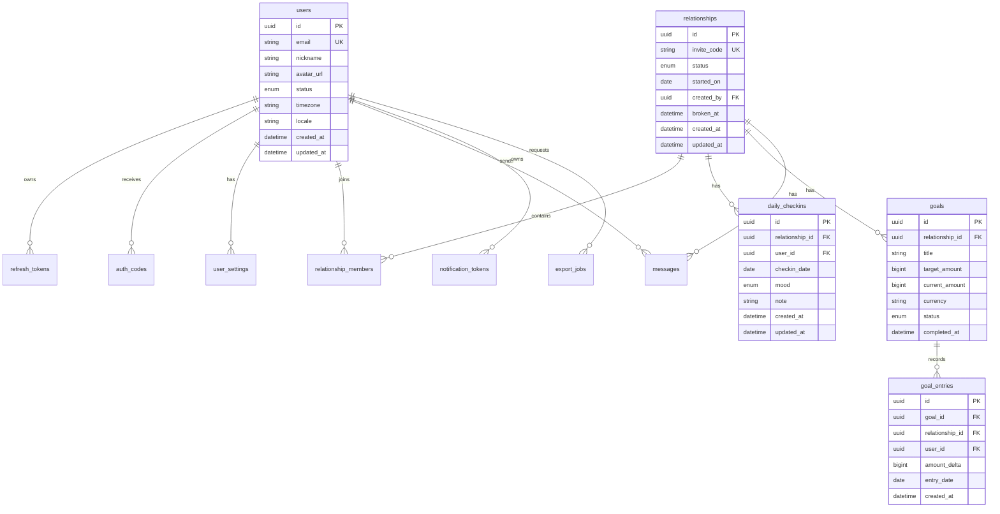

# 数据库 Schema / ER 设计文档

## 1. 设计目标

本数据库设计用于支撑情侣陪伴类 Web App MVP，覆盖以下核心能力：

- 邮箱验证码登录。
- JWT refresh token 管理。
- 用户资料与设置。
- 情侣关系创建、邀请码加入、关系解除。
- 每日心情打卡。
- 首页聚合数据。
- 共同目标与金额流水。
- 日历月数据聚合。
- 今日一言/消息。
- 通知与数据导出预留。

推荐数据库：PostgreSQL。  
推荐 ORM：Prisma。

## 2. 关键设计原则

1. 金额使用整数存储，避免浮点误差。
2. 所有关系资源必须带 `relationship_id`，便于权限校验和查询。
3. 每人每天最多一条打卡记录，由数据库唯一约束兜底。
4. 目标金额变更必须通过流水表和事务更新。
5. 解除关系不物理删除数据，使用状态和时间字段保留历史。
6. 消息删除使用软删除。
7. 验证码明文不入库，只保存哈希。
8. 部分业务约束需要 PostgreSQL partial index 或应用层事务配合。

## 3. ER 关系图



## 4. Prisma Schema 草案

以下 schema 可作为 `prisma/schema.prisma` 的初始版本。实际项目中可根据包管理器、数据库 URL 环境变量和命名规范微调。

```prisma
generator client {
  provider = "prisma-client-js"
}

datasource db {
  provider = "postgresql"
  url      = env("DATABASE_URL")
}

enum UserStatus {
  active
  disabled
  deleted
}

enum RelationshipStatus {
  pending
  active
  broken
}

enum RelationshipRole {
  owner
  member
}

enum Mood {
  happy
  normal
  sad
}

enum GoalStatus {
  active
  completed
  archived
}

enum MessageType {
  daily_word
  reply
  system
}

enum PrivacyLevel {
  default
  private
}

enum ExportStatus {
  pending
  processing
  completed
  failed
}

enum NotificationProvider {
  web_push
  apns
  fcm
}

model User {
  id        String     @id @default(dbgenerated("gen_random_uuid()")) @db.Uuid
  email     String     @unique @db.VarChar(255)
  nickname  String     @default("TwoDays User") @db.VarChar(40)
  avatarUrl String?    @map("avatar_url") @db.VarChar(1000)
  status    UserStatus @default(active)
  timezone  String     @default("Asia/Shanghai") @db.VarChar(64)
  locale    String     @default("zh-CN") @db.VarChar(16)
  createdAt DateTime   @default(now()) @map("created_at") @db.Timestamptz(6)
  updatedAt DateTime   @updatedAt @map("updated_at") @db.Timestamptz(6)

  authCodes           AuthCode[]
  refreshTokens       RefreshToken[]
  settings            UserSettings?
  createdRelationships Relationship[]       @relation("RelationshipCreator")
  relationshipMembers RelationshipMember[]
  checkins            DailyCheckin[]
  createdGoals        Goal[]               @relation("GoalCreator")
  goalEntries         GoalEntry[]
  messages            Message[]
  notificationTokens  NotificationToken[]
  exportJobs          ExportJob[]

  @@map("users")
}

model AuthCode {
  id          String    @id @default(dbgenerated("gen_random_uuid()")) @db.Uuid
  email       String    @db.VarChar(255)
  codeHash    String    @map("code_hash") @db.VarChar(255)
  purpose     String    @default("login") @db.VarChar(32)
  expiresAt   DateTime  @map("expires_at") @db.Timestamptz(6)
  consumedAt  DateTime? @map("consumed_at") @db.Timestamptz(6)
  failedCount Int       @default(0) @map("failed_count")
  createdAt   DateTime  @default(now()) @map("created_at") @db.Timestamptz(6)

  user User? @relation(fields: [email], references: [email])

  @@index([email, purpose, createdAt])
  @@index([expiresAt])
  @@map("auth_codes")
}

model RefreshToken {
  id        String    @id @default(dbgenerated("gen_random_uuid()")) @db.Uuid
  userId    String    @map("user_id") @db.Uuid
  tokenHash String    @map("token_hash") @db.VarChar(255)
  expiresAt DateTime  @map("expires_at") @db.Timestamptz(6)
  revokedAt DateTime? @map("revoked_at") @db.Timestamptz(6)
  createdAt DateTime  @default(now()) @map("created_at") @db.Timestamptz(6)

  user User @relation(fields: [userId], references: [id], onDelete: Cascade)

  @@index([userId, revokedAt])
  @@index([expiresAt])
  @@map("refresh_tokens")
}

model UserSettings {
  userId              String       @id @map("user_id") @db.Uuid
  notificationEnabled Boolean      @default(true) @map("notification_enabled")
  dailyReminderTime   String?      @default("20:30") @map("daily_reminder_time") @db.VarChar(5)
  privacyLevel        PrivacyLevel @default(default) @map("privacy_level")
  createdAt           DateTime     @default(now()) @map("created_at") @db.Timestamptz(6)
  updatedAt           DateTime     @updatedAt @map("updated_at") @db.Timestamptz(6)

  user User @relation(fields: [userId], references: [id], onDelete: Cascade)

  @@map("user_settings")
}

model Relationship {
  id         String             @id @default(dbgenerated("gen_random_uuid()")) @db.Uuid
  inviteCode String             @unique @map("invite_code") @db.VarChar(12)
  status     RelationshipStatus @default(pending)
  startedOn  DateTime           @map("started_on") @db.Date
  createdBy  String             @map("created_by") @db.Uuid
  brokenAt   DateTime?          @map("broken_at") @db.Timestamptz(6)
  createdAt  DateTime           @default(now()) @map("created_at") @db.Timestamptz(6)
  updatedAt  DateTime           @updatedAt @map("updated_at") @db.Timestamptz(6)

  creator User @relation("RelationshipCreator", fields: [createdBy], references: [id])
  members RelationshipMember[]
  checkins DailyCheckin[]
  goals    Goal[]
  entries  GoalEntry[]
  messages Message[]

  @@index([createdBy])
  @@index([status])
  @@map("relationships")
}

model RelationshipMember {
  id             String           @id @default(dbgenerated("gen_random_uuid()")) @db.Uuid
  relationshipId String           @map("relationship_id") @db.Uuid
  userId         String           @map("user_id") @db.Uuid
  role           RelationshipRole @default(member)
  joinedAt       DateTime         @default(now()) @map("joined_at") @db.Timestamptz(6)
  leftAt         DateTime?        @map("left_at") @db.Timestamptz(6)

  relationship Relationship @relation(fields: [relationshipId], references: [id], onDelete: Cascade)
  user         User         @relation(fields: [userId], references: [id], onDelete: Cascade)

  @@unique([relationshipId, userId])
  @@index([userId, leftAt])
  @@index([relationshipId, leftAt])
  @@map("relationship_members")
}

model DailyCheckin {
  id             String   @id @default(dbgenerated("gen_random_uuid()")) @db.Uuid
  relationshipId String   @map("relationship_id") @db.Uuid
  userId         String   @map("user_id") @db.Uuid
  checkinDate    DateTime @map("checkin_date") @db.Date
  mood           Mood
  note           String?  @db.VarChar(200)
  createdAt      DateTime @default(now()) @map("created_at") @db.Timestamptz(6)
  updatedAt      DateTime @updatedAt @map("updated_at") @db.Timestamptz(6)

  relationship Relationship @relation(fields: [relationshipId], references: [id], onDelete: Cascade)
  user         User         @relation(fields: [userId], references: [id], onDelete: Cascade)

  @@unique([relationshipId, userId, checkinDate])
  @@index([relationshipId, checkinDate])
  @@index([userId, checkinDate])
  @@map("daily_checkins")
}

model Goal {
  id             String     @id @default(dbgenerated("gen_random_uuid()")) @db.Uuid
  relationshipId String     @map("relationship_id") @db.Uuid
  title          String     @db.VarChar(60)
  targetAmount   BigInt     @map("target_amount")
  currentAmount  BigInt     @default(0) @map("current_amount")
  currency       String     @default("JPY") @db.VarChar(3)
  status         GoalStatus @default(active)
  coverType      String     @default("couple") @map("cover_type") @db.VarChar(40)
  completedAt    DateTime?  @map("completed_at") @db.Timestamptz(6)
  createdBy      String     @map("created_by") @db.Uuid
  createdAt      DateTime   @default(now()) @map("created_at") @db.Timestamptz(6)
  updatedAt      DateTime   @updatedAt @map("updated_at") @db.Timestamptz(6)

  relationship Relationship @relation(fields: [relationshipId], references: [id], onDelete: Cascade)
  creator      User         @relation("GoalCreator", fields: [createdBy], references: [id])
  entries      GoalEntry[]

  @@index([relationshipId, status])
  @@index([createdBy])
  @@map("goals")
}

model GoalEntry {
  id             String   @id @default(dbgenerated("gen_random_uuid()")) @db.Uuid
  goalId         String   @map("goal_id") @db.Uuid
  relationshipId String   @map("relationship_id") @db.Uuid
  userId         String   @map("user_id") @db.Uuid
  amountDelta    BigInt   @map("amount_delta")
  note           String?  @db.VarChar(100)
  entryDate      DateTime @default(now()) @map("entry_date") @db.Date
  createdAt      DateTime @default(now()) @map("created_at") @db.Timestamptz(6)

  goal         Goal         @relation(fields: [goalId], references: [id], onDelete: Cascade)
  relationship Relationship @relation(fields: [relationshipId], references: [id], onDelete: Cascade)
  user         User         @relation(fields: [userId], references: [id], onDelete: Cascade)

  @@index([goalId, createdAt])
  @@index([relationshipId, entryDate])
  @@index([userId, createdAt])
  @@map("goal_entries")
}

model Message {
  id             String      @id @default(dbgenerated("gen_random_uuid()")) @db.Uuid
  relationshipId String      @map("relationship_id") @db.Uuid
  senderId       String      @map("sender_id") @db.Uuid
  messageDate    DateTime    @map("message_date") @db.Date
  content        String      @db.VarChar(500)
  type           MessageType @default(reply)
  createdAt      DateTime    @default(now()) @map("created_at") @db.Timestamptz(6)
  deletedAt      DateTime?   @map("deleted_at") @db.Timestamptz(6)

  relationship Relationship @relation(fields: [relationshipId], references: [id], onDelete: Cascade)
  sender       User         @relation(fields: [senderId], references: [id], onDelete: Cascade)

  @@index([relationshipId, messageDate, createdAt])
  @@index([senderId, createdAt])
  @@index([deletedAt])
  @@map("messages")
}

model NotificationToken {
  id        String               @id @default(dbgenerated("gen_random_uuid()")) @db.Uuid
  userId    String               @map("user_id") @db.Uuid
  provider  NotificationProvider
  token     String               @db.Text
  userAgent String?              @map("user_agent") @db.Text
  createdAt DateTime             @default(now()) @map("created_at") @db.Timestamptz(6)
  revokedAt DateTime?            @map("revoked_at") @db.Timestamptz(6)

  user User @relation(fields: [userId], references: [id], onDelete: Cascade)

  @@index([userId, revokedAt])
  @@map("notification_tokens")
}

model ExportJob {
  id          String       @id @default(dbgenerated("gen_random_uuid()")) @db.Uuid
  userId      String       @map("user_id") @db.Uuid
  status      ExportStatus @default(pending)
  downloadUrl String?      @map("download_url") @db.VarChar(1000)
  errorMessage String?     @map("error_message") @db.Text
  expiresAt   DateTime?    @map("expires_at") @db.Timestamptz(6)
  createdAt   DateTime     @default(now()) @map("created_at") @db.Timestamptz(6)
  updatedAt   DateTime     @updatedAt @map("updated_at") @db.Timestamptz(6)

  user User @relation(fields: [userId], references: [id], onDelete: Cascade)

  @@index([userId, createdAt])
  @@index([status])
  @@map("export_jobs")
}
```

## 5. PostgreSQL 扩展与 Raw SQL 迁移

Prisma 可以覆盖大多数结构，但以下数据库能力建议通过 raw SQL migration 补充。

### 5.1 UUID 扩展

```sql
CREATE EXTENSION IF NOT EXISTS pgcrypto;
```

`gen_random_uuid()` 依赖 `pgcrypto`。

### 5.2 一个用户只能有一个有效关系

Prisma 当前不直接表达 PostgreSQL partial unique index，建议额外添加：

```sql
CREATE UNIQUE INDEX relationship_members_one_active_relationship_per_user
ON relationship_members(user_id)
WHERE left_at IS NULL;
```

注意：解除关系时需要将该关系下所有成员的 `left_at` 一并写入。

### 5.3 一个关系最多两个有效成员

PostgreSQL 不能用普通唯一索引直接表达“最多 2 行”的约束。建议首期使用应用层事务处理：

```text
1. 开启事务。
2. SELECT 当前 relationship_id 下 left_at IS NULL 的成员数量 FOR UPDATE。
3. 如果数量 >= 2，返回 RELATIONSHIP_FULL。
4. 写入新成员。
5. 如果写入后成员数量为 2，将 relationships.status 更新为 active。
```

如果需要数据库强约束，可第二期增加 trigger。

### 5.4 每个关系只允许一个 active 目标

建议添加 partial unique index：

```sql
CREATE UNIQUE INDEX goals_one_active_goal_per_relationship
ON goals(relationship_id)
WHERE status = 'active';
```

这样可以避免同一情侣关系同时存在多个当前目标。

### 5.5 金额非负与目标金额校验

建议添加 check constraints：

```sql
ALTER TABLE goals
ADD CONSTRAINT goals_target_amount_positive CHECK (target_amount > 0);

ALTER TABLE goals
ADD CONSTRAINT goals_current_amount_non_negative CHECK (current_amount >= 0);

ALTER TABLE goal_entries
ADD CONSTRAINT goal_entries_amount_delta_positive CHECK (amount_delta > 0);
```

首期只允许添加正向金额，因此 `amount_delta > 0`。如果后续支持撤销或退款，再调整为允许负数并增加业务审计。

### 5.6 设置时间格式校验

```sql
ALTER TABLE user_settings
ADD CONSTRAINT user_settings_daily_reminder_time_format
CHECK (
  daily_reminder_time IS NULL
  OR daily_reminder_time ~ '^([01][0-9]|2[0-3]):[0-5][0-9]$'
);
```

## 6. 表说明与字段规则

### 6.1 users

存储用户基础资料。

关键规则：

- `email` 唯一。
- `status=deleted` 时不物理删除用户。
- `timezone` 影响打卡日期和提醒时间。
- `nickname` 首期可自动生成，后续允许用户修改。

### 6.2 auth_codes

存储邮箱验证码记录，也可以使用 Redis 替代。

关键规则：

- 只保存验证码哈希，不保存明文。
- 验证成功后写入 `consumed_at`。
- 验证失败递增 `failed_count`。
- 过期记录可定期清理。

### 6.3 refresh_tokens

用于 refresh token 轮换和退出登录。

关键规则：

- 只保存 token 哈希。
- 退出登录写入 `revoked_at`。
- 刷新 token 时可采用 rotate 策略：旧 token 失效，新 token 写入。

### 6.4 relationships

情侣关系主表。

关键规则：

- `pending`：只有创建者，等待对方加入。
- `active`：两人已绑定。
- `broken`：关系已解除。
- `started_on` 用于计算关系天数。
- `invite_code` 唯一，不建议使用连续数字。

### 6.5 relationship_members

关系成员表。

关键规则：

- `left_at IS NULL` 表示当前有效成员。
- 同一关系同一用户只能有一条成员记录。
- 解除关系时，关系状态设为 `broken`，成员 `left_at` 写入当前时间。

### 6.6 daily_checkins

每日心情打卡表。

关键规则：

- `(relationship_id, user_id, checkin_date)` 唯一。
- `checkin_date` 是根据用户/关系时区计算出的业务日期。
- `note` 最多 200 字。
- 首期允许当天覆盖更新，可使用 upsert。

### 6.7 goals

共同目标表。

关键规则：

- `target_amount` 必须大于 0。
- `current_amount` 通过流水聚合更新，不允许前端直接写。
- 同一关系首期只允许一个 active 目标。
- 达成后将 `status` 改为 `completed` 并写入 `completed_at`。

### 6.8 goal_entries

目标金额流水表。

关键规则：

- 添加流水与更新目标金额必须在同一事务中完成。
- `relationship_id` 冗余存储，便于权限校验和列表查询。
- 首期只允许正向金额。

### 6.9 messages

消息/今日一言表。

关键规则：

- `message_date` 是消息所属业务日期。
- `daily_word` 可用于首页今日一言。
- 删除消息写入 `deleted_at`。
- 查询列表默认排除 `deleted_at IS NOT NULL`。

### 6.10 notification_tokens

通知设备表，首期可预留。

关键规则：

- 用户关闭通知时不一定删除 token。
- 设备失效时写入 `revoked_at`。

### 6.11 export_jobs

数据导出任务表，首期可做骨架。

关键规则：

- 导出任务只能由创建者查询。
- `download_url` 需要短期有效。
- 失败时写入 `error_message`。

## 7. 查询索引建议

| 表 | 索引 | 用途 |
| --- | --- | --- |
| `users` | `email unique` | 登录查用户 |
| `auth_codes` | `email, purpose, created_at` | 找最近验证码 |
| `refresh_tokens` | `user_id, revoked_at` | token 轮换和退出 |
| `relationships` | `invite_code unique` | 邀请码加入 |
| `relationship_members` | `user_id, left_at` | 找当前关系 |
| `relationship_members` | `relationship_id, left_at` | 找当前成员 |
| `daily_checkins` | `relationship_id, checkin_date` | 首页、日历、连续天数 |
| `daily_checkins` | `relationship_id, user_id, checkin_date unique` | 防止重复打卡 |
| `goals` | `relationship_id, status` | 当前目标 |
| `goal_entries` | `goal_id, created_at` | 目标流水 |
| `messages` | `relationship_id, message_date, created_at` | 消息列表 |
| `export_jobs` | `user_id, created_at` | 用户导出记录 |

## 8. 事务设计

### 8.1 加入关系

必须事务处理：

```text
1. 根据 invite_code 查询 relationship。
2. 校验 relationship.status 不是 broken。
3. 校验当前用户没有有效关系。
4. 锁定当前 relationship 的成员记录或 relationship 行。
5. 统计有效成员数。
6. 如果成员数 >= 2，返回 RELATIONSHIP_FULL。
7. 写入 relationship_members。
8. 如果成员数变为 2，将 relationship.status 更新为 active。
```

### 8.2 解除关系

必须事务处理：

```text
1. 查询当前用户有效关系。
2. 校验 confirm=true。
3. 更新 relationships.status=broken，写入 broken_at。
4. 更新 relationship_members.left_at。
5. 使后续写接口返回 RELATIONSHIP_INACTIVE。
```

### 8.3 提交今日打卡

推荐 upsert：

```text
1. 计算业务日期 checkin_date。
2. 校验当前关系 active。
3. upsert daily_checkins。
4. 查询当天双方记录。
5. 计算 bothCompleted 和 streakDays。
```

### 8.4 添加目标金额

必须事务处理：

```text
1. 查询目标并校验 relationship_id。
2. 校验目标 active。
3. 写入 goal_entries。
4. 原子更新 goals.current_amount。
5. 如果 current_amount >= target_amount，更新 status=completed 和 completed_at。
6. 返回 entry 和更新后的 goal。
```

并发安全建议：

- 使用数据库事务。
- 更新目标金额时使用 `current_amount = current_amount + amount_delta`。
- 必要时对目标行执行 `SELECT ... FOR UPDATE`。

## 9. 软删除与历史保留

首期策略：

- 用户不物理删除，使用 `users.status=deleted`。
- 关系不物理删除，使用 `relationships.status=broken`。
- 关系成员离开使用 `left_at`。
- 消息删除使用 `deleted_at`。
- 打卡、目标、流水不删除，必要时第二期增加审计表。

## 10. 种子数据建议

本地开发建议 seed：

- 用户 A：`yuta@example.com`
- 用户 B：`sakura@example.com`
- 一条 active 关系，邀请码 `A8X2K`。
- 关系开始日期：`2024-05-01`。
- 最近 7 天双方打卡数据，其中一天缺失用于测试中断。
- 一个 active 目标：`一緒に10万円貯める`。
- 4 条目标流水。
- 3 条消息。

用途：

- 前端首页可直接展示情侣头像、关系天数、连续打卡。
- 日历页可测试 both、me_only、partner_only、none。
- 目标页可测试进度与流水。
- 消息页可测试气泡展示。

## 11. 迁移实施顺序

建议按以下顺序执行：

1. 创建 PostgreSQL 数据库。
2. 启用 `pgcrypto`。
3. 初始化 Prisma。
4. 创建 enum 和基础表。
5. 执行 Prisma migration。
6. 添加 raw SQL partial indexes 和 check constraints。
7. 执行 seed。
8. 运行后端集成测试。

## 12. 验收标准

数据库设计完成时需要满足：

- Prisma Client 可生成。
- 所有核心表迁移成功。
- `users.email` 唯一约束生效。
- 当前有效关系约束生效。
- 每日打卡唯一约束生效。
- 当前 active 目标唯一约束生效。
- 目标金额 check constraint 生效。
- 种子数据可支持前端核心页面。
- 后端关键集成测试可以基于该 schema 运行。
